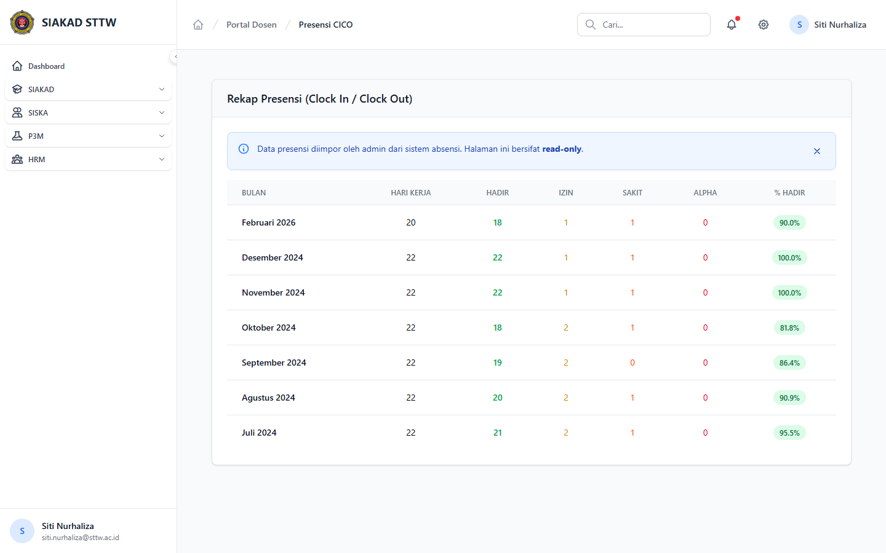

# Workflow Report: Presensi CICO Dosen

**Tanggal**: 2026-04-18  
**Role**: Dosen  
**Modul**: HRM > Portal Saya  
**Fitur**: Presensi CICO Dosen  
**Status**: ⚠️ Partial

## Deskripsi Workflow

Ringkasan presensi CICO dosen.

## Ringkasan

1 langkah berhasil, 0 langkah gagal, dan 1 temuan warning tercatat.

## Langkah-langkah

### 1. Presensi CICO

**Deskripsi**: Halaman ini merekam tampilan utama presensi cico sebagai bagian dari alur presensi cico dosen.

**Akun**: Portal Dosen

**URL**: `http://127.0.0.1:8000/hrm/portal/presensi-cico`

**Catatan langkah**: missing-sidebar: Halaman ini dicapai lewat quick action atau tombol sekunder karena tidak ada item sidebar langsung.

## Temuan & Masalah

| # | Halaman | URL | Kategori | Deskripsi | Screenshot | Prioritas |
|---|---------|-----|----------|-----------|------------|-----------|
| 1 | Presensi CICO | `http://127.0.0.1:8000/hrm/portal/presensi-cico` | `missing-sidebar` | Halaman ini dicapai lewat quick action atau tombol sekunder karena tidak ada item sidebar langsung. | [Lihat](screenshots/01_index.png) | Medium |

## Catatan

- Screenshot diambil otomatis menggunakan Playwright dengan full-page capture.
- Navigasi utama diprioritaskan melalui sidebar; jika sebuah halaman hanya bisa dicapai dari quick action atau tombol sekunder, report akan menandainya sebagai `missing-sidebar`.
- Form pada report ini dibuka untuk verifikasi visual dan field wajib, tidak disubmit secara destruktif agar hasil scan tidak memalsukan status sukses.
- Data yang tampil mengikuti seeder HRM yang aktif saat scan dijalankan.
