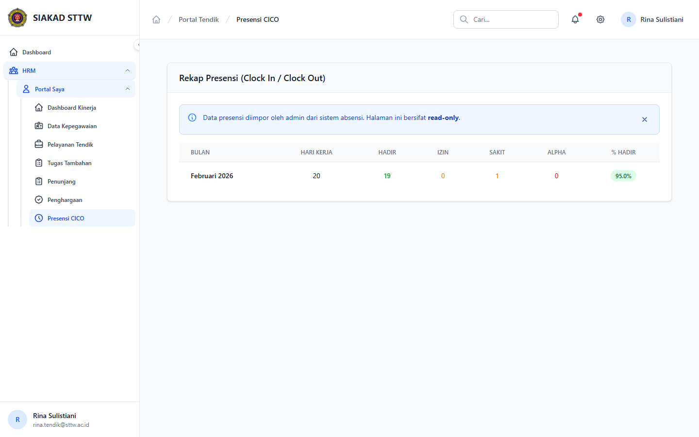

# Workflow Report: Presensi CICO Tendik

**Tanggal**: 2026-04-18  
**Role**: Tendik  
**Modul**: HRM  
**Fitur**: Presensi CICO Tendik  
**Status**: ✅ Berhasil

## Deskripsi Workflow

Ringkasan presensi CICO tendik.

## Ringkasan

Semua 1 langkah pada scan ini lolos tanpa error maupun warning.

## Langkah-langkah

### 1. Presensi CICO

**Deskripsi**: Halaman ini merekam tampilan utama presensi cico sebagai bagian dari alur presensi cico tendik.

**Akun**: Portal Tendik

**URL**: `http://127.0.0.1:8000/hrm/tendik/presensi-cico`

## Temuan & Masalah

Tidak ada temuan kritis maupun warning pada scan ini.

## Catatan

- Screenshot diambil otomatis menggunakan Playwright dengan full-page capture.
- Navigasi utama diprioritaskan melalui sidebar; jika sebuah halaman hanya bisa dicapai dari quick action atau tombol sekunder, report akan menandainya sebagai `missing-sidebar`.
- Form pada report ini dibuka untuk verifikasi visual dan field wajib, tidak disubmit secara destruktif agar hasil scan tidak memalsukan status sukses.
- Data yang tampil mengikuti seeder HRM yang aktif saat scan dijalankan.
