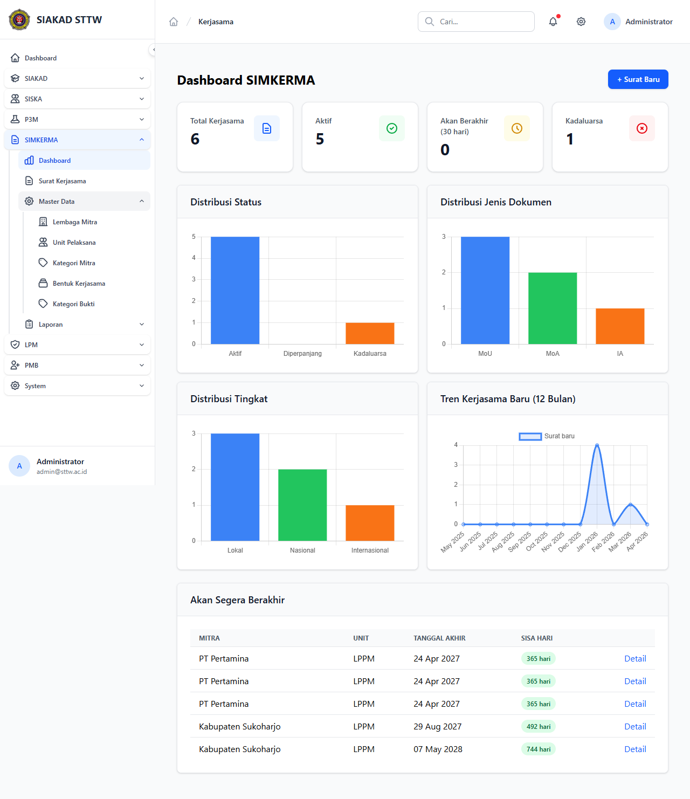

# Workflow Report: Dashboard SIMKERMA

**Tanggal**: 2026-04-24
**Role**: admin
**Modul**: kerjasama (SIMKERMA)
**Fitur**: Dashboard
**Status**: ✅ Berhasil

## Deskripsi Workflow

Halaman entry point modul SIMKERMA. Menampilkan ringkasan kerjasama institusi dalam bentuk 4 stats card (Total / Aktif / Akan Berakhir 30 hari / Kadaluarsa), 4 chart distribusi (Status, Jenis Dokumen, Tingkat, Tren 12 bulan), serta tabel "Akan Segera Berakhir" untuk reminder operasional.

## Ringkasan

Setelah perbaikan UI bug (`label=` → `title=` pada `<x-stats-card>`, color `orange` → `yellow`), label angka pada stats card sekarang tampil jelas beserta icon kontekstual. Semua 4 chart Chart.js render correct dengan data driver-aware (MySQL/SQLite). Tabel upcoming menampilkan 5 surat dengan badge sisa hari.

## Langkah-langkah

### 1. Dashboard SIMKERMA — full view

**Deskripsi**: Setelah login admin → klik group SIMKERMA → klik Dashboard. Halaman menampilkan judul "Dashboard SIMKERMA", tombol "+ Surat Baru" di kanan atas, 4 stats card berlabel ("Total Kerjasama 6", "Aktif 5", "Akan Berakhir (30 hari) 0", "Kadaluarsa 1") dengan icon dokumen/check/clock/x dan warna biru/hijau/kuning/merah. Dibawahnya 4 chart distribusi (bar untuk Status / Jenis Dokumen / Tingkat, line untuk Tren 12 Bulan). Paling bawah card "Akan Segera Berakhir" berisi tabel 5 baris (mitra, unit, tanggal akhir, sisa hari badge).

**URL**: `http://127.0.0.1:8000/kerjasama`

## Temuan & Masalah

| # | Halaman | URL | Kategori | Deskripsi | Screenshot | Prioritas |
|---|---------|-----|----------|-----------|------------|-----------|
| - | - | - | - | Tidak ada (semua bug pre-existing sudah di-fix di commit ini) | - | - |

## Catatan

- Bug **stats card tanpa label** ditemukan saat scan pertama (24 Apr 2026): view passed `label="..."` tapi komponen `<x-stats-card>` cuma menerima prop `title`, sehingga label silently dropped → user hanya melihat angka. Fixed di commit ini (`label`→`title`, +icon kontekstual, +`color="yellow"` ganti `orange` yang tidak ada di palette).
- Data dummy hasil seeding: 6 surat (5 Aktif, 1 Kadaluarsa) dengan jenis MoU/MoA/IA dan tingkat Lokal/Nasional/Internasional.
