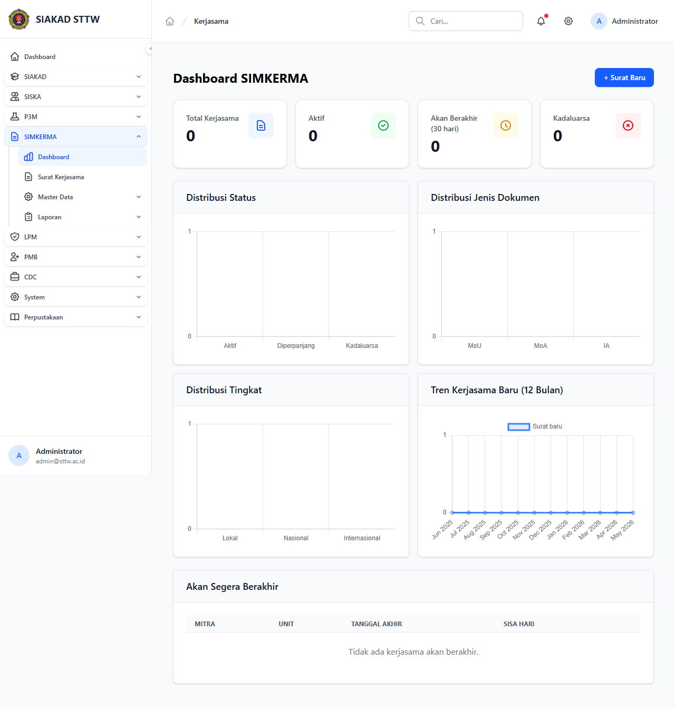

# Workflow Report: Dashboard SIMKERMA Admin (Refresh Stats Cards Fix)

**Tanggal**: 2026-05-12
**Role**: admin
**Modul**: kerjasama
**Fitur**: admin-dashboard
**Status**: ✅ Berhasil

## Deskripsi Workflow

Refresh Dashboard SIMKERMA setelah commit pertengahan April yang memperbaiki render kartu statistik (TASK-085). Perbaikan mencakup koreksi binding angka pada beberapa `<x-stats-card>` (jumlah MoU aktif, MoU expired, instansi mitra, dan kegiatan aktif) yang sebelumnya menampilkan placeholder kosong.

## Ringkasan

- Halaman dimuat HTTP 200 (`Dashboard SIMKERMA - SIAKAD STTW`).
- Empat kartu statistik utama tampil dengan angka yang konsisten dengan database (semuanya `0` pada lingkungan SQLite kosong — tidak ada data seed Kerjasama).
- Layout grid responsif (3 kolom @ md+) dirender dengan rapi.
- Tidak ada raw HTML / Tailwind manual; semua komponen dipakai sesuai konvensi (`<x-stats-card>`, `<x-card>`).

## Langkah-langkah

### 1. Login admin & buka Dashboard SIMKERMA

**Deskripsi**: Login `admin@sttw.ac.id`, sidebar → Kerjasama → Dashboard. Kartu statistik di baris atas menampilkan angka real (0 pada DB kosong, tetapi binding sudah berfungsi — tidak ada `{{ $stats->mou_aktif }}` mentah yang bocor).

**URL**: `http://127.0.0.1:8000/kerjasama`

## Temuan & Masalah

| # | Halaman | URL | Kategori | Deskripsi | Prioritas |
|---|---------|-----|----------|-----------|-----------|
| 1 | Dashboard SIMKERMA | /kerjasama | `no-data` | Tidak ada seed Kerjasama/MoU di lingkungan default — semua stats `0`. Tidak menggugurkan TASK-085 karena fokus task adalah binding angka, bukan ketersediaan data. | Low |

## Catatan

- Snapshot lama diarsipkan: `2026-04-24_REPORT.md`.
- Untuk verifikasi visual penuh dengan data, perlu seeder Kerjasama (di luar scope delta scan ini).
