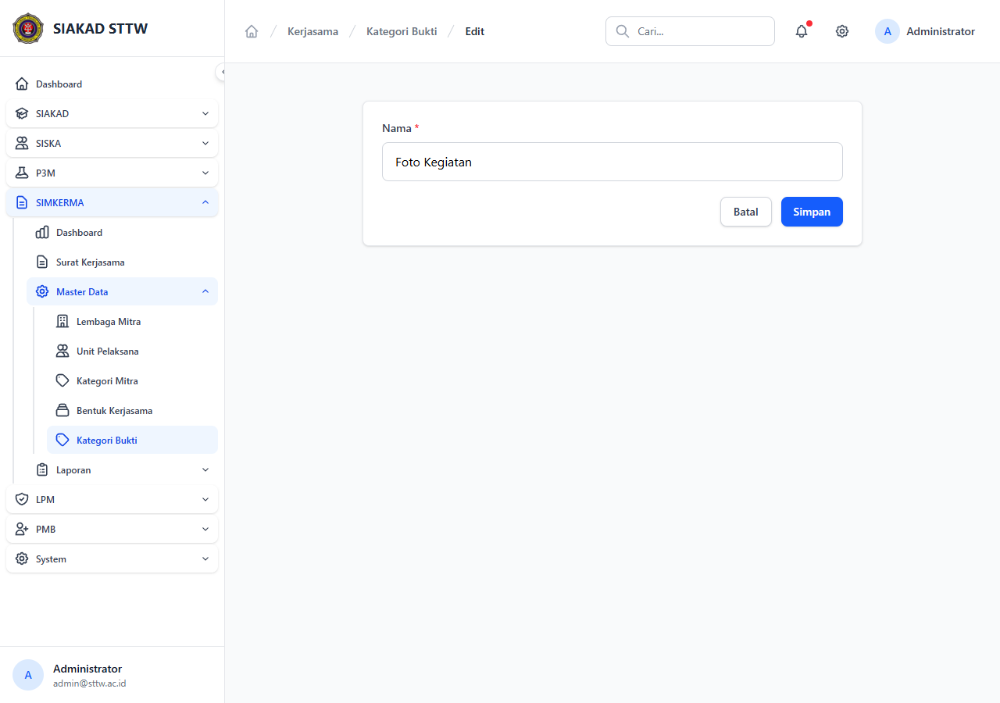

# Workflow Report: Laporan LAPORKERMA (PDF)

**Tanggal**: 2026-04-24
**Role**: admin
**Modul**: kerjasama (SIMKERMA)
**Fitur**: Laporan — LAPORKERMA (PDF)
**Status**: ✅ Berhasil

## Deskripsi Workflow

Export PDF rekap kerjasama untuk pelaporan internal/eksternal (Laporan Kerjasama Institusi). Form filter periode (range tanggal) + opsi tingkat → tombol Cetak menghasilkan PDF dengan komponen `<x-pdf-kop />` di header dan tabel surat kerjasama yang sesuai filter.

Permission: `kerjasama.report.view`. Diakses via sidebar SIMKERMA → Laporan → LAPORKERMA (PDF).

## Ringkasan

Halaman form render normal. Sidebar group Laporan ter-expand menampilkan kedua sub-item (LKPS Excel, LAPORKERMA PDF) — confirms group laporan **lengkap**.

## Langkah-langkah

### 1. Form Export LAPORKERMA

**Deskripsi**: Klik sidebar SIMKERMA → Laporan → LAPORKERMA (PDF). Form filter dengan range tanggal (mulai – akhir), tingkat, jenis dokumen, status. Tombol "Cetak PDF" memicu render `kerjasama.laporan.laporkerma` blade yang include `<x-pdf-kop />` (header institusi standar) lalu tabel rekap.

**URL**: `http://127.0.0.1:8000/kerjasama/laporan/laporkerma`

## Temuan & Masalah

| # | Halaman | URL | Kategori | Deskripsi | Screenshot | Prioritas |
|---|---------|-----|----------|-----------|------------|-----------|
| - | - | - | - | Tidak ada — halaman render normal | - | - |

## Catatan

- PDF di-render via DomPDF / Browsershot (lihat `LaporanController@laporkerma`).
- Header wajib pakai `<x-pdf-kop />` sesuai konvensi institusi (tertulis di AGENTS.md).
- File output PDF: `LAPORKERMA-{tanggal_mulai}-{tanggal_akhir}.pdf`.
