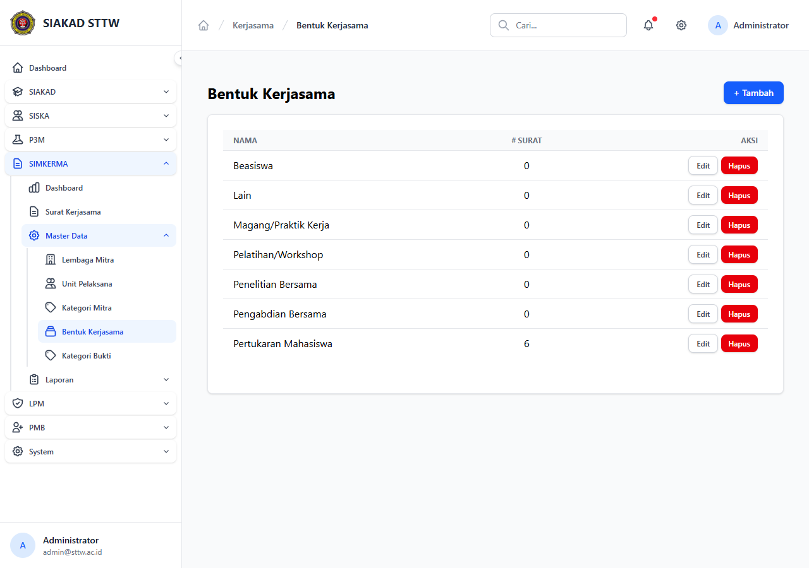
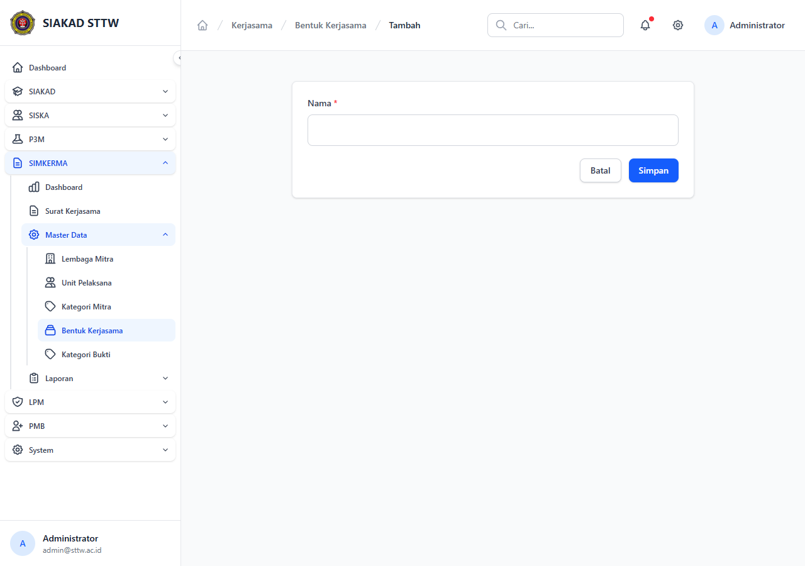
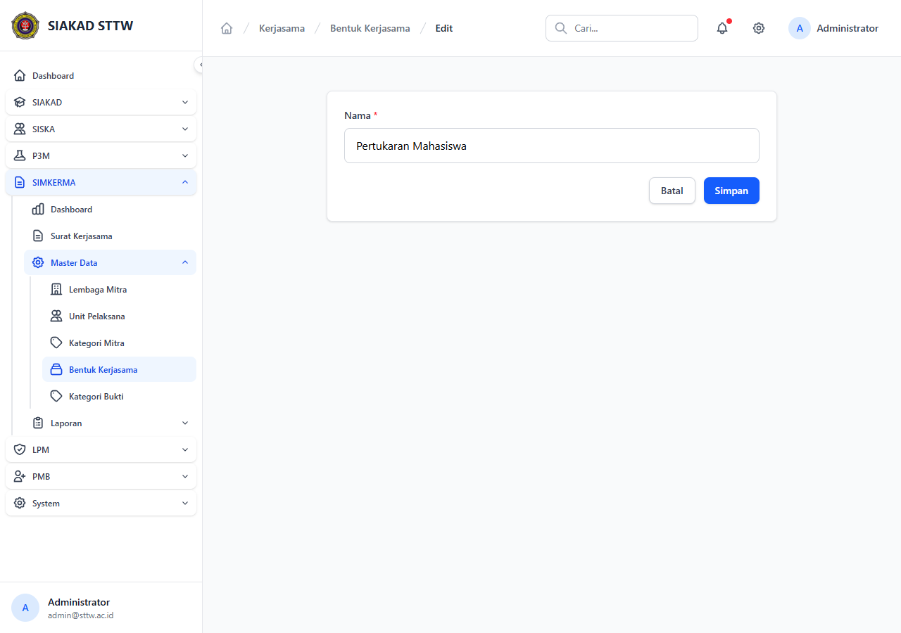

# Workflow Report: Master Bentuk Kerjasama

**Tanggal**: 2026-04-24
**Role**: admin
**Modul**: kerjasama (SIMKERMA)
**Fitur**: Master Data — Bentuk Kerjasama
**Status**: ✅ Berhasil

## Deskripsi Workflow

CRUD master bentuk-bentuk kerjasama institusi (Pendidikan, Penelitian, PkM, Tridharma, dll) sesuai standar LKPS BAN-PT. Diakses dari sidebar SIMKERMA → Master Data → Bentuk Kerjasama. Permission tunggal: `kerjasama.master.manage`.

## Ringkasan

Halaman index, create, dan edit semua render normal. Sidebar SIMKERMA → Master Data ter-expand menampilkan 5 sub-item (Lembaga Mitra, Unit Pelaksana, Kategori Mitra, Bentuk Kerjasama, Kategori Bukti) — confirms master data sub-menu **lengkap** (sebelumnya report hanya cover 1 dari 5).

## Langkah-langkah

### 1. Index — Daftar Bentuk Kerjasama

**Deskripsi**: Klik sidebar SIMKERMA → Master Data → Bentuk Kerjasama. Tabel menampilkan semua record dengan kolom utama dan aksi Edit/Hapus. Tombol "+ Tambah" di kanan atas.

**URL**: `http://127.0.0.1:8000/kerjasama/master/bentuk`

### 2. Create — Form Tambah

**Deskripsi**: Klik tombol "+ Tambah". Form dengan field: Kode, Nama, Bidang, Deskripsi, Urutan, status Aktif. Tombol Simpan/Batal.

**URL**: `http://127.0.0.1:8000/kerjasama/master/bentuk/create`

### 3. Edit — Form Ubah

**Deskripsi**: Klik aksi Edit pada salah satu baris. Form pre-filled dengan data existing.

**URL**: `http://127.0.0.1:8000/kerjasama/master/bentuk/{id}/edit`

## Temuan & Masalah

| # | Halaman | URL | Kategori | Deskripsi | Screenshot | Prioritas |
|---|---------|-----|----------|-----------|------------|-----------|
| - | - | - | - | Tidak ada — halaman 200 OK, sidebar lengkap | - | - |

## Catatan

- Master Bentuk Kerjasama di-seed via `MasterKerjasamaSeeder`.
- Hapus menggunakan soft delete (kolom `deleted_at`); record tetap aman jika sudah direferensi surat.
