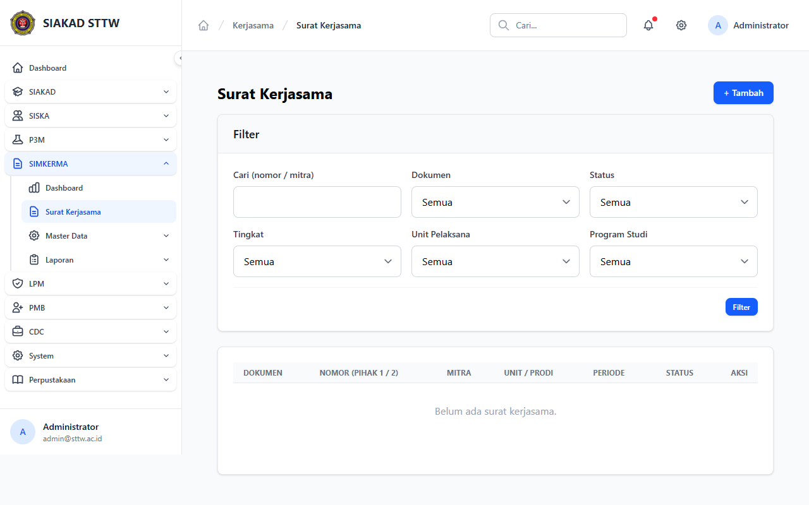
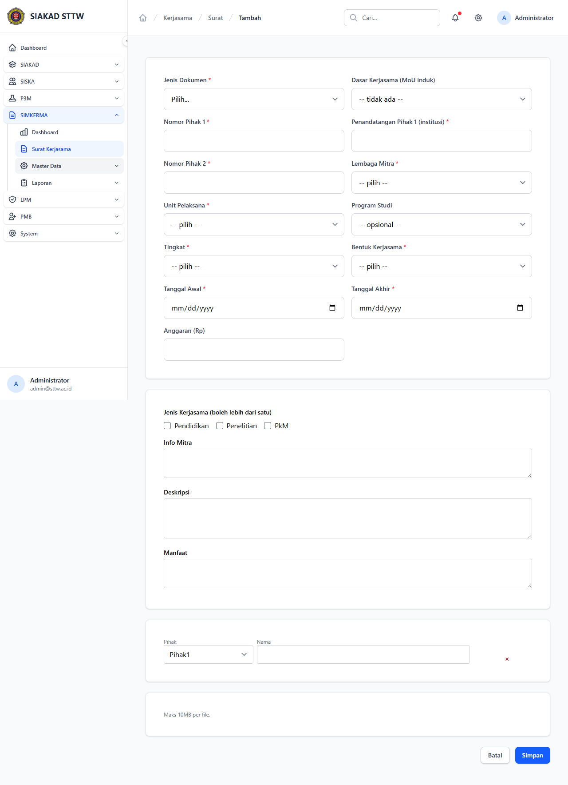

# Workflow Report: Surat Kerjasama (CRUD)

**Tanggal**: 2026-04-24
**Role**: admin
**Modul**: kerjasama (SIMKERMA)
**Fitur**: Surat Kerjasama
**Status**: ✅ Berhasil

## Deskripsi Workflow

Modul inti SIMKERMA: pengelolaan surat kerjasama (MoU / MoA / IA) antara institusi dengan lembaga mitra. Mendukung CRUD penuh (index, create, show, edit), upload bukti pelaksanaan, perpanjangan periode, restore soft-deleted, serta cetak PDF.

## Ringkasan

Semua halaman CRUD surat render normal pasca-fix BackedEnum di PR #162 (`->value` pada blade). Form create menampilkan dropdown Unit Pelaksana, Lembaga Mitra, Bentuk, Kategori, Jenis Dokumen, Tingkat, Status. Show menampilkan detail lengkap + tab bukti & timeline. Edit pre-filled dengan data existing.

## Langkah-langkah

### 1. Index — Daftar Surat Kerjasama

**Deskripsi**: Klik sidebar SIMKERMA → Surat Kerjasama. Menampilkan filter (search, status, jenis dokumen, tingkat, periode) dan tabel surat dengan kolom Nomor, Mitra, Unit, Tanggal Mulai/Akhir, Status (badge), aksi (Detail/Edit). Pagination di bawah.

**URL**: `http://127.0.0.1:8000/kerjasama/surat`

### 2. Create — Form Tambah Surat

**Deskripsi**: Klik tombol "+ Surat Baru". Form dengan field: Nomor Surat, Tanggal Surat, Lembaga Mitra (select2), Unit Pelaksana (select), Bentuk Kerjasama, Kategori Mitra, Jenis Dokumen (MoU/MoA/IA), Tingkat (Lokal/Nasional/Internasional), Tanggal Mulai/Akhir, Pihak Pertama TTD, Catatan. Tombol Simpan/Batal di bawah.

**URL**: `http://127.0.0.1:8000/kerjasama/surat/create`

### 3. Show — Detail Surat

**Deskripsi**: Detail surat menampilkan info lengkap (mitra, unit, tanggal, status badge), section bukti pelaksanaan (uploader), riwayat aktivitas, dan action button (Edit, Perpanjang, Cetak PDF, Hapus). Status badge ter-render dari BackedEnum dengan benar (fix PR #162).

**URL**: `http://127.0.0.1:8000/kerjasama/surat/1`

### 4. Edit — Form Ubah

**Deskripsi**: Form pre-filled dengan data existing surat. Semua field bisa diubah kecuali yang sudah ditentukan oleh policy. Tombol Simpan / Batal.

**URL**: `http://127.0.0.1:8000/kerjasama/surat/1/edit`

## Skenario Alternatif

Belum di-screenshot di scan ini (akan di-cover saat regression):
- **Skenario Perpanjang**: aksi extend tanggal_akhir + alasan
- **Skenario Soft Delete + Restore**: hapus → tampil di filter "Trashed" → restore
- **Skenario Cetak PDF**: tombol cetak → render `<x-pdf-kop>` + isi surat

## Temuan & Masalah

| # | Halaman | URL | Kategori | Deskripsi | Screenshot | Prioritas |
|---|---------|-----|----------|-----------|------------|-----------|
| - | - | - | - | Tidak ada — semua halaman 200 OK | - | - |

## Catatan

- Surat kerjasama menggunakan permission split: `kerjasama.surat.view-all` (akademik penuh) vs `kerjasama.surat.view-prodi` (kaprodi scoped via `SuratKerjasamaPolicy`).
- Field `pihak1_ttd` tidak punya default → factory provide faker name.
- Soft delete aktif: kolom `deleted_at` exist; restore route memerlukan `kerjasama.surat.restore`.
