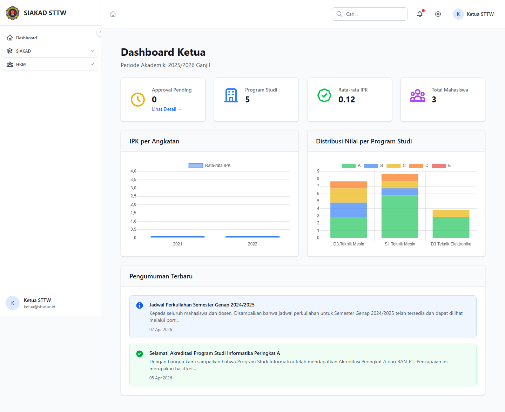
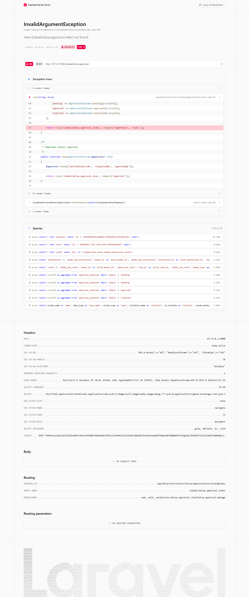

# Ketua — Approval (Ketua)

- **Tanggal:** 2026-04-22
- **Role:** ketua (akun ad-hoc `ketua@sttw.ac.id`, password `password`)
- **Modul:** SIAKAD → Ketua (Approval Yudisium)
- **Status:** ❌ Gap — 1 bug P1 (HTTP 500), view halaman approval **tidak ada**

## Ringkasan

Modul Ketua hanya memiliki dua route GET: dashboard & approval. **Dashboard render normal**, namun **`/siakad/ketua/approval` HTTP 500** karena view `siakad.ketua.approval.index` tidak pernah dibuat. Lihat Temuan.

## Halaman

| # | Halaman | URL | Status |
|---|---|---|---|
| 1 | Dashboard Ketua | `/siakad/ketua/dashboard` | 200 |
| 2 | Approval — Index | `/siakad/ketua/approval` | **500** |

## Screenshots

### 03 Dashboard Ketua

### 04 Approval Index — 500

## Temuan & Masalah

### ❌ P1 — `/siakad/ketua/approval` HTTP 500 (View not found)

**Issue:** [#139](https://github.com/ricomuh/siakad-sttw/issues/139)

`Ketua\ApprovalController` mereturn `view('siakad.ketua.approval.index')` & `view('siakad.ketua.approval.show')`, namun direktori `resources/views/siakad/ketua/` tidak ada. Akibatnya seluruh fitur approval Ketua **non-fungsional**, padahal endpoint POST approve/reject sudah terdaftar.

**Suggested fix:** Buat blade `index.blade.php` (table approvals + filter status/jenis_aksi + stats card) dan `show.blade.php` (detail + form approve/reject) sesuai pola waket1/waket2. Detail di issue #139.

### 🛈 Catatan setup

Akun `ketua@sttw.ac.id` **belum tersedia di seeder default** — dibuat ad-hoc untuk scan ini. Sebaiknya seeder ditambahi sample ketua sehingga QA approval flow tidak butuh setup manual.

## Catatan Skenario

- Dashboard Ketua menampilkan widget statistik approval — render OK.
- Approval index gagal sebelum render apapun (exception saat resolve view).
