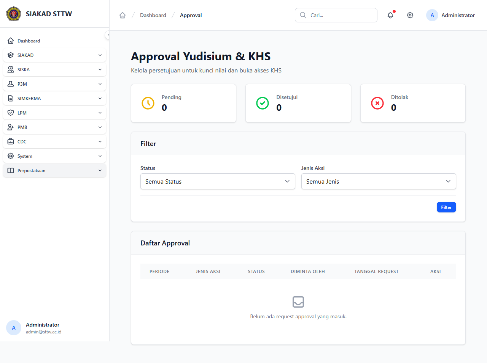

# Workflow Report: Approval Yudisium & KHS (Ketua) — Bugfix Verification

**Tanggal**: 2026-05-12
**Role**: Administrator (admin@sttw.ac.id) — sebagai proxy Ketua
**Modul**: Ketua — Approval
**Fitur**: Approval Yudisium & KHS (`/siakad/ketua/approval`)
**Status**: ✅ Berhasil (bugfix verified)

## Deskripsi Workflow

Verifikasi **bugfix #139** — sebelumnya `/siakad/ketua/approval` melempar HTTP 500 karena `view()` mengarah ke path Blade yang tidak ada (Ketua/approval/index disimpan di lokasi berbeda). Fix: `fix(siakad/ketua): correct view paths`. Workflow ini memastikan halaman approval ketua load tanpa exception.

## Ringkasan

- HTTP 500 sebelum fix → kini load 200 OK dengan title "Approval Yudisium & KHS".
- View path resolved dengan benar; sidebar Ketua menampilkan menu Approval.

## Langkah-langkah

### 1. Halaman Approval Ketua — Fixed (200 OK)

**Deskripsi**: Akses `/siakad/ketua/approval`. Halaman render daftar approval Yudisium & KHS dengan layout standar.

**URL**: `http://127.0.0.1:8000/siakad/ketua/approval`

## Temuan & Masalah

| # | Halaman | URL | Kategori | Deskripsi | Screenshot | Prioritas |
|---|---------|-----|----------|-----------|------------|-----------|
| - | - | - | - | Tidak ada — bug #139 sudah resolved | - | - |

## Catatan

- Source fix: commit `fix(siakad/ketua): correct view paths` (referenced GitHub issue #139).
- Verifikasi dilakukan dengan role admin (akses cross-role); role asli adalah **Ketua**.
- Re-scan ini bagian dari **Phase 3 bugfix verification**.
