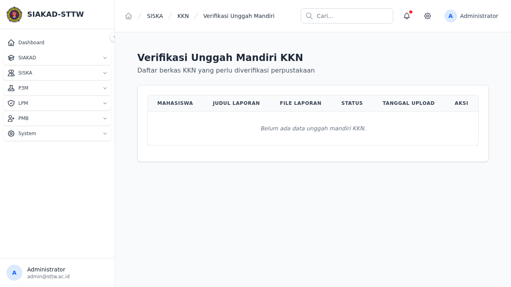
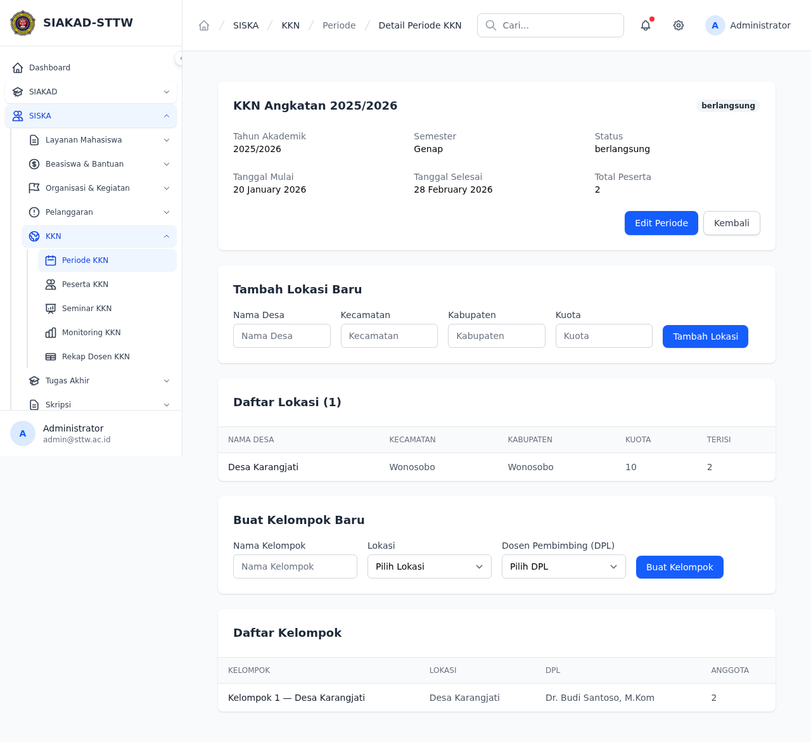

# Workflow Report: KKN — Admin

**Tanggal**: 2026-04-14  
**Role**: Admin (admin@sttw.ac.id)  
**Modul**: KKN (Kuliah Kerja Nyata)  
**Status**: ✅ Berhasil

## Ringkasan

Dokumentasi lengkap fitur KKN dari perspektif Admin. Modul KKN dikelola melalui menu **SISKA → KKN** di sidebar. Data yang tersedia: 1 batch KKN, 3 kelompok, 6 peserta terdaftar, 48 logbook, 3 DPL (Dosen Pembimbing Lapangan).

---

## Langkah-langkah

### 1. Periode KKN — Halaman Index
**URL**: `/siska/kkn/periode`  
**Status**: ✅ Berhasil

Menampilkan daftar periode/batch KKN dalam bentuk tabel dengan kolom: Nama Periode, Tahun Akademik, Semester, Pelaksanaan (tanggal mulai-selesai), Status, dan Aksi (Detail, Edit, Hapus).

Data yang tampil:
| Nama Periode | Tahun Akademik | Semester | Pelaksanaan |
|---|---|---|---|
| KKN Reguler 2025/2026 | 2025/2026 | Genap | 14 Feb 2026 - 14 May 2026 |

Terdapat tombol **+ Tambah Periode** untuk membuat periode baru.

---

### 2. Periode KKN — Form Tambah
**URL**: `/siska/kkn/periode/create`  
**Status**: ✅ Berhasil

Form pembuatan periode baru dengan field:
- **Nama Periode** (text, wajib) — contoh: "KKN Tematik 2024"
- **Tahun Akademik** (text, wajib) — contoh: "2023/2024"
- **Semester** (dropdown: Ganjil / Genap)
- **Tanggal Mulai** (date, wajib)
- **Tanggal Selesai** (date, wajib)
- **Status** (dropdown: Persiapan / Aktif / Selesai)

Tombol aksi: **Batal** (kembali ke index) dan **Simpan**.

---

### 3. Seminar KKN
**URL**: `/siska/kkn/seminar`  
**Status**: ✅ Berhasil

Menampilkan daftar jadwal seminar KKN per periode. Filter berdasarkan periode tersedia via dropdown.

Data yang tampil (3 kelompok):

| Kelompok | Lokasi | DPL | Tanggal | Jam | Ruangan | Status |
|---|---|---|---|---|---|---|
| Kelompok KKN 3 | Desa Bekonang | Siti Nurhaliza | 09 Apr 2026 | 09:00 | Ruang Seminar Lt. 2 | Selesai |
| Kelompok KKN 1 | Desa Gentan | Dr. Budi Santoso, M.Kom | 28 Apr 2026 | 09:00 | Ruang Seminar Lt. 2 | Terjadwal |
| Kelompok KKN 2 | Desa Weru | Ahmad Subagyo | 01 May 2026 | 09:00 | Ruang Seminar Lt. 2 | Terjadwal |

Fitur pada setiap baris:
- Upload file (2 file input + tombol Upload)
- Update status (dropdown: Terjadwal / Selesai / Batal + tombol Update)

---

### 4. Monitoring KKN
**URL**: `/siska/kkn/monitoring`  
**Status**: ✅ Berhasil

Dashboard monitoring seluruh peserta KKN. Dilengkapi filter:
- **Periode** (dropdown)
- **Status** (dropdown: Semua / Terdaftar / Verifikasi / Diterima / Ditolak / Lulus / Tidak lulus)
- **Cari** (NIM / Nama)
- Tombol **Filter**

Data yang tampil (6 peserta):

| NIM | Nama | Lokasi | DPL | Status | Logbook | Tgl Seminar | Nilai DPL | Nilai Akhir |
|---|---|---|---|---|---|---|---|---|
| 2024881612 | Amalia Zulaika | Desa Gentan | Dr. Budi Santoso, M.Kom | Diterima | 6 | 28 Apr 2026 | - | - |
| 2022451865 | Garan Damanik | Desa Weru | Ahmad Subagyo | Diterima | 6 | 01 May 2026 | - | - |
| 2022419757 | Edison Wijaya | Desa Bekonang | Siti Nurhaliza | Lulus | 12 | 09 Apr 2026 | 85.00 | 86.50 |
| 2023701515 | Dalimin Yuliarti | Desa Gentan | Dr. Budi Santoso, M.Kom | Diterima | 6 | 28 Apr 2026 | - | - |
| 2025100442 | Pia Siregar | Desa Weru | Ahmad Subagyo | Diterima | 6 | 01 May 2026 | - | - |
| 2025197889 | Febi Sirait | Desa Bekonang | Siti Nurhaliza | Lulus | 12 | 09 Apr 2026 | 85.00 | 86.50 |

---

### 5. Rekap Dosen DPL
**URL**: `/siska/kkn/rekap-dosen`  
**Status**: ✅ Berhasil

Rekapitulasi dosen pembimbing lapangan (DPL) per batch KKN. Filter berdasarkan batch tersedia.

Data yang tampil (3 dosen):

| No | NIP | Nama Dosen | Total Kelompok | Total Mahasiswa |
|---|---|---|---|---|
| 1 | - | Ahmad Subagyo | 1 | 2 |
| 2 | - | Dr. Budi Santoso, M.Kom | 1 | 2 |
| 3 | - | Siti Nurhaliza | 1 | 2 |

---

### 6. Unggah Mandiri Admin
**URL**: `/siska/kkn/unggah-mandiri-admin`  
**Status**: ✅ Berhasil

Halaman verifikasi unggah mandiri KKN. Admin dapat memverifikasi berkas dan laporan KKN yang telah diunggah oleh mahasiswa sebagai syarat penyelesaian administrasi ke perpustakaan.

---

### 7. Periode KKN — Detail
**URL**: `/siska/kkn/periode/1`  
**Status**: ✅ Berhasil

Halaman detail untuk sebuah batch KKN. Menampilkan informasi spesifik terkait pelaksanaan, dosen pembimbing (DPL) yang ditugaskan, dan daftar mahasiswa yang menjadi peserta pada periode tersebut.

---

## Rangkuman Fitur

| No | Fitur | URL | Status | Catatan |
|---|---|---|---|---|
| 1 | Periode KKN — Index | `/siska/kkn/periode` | ✅ OK | Tabel periode, CRUD lengkap |
| 2 | Periode KKN — Create | `/siska/kkn/periode/create` | ✅ OK | Form dengan validasi |
| 3 | Seminar KKN | `/siska/kkn/seminar` | ✅ OK | Jadwal, upload file, update status |
| 4 | Monitoring KKN | `/siska/kkn/monitoring` | ✅ OK | Dashboard lengkap + filter |
| 5 | Rekap Dosen DPL | `/siska/kkn/rekap-dosen` | ✅ OK | Rekap per batch |
| 6 | Unggah Mandiri Admin | `/siska/kkn/unggah-mandiri-admin` | ✅ OK | Halaman verifikasi unggah laporan |
| 7 | Periode KKN Detail | `/siska/kkn/periode/1` | ✅ OK | Detail batch & peserta |

---

## Navigasi Sidebar KKN

Menu KKN tersedia di sidebar **SISKA → KKN** dengan sub-menu:
1. Periode KKN
2. Peserta KKN
3. Seminar KKN
4. Monitoring KKN
5. Rekap Dosen KKN
