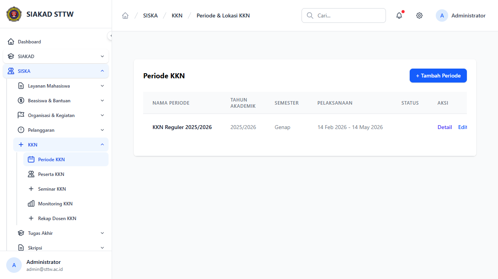
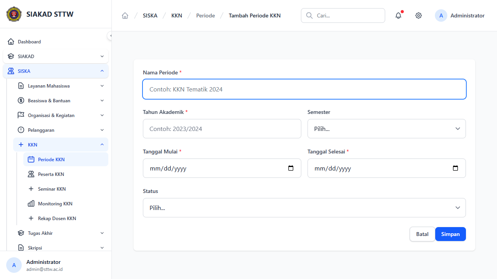
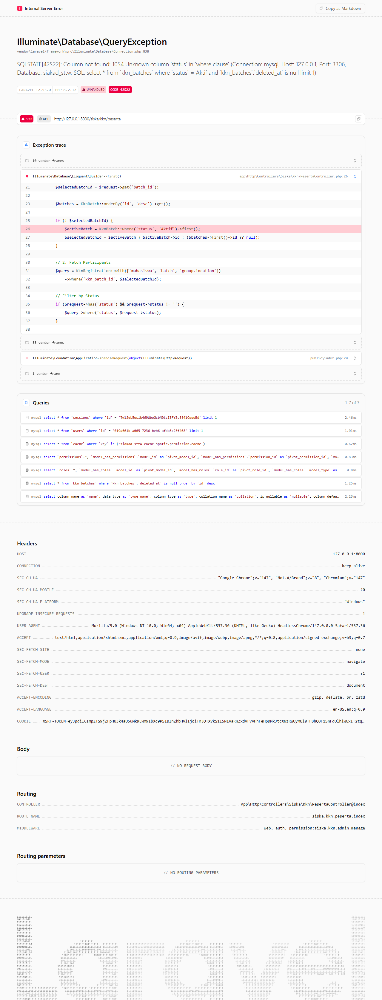
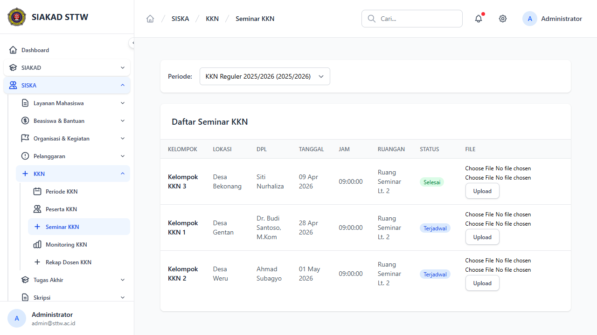
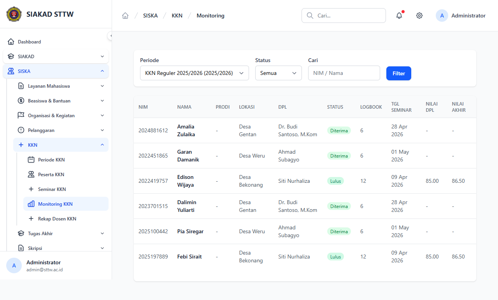
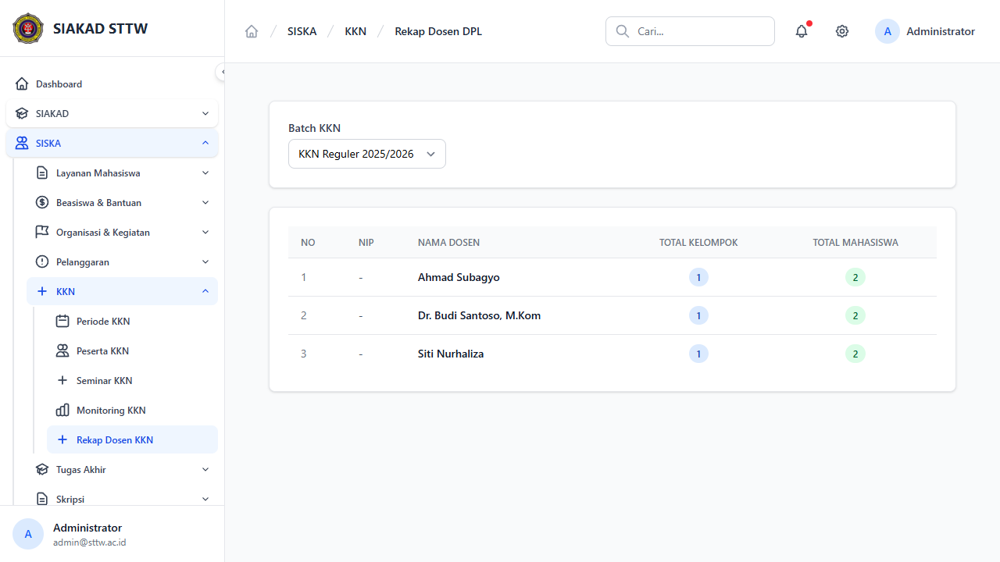
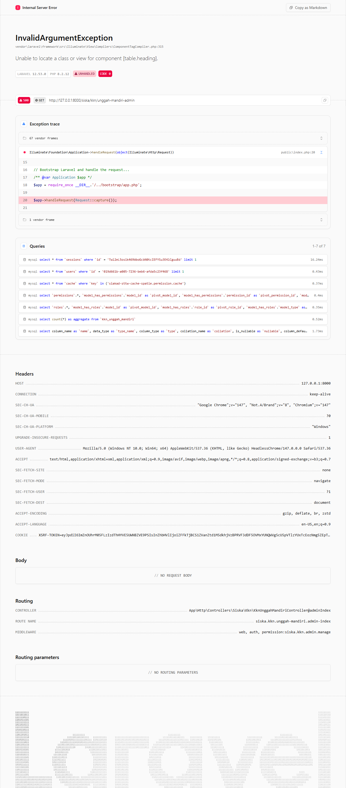
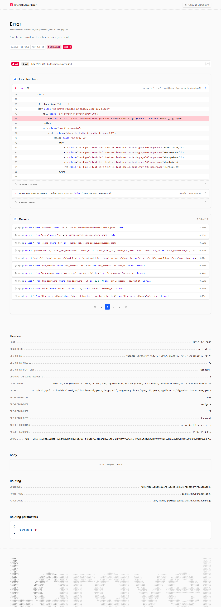

# Workflow Report: KKN — Admin

**Tanggal**: 2026-04-14  
**Role**: Admin (admin@sttw.ac.id)  
**Modul**: KKN (Kuliah Kerja Nyata)  
**Status**: ⚠️ Sebagian Berhasil (4/7 halaman OK, 3 halaman error)

## Ringkasan

Dokumentasi lengkap fitur KKN dari perspektif Admin. Modul KKN dikelola melalui menu **SISKA → KKN** di sidebar. Data yang tersedia: 1 batch KKN, 3 kelompok, 6 peserta terdaftar, 48 logbook, 3 DPL (Dosen Pembimbing Lapangan).

Terdapat 3 halaman yang mengalami error 500 dan perlu diperbaiki sebelum modul ini dapat digunakan sepenuhnya.

---

## Langkah-langkah

### 1. Periode KKN — Halaman Index
**URL**: `/siska/kkn/periode`  
**Status**: ✅ Berhasil

Menampilkan daftar periode/batch KKN dalam bentuk tabel dengan kolom: Nama Periode, Tahun Akademik, Semester, Pelaksanaan (tanggal mulai-selesai), Status, dan Aksi (Detail, Edit, Hapus).

Data yang tampil:
| Nama Periode | Tahun Akademik | Semester | Pelaksanaan |
|---|---|---|---|
| KKN Reguler 2025/2026 | 2025/2026 | Genap | 14 Feb 2026 - 14 May 2026 |

Terdapat tombol **+ Tambah Periode** untuk membuat periode baru.

---

### 2. Periode KKN — Form Tambah
**URL**: `/siska/kkn/periode/create`  
**Status**: ✅ Berhasil

Form pembuatan periode baru dengan field:
- **Nama Periode** (text, wajib) — contoh: "KKN Tematik 2024"
- **Tahun Akademik** (text, wajib) — contoh: "2023/2024"
- **Semester** (dropdown: Ganjil / Genap)
- **Tanggal Mulai** (date, wajib)
- **Tanggal Selesai** (date, wajib)
- **Status** (dropdown: Persiapan / Aktif / Selesai)

Tombol aksi: **Batal** (kembali ke index) dan **Simpan**.

---

### 3. Peserta KKN
**URL**: `/siska/kkn/peserta`  
**Status**: ❌ Error 500

**Error**: `SQLSTATE[42S22]: Column not found: 1054 Unknown column 'status' in 'where clause'`  
**Lokasi**: `PesertaController.php:26`  
**Penyebab**: Tabel `kkn_batches` tidak memiliki kolom `status`. Query `KknBatch::where('status', 'Aktif')->first()` gagal.

**Solusi yang diperlukan**: Tambahkan kolom `status` pada tabel `kkn_batches` melalui migration, atau sesuaikan query controller agar tidak bergantung pada kolom tersebut.

---

### 4. Seminar KKN
**URL**: `/siska/kkn/seminar`  
**Status**: ✅ Berhasil

Menampilkan daftar jadwal seminar KKN per periode. Filter berdasarkan periode tersedia via dropdown.

Data yang tampil (3 kelompok):

| Kelompok | Lokasi | DPL | Tanggal | Jam | Ruangan | Status |
|---|---|---|---|---|---|---|
| Kelompok KKN 3 | Desa Bekonang | Siti Nurhaliza | 09 Apr 2026 | 09:00 | Ruang Seminar Lt. 2 | Selesai |
| Kelompok KKN 1 | Desa Gentan | Dr. Budi Santoso, M.Kom | 28 Apr 2026 | 09:00 | Ruang Seminar Lt. 2 | Terjadwal |
| Kelompok KKN 2 | Desa Weru | Ahmad Subagyo | 01 May 2026 | 09:00 | Ruang Seminar Lt. 2 | Terjadwal |

Fitur pada setiap baris:
- Upload file (2 file input + tombol Upload)
- Update status (dropdown: Terjadwal / Selesai / Batal + tombol Update)

---

### 5. Monitoring KKN
**URL**: `/siska/kkn/monitoring`  
**Status**: ✅ Berhasil

Dashboard monitoring seluruh peserta KKN. Dilengkapi filter:
- **Periode** (dropdown)
- **Status** (dropdown: Semua / Terdaftar / Verifikasi / Diterima / Ditolak / Lulus / Tidak lulus)
- **Cari** (NIM / Nama)
- Tombol **Filter**

Data yang tampil (6 peserta):

| NIM | Nama | Lokasi | DPL | Status | Logbook | Tgl Seminar | Nilai DPL | Nilai Akhir |
|---|---|---|---|---|---|---|---|---|
| 2024881612 | Amalia Zulaika | Desa Gentan | Dr. Budi Santoso, M.Kom | Diterima | 6 | 28 Apr 2026 | - | - |
| 2022451865 | Garan Damanik | Desa Weru | Ahmad Subagyo | Diterima | 6 | 01 May 2026 | - | - |
| 2022419757 | Edison Wijaya | Desa Bekonang | Siti Nurhaliza | Lulus | 12 | 09 Apr 2026 | 85.00 | 86.50 |
| 2023701515 | Dalimin Yuliarti | Desa Gentan | Dr. Budi Santoso, M.Kom | Diterima | 6 | 28 Apr 2026 | - | - |
| 2025100442 | Pia Siregar | Desa Weru | Ahmad Subagyo | Diterima | 6 | 01 May 2026 | - | - |
| 2025197889 | Febi Sirait | Desa Bekonang | Siti Nurhaliza | Lulus | 12 | 09 Apr 2026 | 85.00 | 86.50 |

---

### 6. Rekap Dosen DPL
**URL**: `/siska/kkn/rekap-dosen`  
**Status**: ✅ Berhasil

Rekapitulasi dosen pembimbing lapangan (DPL) per batch KKN. Filter berdasarkan batch tersedia.

Data yang tampil (3 dosen):

| No | NIP | Nama Dosen | Total Kelompok | Total Mahasiswa |
|---|---|---|---|---|
| 1 | - | Ahmad Subagyo | 1 | 2 |
| 2 | - | Dr. Budi Santoso, M.Kom | 1 | 2 |
| 3 | - | Siti Nurhaliza | 1 | 2 |

---

### 7. Unggah Mandiri Admin
**URL**: `/siska/kkn/unggah-mandiri-admin`  
**Status**: ❌ Error 500

**Error**: `InvalidArgumentException: Unable to locate a class or view for component [table.heading]`  
**Lokasi**: `ComponentTagCompiler.php:315`  
**Penyebab**: View menggunakan komponen `<x-table.heading>` yang belum terdaftar/tersedia di sistem.

**Solusi yang diperlukan**: Buat komponen Blade `table.heading` atau ganti penggunaannya dengan komponen tabel yang sudah ada.

---

### 8. Periode KKN — Detail (Bonus)
**URL**: `/siska/kkn/periode/1`  
**Status**: ❌ Error 500

**Error**: `Call to a member function count() on null`  
**Lokasi**: `show.blade.php:74`  
**Penyebab**: Properti `$batch->locations` bernilai null. Relasi `locations` pada model `KknBatch` tidak di-load atau tidak terdefinisi.

**Solusi yang diperlukan**: Pastikan relasi `locations()` terdefinisi di model `KknBatch` dan di-eager-load di controller `PeriodeController@show`.

---

## Rangkuman Fitur

| No | Fitur | URL | Status | Catatan |
|---|---|---|---|---|
| 1 | Periode KKN — Index | `/siska/kkn/periode` | ✅ OK | Tabel periode, CRUD lengkap |
| 2 | Periode KKN — Create | `/siska/kkn/periode/create` | ✅ OK | Form dengan validasi |
| 3 | Periode KKN — Detail | `/siska/kkn/periode/{id}` | ❌ Error | `$batch->locations` null |
| 4 | Peserta KKN | `/siska/kkn/peserta` | ❌ Error | Kolom `status` tidak ada di `kkn_batches` |
| 5 | Seminar KKN | `/siska/kkn/seminar` | ✅ OK | Jadwal, upload file, update status |
| 6 | Monitoring KKN | `/siska/kkn/monitoring` | ✅ OK | Dashboard lengkap + filter |
| 7 | Rekap Dosen DPL | `/siska/kkn/rekap-dosen` | ✅ OK | Rekap per batch |
| 8 | Unggah Mandiri Admin | `/siska/kkn/unggah-mandiri-admin` | ❌ Error | Komponen `table.heading` tidak ditemukan |

---

## Bug yang Ditemukan

### Bug 1: Kolom `status` tidak ada di tabel `kkn_batches`
- **Severity**: 🔴 Critical — halaman Peserta KKN tidak bisa dibuka
- **File**: `app/Http/Controllers/Siska/Kkn/PesertaController.php:26`
- **Fix**: Buat migration untuk menambah kolom `status` pada `kkn_batches`

### Bug 2: Relasi `locations` pada `KknBatch` tidak berfungsi
- **Severity**: 🔴 Critical — halaman Detail Periode tidak bisa dibuka
- **File**: `resources/views/siska/kkn/periode/show.blade.php:74`
- **Fix**: Definisikan relasi `locations()` di model dan eager-load di controller

### Bug 3: Komponen `table.heading` tidak terdaftar
- **Severity**: 🔴 Critical — halaman Unggah Mandiri Admin tidak bisa dibuka
- **File**: View unggah mandiri admin
- **Fix**: Buat komponen Blade atau ganti dengan komponen yang sudah ada

---

## Navigasi Sidebar KKN

Menu KKN tersedia di sidebar **SISKA → KKN** dengan sub-menu:
1. Periode KKN
2. Peserta KKN
3. Seminar KKN
4. Monitoring KKN
5. Rekap Dosen KKN

*Catatan: Unggah Mandiri Admin tidak muncul di sidebar menu KKN.*
