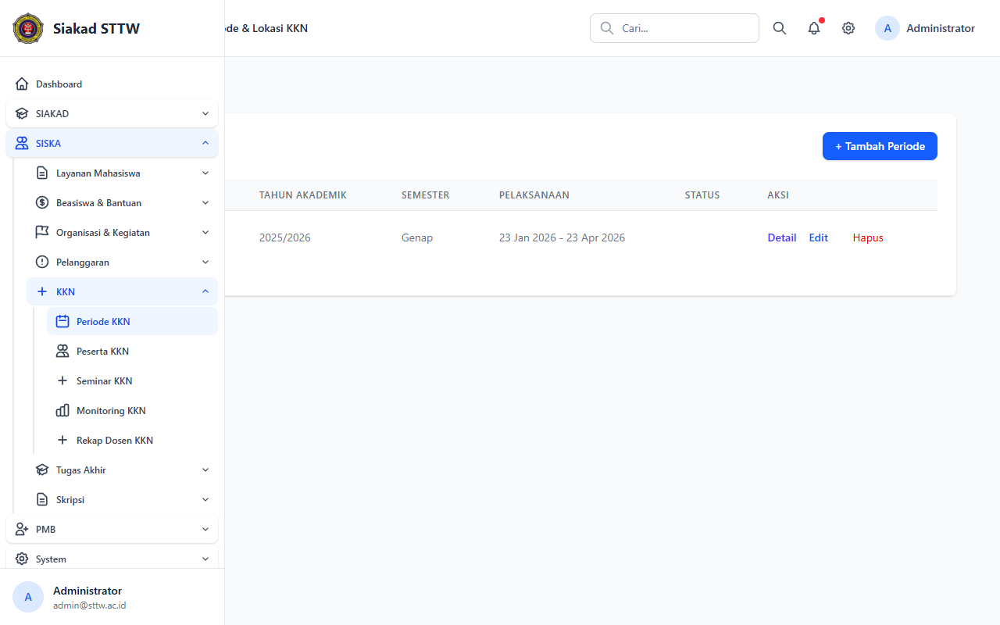
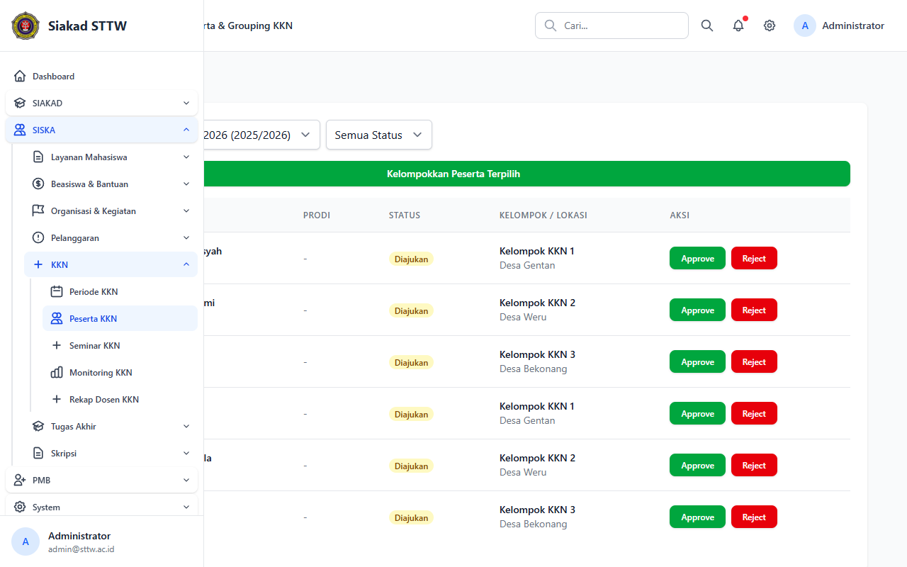
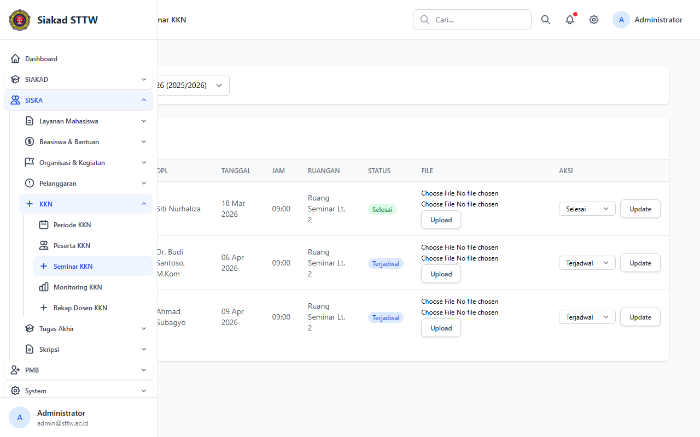
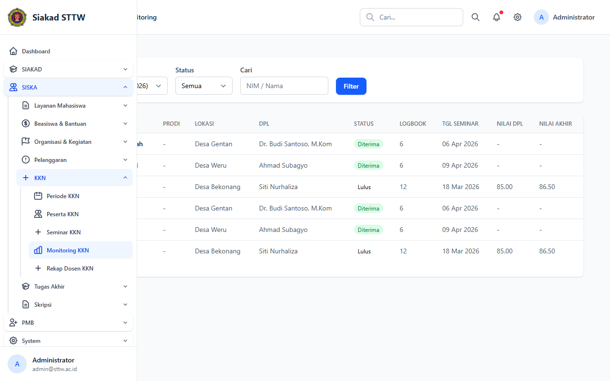
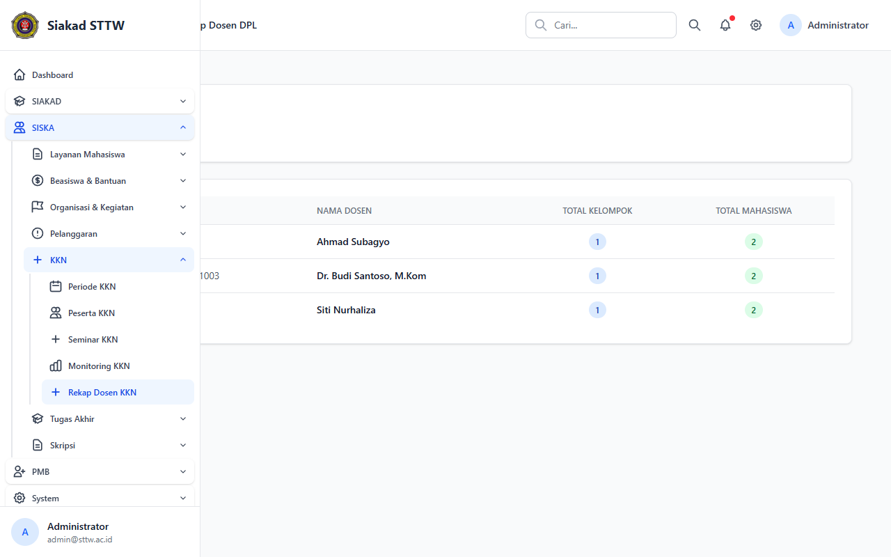

# KKN — Administrator

> Direkam: 2026-03-25  
> Role: **Administrator (admin@sttw.ac.id)**  
> Modul: **KKN (Kuliah Kerja Nyata)**  
> Status: ✅ Berhasil

## Ringkasan

Workflow KKN dari sisi administrator. Menampilkan manajemen periode dan lokasi, peserta dan pengelompokan, seminar, monitoring progress, serta rekap beban DPL.

## Halaman

| # | Halaman | URL | Status |
|---|---------|-----|--------|
| 01 | Periode & Lokasi KKN | `/siska/kkn/periode` | ✅ OK |
| 02 | Peserta & Grouping KKN | `/siska/kkn/peserta` | ✅ OK |
| 03 | Seminar KKN | `/siska/kkn/seminar` | ✅ OK |
| 04 | Monitoring KKN | `/siska/kkn/monitoring` | ✅ OK |
| 05 | Rekap Dosen DPL KKN | `/siska/kkn/rekap-dosen` | ✅ OK |

## Screenshots

### 1. Periode & Lokasi KKN

Manajemen batch KKN, lokasi, dan kuota per periode.

### 2. Peserta & Grouping KKN

Daftar peserta dan pengelompokan per lokasi KKN.

### 3. Seminar KKN

Jadwal dan manajemen seminar KKN.

### 4. Monitoring KKN

Dashboard monitoring progress KKN keseluruhan.

### 5. Rekap Dosen DPL KKN

Rekap beban bimbingan per DPL.

