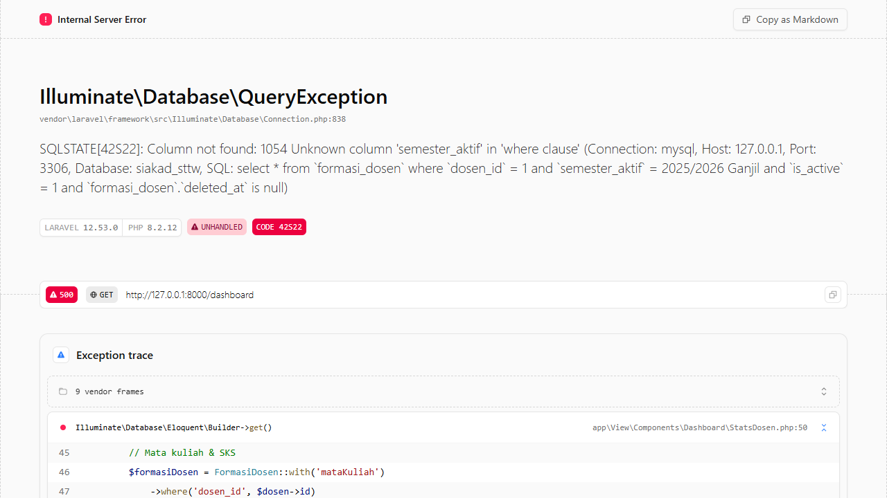
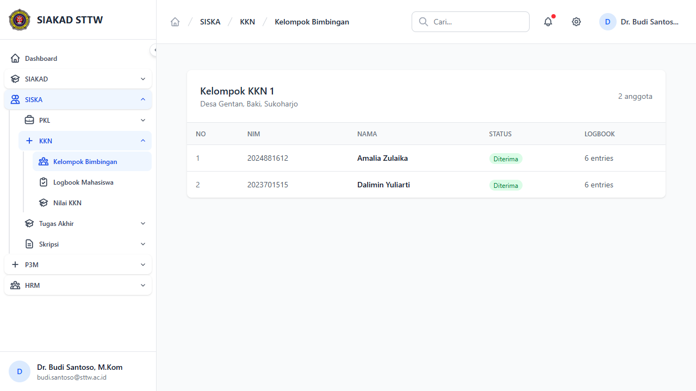
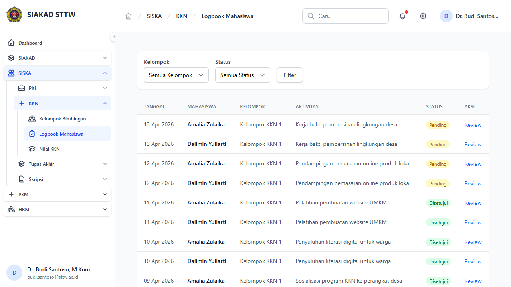
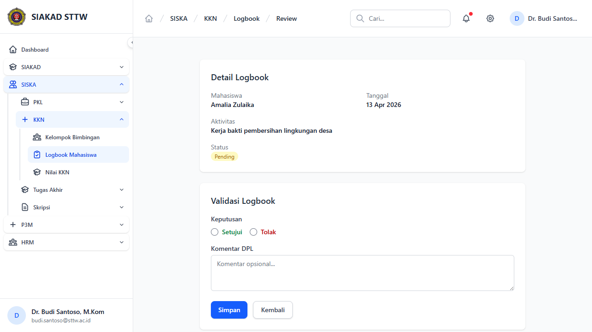
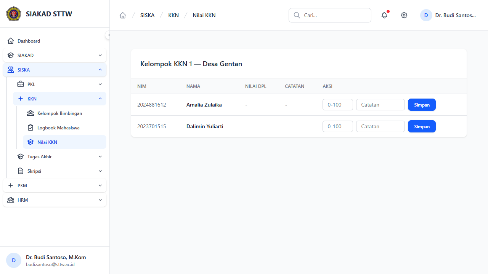

# Workflow Report: KKN — Dosen (DPL)

**Tanggal**: 2026-04-14
**Role**: Dosen (Dr. Budi Santoso, M.Kom — budi.santoso@sttw.ac.id)
**Modul**: SISKA — KKN
**Status**: ✅ Berhasil

## Ringkasan

Dokumentasi alur kerja dosen pembimbing lapangan (DPL) dalam modul KKN. Dosen DPL memiliki akses ke 3 halaman utama melalui prefix `/siska/kkn/dpl/`: **Kelompok Bimbingan** (participants), **Logbook Mahasiswa** (logbooks + review), dan **Nilai KKN** (nilai).

## Langkah-langkah

### 1. Login & Dashboard

- **URL**: `http://127.0.0.1:8000/dashboard`
- **Status**: ✅ Berhasil
- Login menggunakan state file `dosen-auth.json`, redirect otomatis ke dashboard.

---

### 2. Kelompok Bimbingan (DPL Participants)

- **URL**: `http://127.0.0.1:8000/siska/kkn/dpl/participants`
- **Page Title**: Kelompok Bimbingan KKN - SIAKAD STTW
- **Status**: ✅ Berhasil

Menampilkan daftar kelompok KKN yang dibimbing oleh dosen. Terdapat:
- **Kelompok KKN 1** — Desa Gentan, Baki, Sukoharjo
- Tabel berisi kolom: No, NIM, Nama, Status, Logbook
- Data mahasiswa:
  | No | NIM | Nama | Status | Logbook |
  |----|-----|------|--------|---------|
  | 1 | 2024881612 | Amalia Zulaika | Diterima | 6 entries |
  | 2 | 2023701515 | Dalimin Yuliarti | Diterima | 6 entries |
- Fitur search (textbox "Cari...") tersedia

---

### 3. Logbook Mahasiswa (DPL Logbooks)

- **URL**: `http://127.0.0.1:8000/siska/kkn/dpl/logbooks`
- **Page Title**: Logbook Mahasiswa KKN - SIAKAD STTW
- **Status**: ✅ Berhasil

Menampilkan daftar logbook mahasiswa bimbingan untuk di-review. Fitur:
- Filter berdasarkan DPL, Status, dan tombol "Filter"
- Tabel berisi kolom: Tanggal, Mahasiswa, Kelompok, Aktivitas, Status, Aksi
- Contoh data logbook:
  | Tanggal | Mahasiswa | Kelompok | Aktivitas | Status | Aksi |
  |---------|-----------|----------|-----------|--------|------|
  | 13 Apr 2026 | Amalia Zulaika | Kelompok KKN 1 | Kerja bakti pembersihan lingkungan desa | Pending | Review |
  | 13 Apr 2026 | Dalimin Yuliarti | Kelompok KKN 1 | Kerja bakti pembersihan lingkungan desa | Pending | Review |
  | 12 Apr 2026 | Amalia Zulaika | Kelompok KKN 1 | Pendampingan pemasaran online produk lokal | Pending | Review |
- Tombol "Review" mengarah ke halaman validasi logbook

---

### 4. Review Logbook (Detail Validasi)

- **URL**: `http://127.0.0.1:8000/siska/kkn/dpl/logbooks/6/validate`
- **Page Title**: Review Logbook KKN - SIAKAD STTW
- **Status**: ✅ Berhasil

Halaman detail untuk memvalidasi logbook individual. Terdiri dari:
- **Detail Logbook**: informasi Mahasiswa, Tanggal, Aktivitas, Status
- **Validasi Logbook**: form dengan pilihan:
  - Radio button: **Setujui** / **Tolak**
  - Textbox: Komentar opsional
  - Tombol: **Simpan**

---

### 5. Nilai KKN (DPL Nilai)

- **URL**: `http://127.0.0.1:8000/siska/kkn/dpl/nilai`
- **Page Title**: Nilai KKN - SIAKAD STTW
- **Status**: ✅ Berhasil

Halaman input nilai KKN per kelompok. Terdapat:
- Heading: **Kelompok KKN 1 — Desa Gentan**
- Filter berdasarkan DPL
- Tabel berisi kolom: NIM, Nama, Nilai DPL, Catatan, Aksi
- Setiap baris memiliki:
  - **Spinbutton** untuk input nilai
  - **Textbox** "Catatan" untuk catatan penilaian
  - **Tombol "Simpan"** per mahasiswa
- Data mahasiswa:
  | NIM | Nama | Nilai DPL | Catatan |
  |-----|------|-----------|---------|
  | 2024881612 | Amalia Zulaika | - | - |
  | 2023701515 | Dalimin Yuliarti | - | - |

---

## Ringkasan Akses DPL

| Halaman | URL | Status |
|---------|-----|--------|
| Dashboard | `/dashboard` | ✅ Berhasil |
| Kelompok Bimbingan | `/siska/kkn/dpl/participants` | ✅ Berhasil |
| Logbook Mahasiswa | `/siska/kkn/dpl/logbooks` | ✅ Berhasil |
| Review Logbook | `/siska/kkn/dpl/logbooks/{id}/validate` | ✅ Berhasil |
| Nilai KKN | `/siska/kkn/dpl/nilai` | ✅ Berhasil |

## Catatan

1. **Route structure**: Rute DPL KKN berada di prefix `/siska/kkn/dpl/`, bukan `/siska/dosen/kkn/` seperti yang mungkin diharapkan. Ini konsisten dengan controller `Siska\Kkn\DplController`.

2. **Data tersedia**: Terdapat data test yang cukup — 2 mahasiswa (Amalia Zulaika, Dalimin Yuliarti) dengan masing-masing 6 logbook entries di Kelompok KKN 1 (Desa Gentan, Baki, Sukoharjo).

3. **Logbook status**: Semua logbook yang ditampilkan berstatus "Pending" — belum ada yang di-review/validasi oleh DPL.

4. **Nilai belum diinput**: Semua nilai DPL masih kosong (ditampilkan sebagai "-").

5. **Tidak ada bug/error 500**: Semua halaman yang accessible berfungsi normal.
