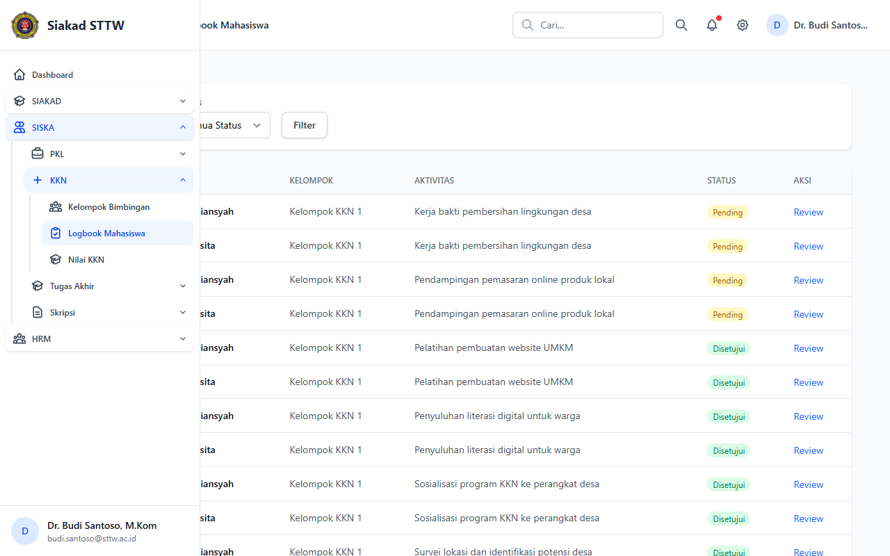
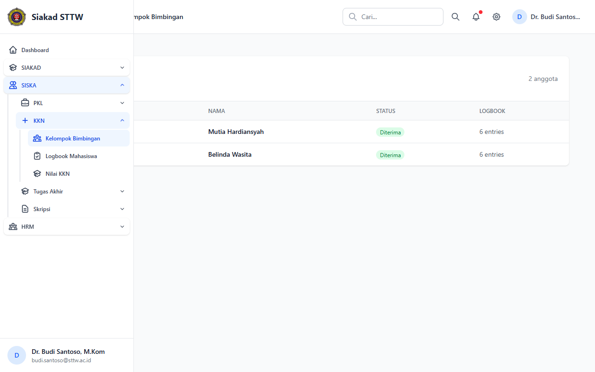
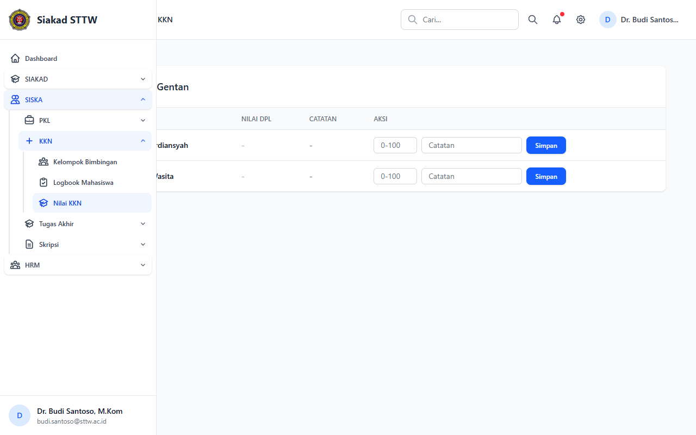

# KKN — Dosen DPL (Dr. Budi Santoso, M.Kom)

> Direkam: 2026-03-25  
> Role: **Dosen (budi.santoso@sttw.ac.id)**  
> Modul: **KKN**  
> Status: ✅ Berhasil

## Ringkasan

Workflow KKN dari sisi Dosen Pembimbing Lapangan (DPL). Menampilkan logbook mahasiswa bimbingan, daftar peserta kelompok, dan form penilaian KKN.

## Halaman

| # | Halaman | URL | Status |
|---|---------|-----|--------|
| 01 | Logbook Mahasiswa KKN | `/siska/kkn/dpl/logbooks` | ✅ OK |
| 02 | Kelompok Bimbingan KKN | `/siska/kkn/dpl/participants` | ✅ OK |
| 03 | Input Nilai KKN | `/siska/kkn/dpl/nilai` | ✅ OK |

## Screenshots

### 1. Logbook Mahasiswa KKN

Daftar logbook mahasiswa bimbingan KKN.

### 2. Kelompok Bimbingan KKN

Daftar peserta dalam kelompok DPL.

### 3. Input Nilai KKN

Form penilaian mahasiswa KKN.

