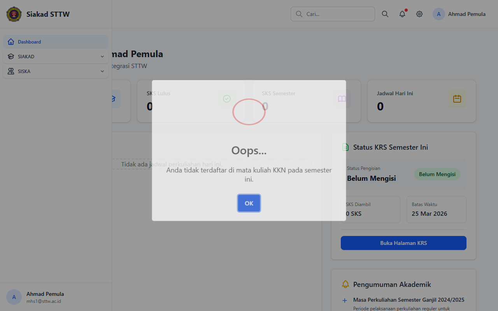

# KKN — Mahasiswa (Ahmad Pemula)

> Direkam: 2026-03-25  
> Role: **Mahasiswa (mhs1@sttw.ac.id)**  
> Modul: **KKN (Kuliah Kerja Nyata)**  
> Status: ⚠️ Tidak Eligible

## Ringkasan

Workflow KKN dari sisi mahasiswa. Mahasiswa tidak dapat mengakses modul KKN karena belum memiliki KRS yang disetujui untuk mata kuliah KKN/Kuliah Kerja Nyata. Middleware `EnsureSiskaEligible` mencegah akses.

## Halaman

| # | Halaman | URL | Status |
|---|---------|-----|--------|
| 01 | Cek Eligibilitas KKN | `/siska/kkn` | ⚠️ Tidak Eligible |

## Screenshots

### 1. Cek Eligibilitas KKN

Muncul dialog "Anda tidak terdaftar di mata kuliah KKN pada semester ini" yang mencegah mahasiswa mengakses fitur KKN.

## Catatan

- Mahasiswa ini belum memiliki KRS yang disetujui untuk mata kuliah KKN/Kuliah Kerja Nyata
- Middleware `EnsureSiskaEligible` mencegah akses
