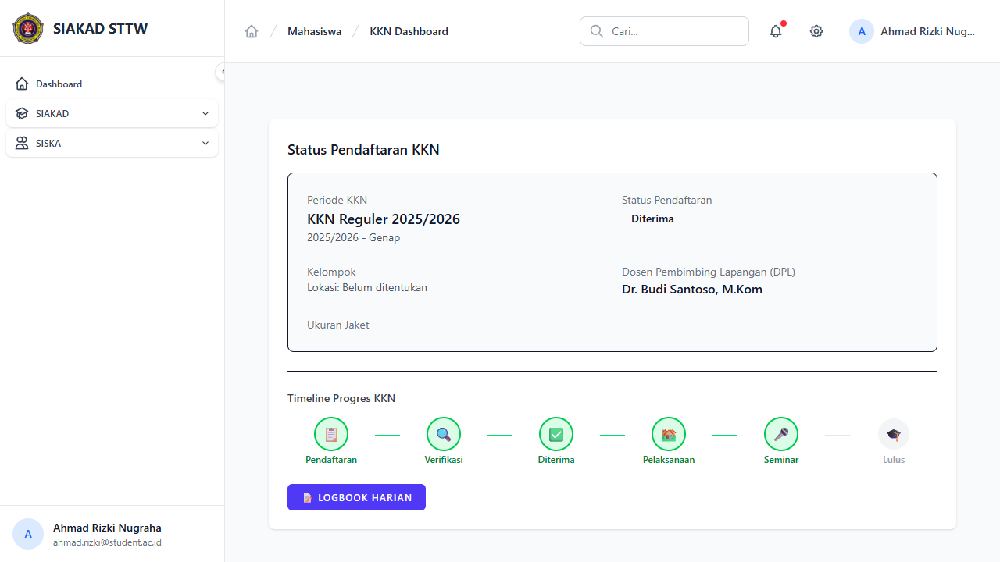
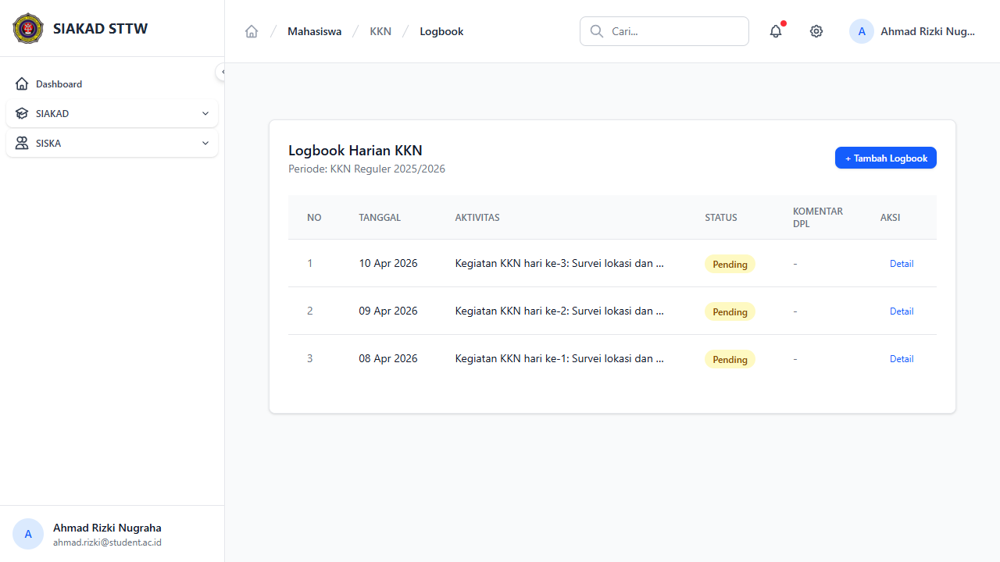
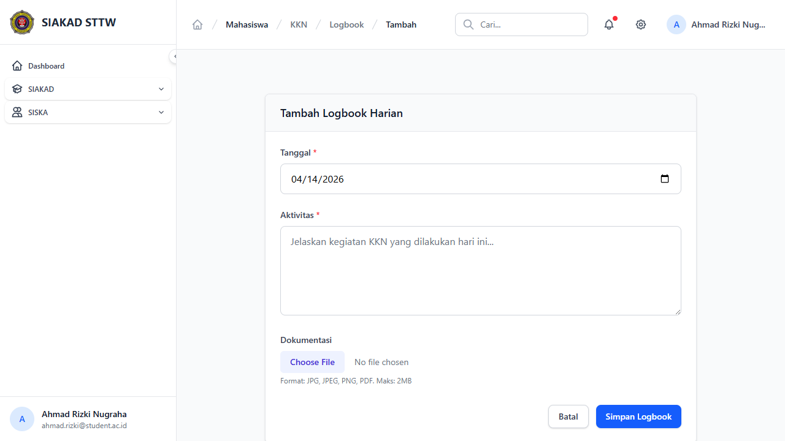
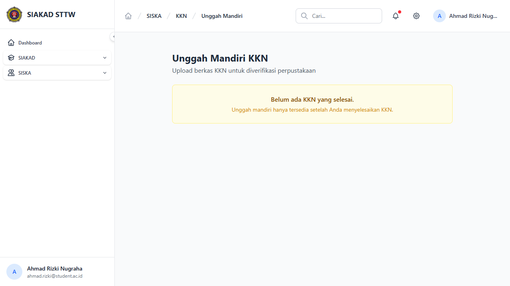
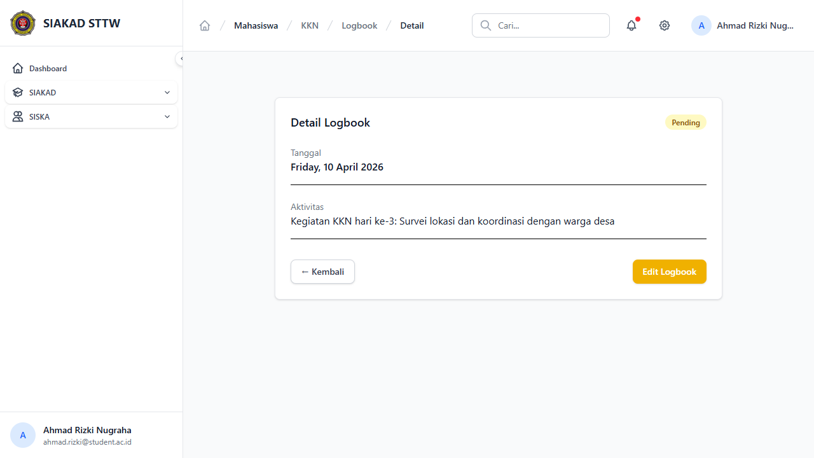

# Workflow Report: KKN — Mahasiswa

**Tanggal**: 2026-04-14
**Role**: Mahasiswa (ahmad.rizki@student.ac.id — Ahmad Rizki Nugraha, 202110001)
**Modul**: SISKA — KKN
**Status**: ✅ Berhasil (5/5 halaman OK)

## Ringkasan

Dokumentasi alur kerja mahasiswa dalam modul KKN. Ahmad memiliki registrasi KKN dengan status "diterima" (group_id=1) dan 3 logbook. Akses ke modul ini memerlukan mata kuliah "KKN" dalam KRS yang disetujui.

## Langkah-langkah

### 1. KKN Dashboard
**URL**: `/siska/kkn/`
**Status**: ✅ OK

Halaman KKN Dashboard mahasiswa. Menampilkan status registrasi KKN dan informasi grup/kelompok yang ditugaskan.

---

### 2. Logbook KKN — Daftar
**URL**: `/siska/kkn/mahasiswa/logbook`
**Status**: ✅ OK

Daftar logbook KKN mahasiswa. Tabel: No, Tanggal, Kegiatan, Status Validasi, Komentar Dosen, Aksi. Tombol "Tambah Logbook" tersedia.

---

### 3. Tambah Logbook KKN
**URL**: `/siska/kkn/mahasiswa/logbook/create`
**Status**: ✅ OK

Form input logbook KKN baru:
- **Tanggal**: Date picker
- **Kegiatan**: Textarea deskripsi kegiatan KKN
- **File Pendukung**: Upload lampiran (opsional)

---

### 4. Unggah Mandiri KKN
**URL**: `/siska/kkn/unggah-mandiri`
**Status**: ✅ OK

Halaman unggah berkas KKN mandiri untuk perpustakaan. Mahasiswa yang sudah menyelesaikan KKN dapat mengunggah file laporan final.

---

### 5. Logbook Detail
**URL**: `/siska/kkn/mahasiswa/logbook/{id}`
**Status**: ✅ OK

Detail logbook KKN. Menampilkan informasi kegiatan, tanggal, file pendukung, status validasi dosen, dan komentar.

---

## Catatan

- Semua halaman mahasiswa KKN berfungsi tanpa error
- Bug `kknGroup` → `group` relationship telah diperbaiki (sebelumnya menyebabkan RelationNotFoundException)
- Ahmad terdaftar di KKN group 1 dengan 3 logbook
- Akses memerlukan mata kuliah "KKN" di KRS aktif (Disetujui)
