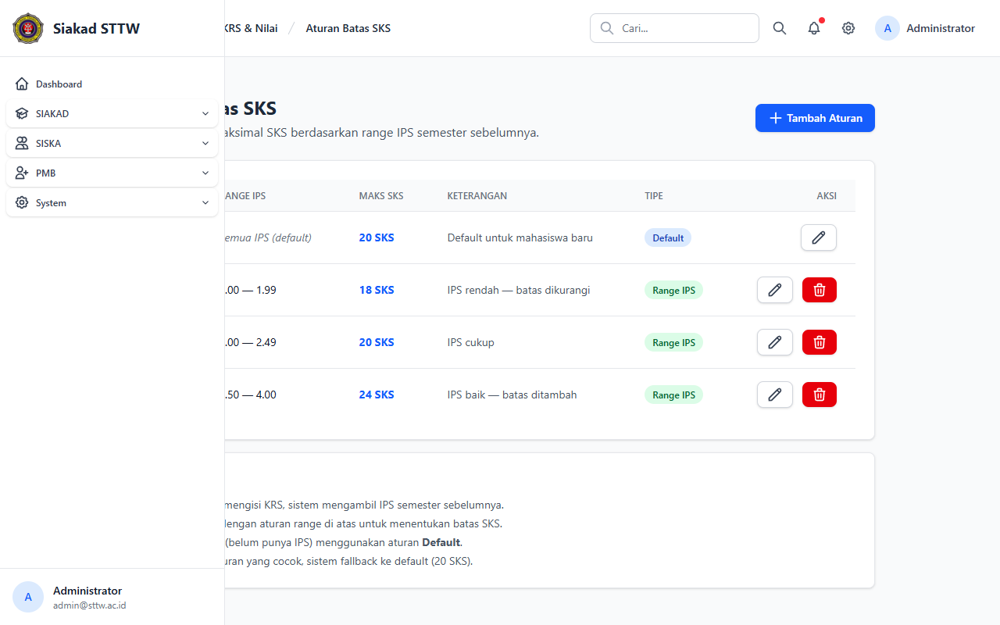
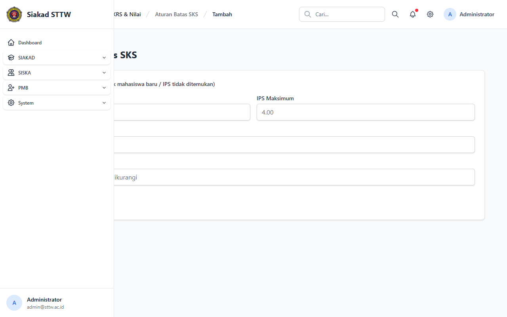

# KRS — Administrator (Batas SKS)

> Direkam: 2026-03-25  
> Role: **Administrator (admin@sttw.ac.id)**  
> Modul: **KRS - Aturan Batas SKS**  
> Status: ✅ Berhasil

## Ringkasan

Workflow pengelolaan aturan batas SKS oleh administrator. Menampilkan CRUD lengkap untuk mengatur batas maksimal SKS berdasarkan rentang IPS mahasiswa. Dikelola oleh Waket1/admin.

## Halaman

| # | Halaman | URL | Status |
|---|---------|-----|--------|
| 01 | Daftar Aturan Batas SKS | `/krs/batas-sks` | ✅ OK |
| 02 | Form Tambah Aturan Batas SKS | `/krs/batas-sks/create` | ✅ OK |

## Screenshots

### 1. Daftar Aturan Batas SKS

Daftar aturan batas SKS menampilkan tabel aturan berdasarkan rentang IPS dengan maksimal SKS yang diperbolehkan.

### 2. Form Tambah Aturan Batas SKS

Form tambah aturan batas SKS baru dengan input IPS min/max, maks SKS, dan keterangan.

## Catatan

- CRUD lengkap untuk mengelola aturan batas SKS
- Dikelola oleh Waket1/admin
- Aturan default tidak dapat dihapus
