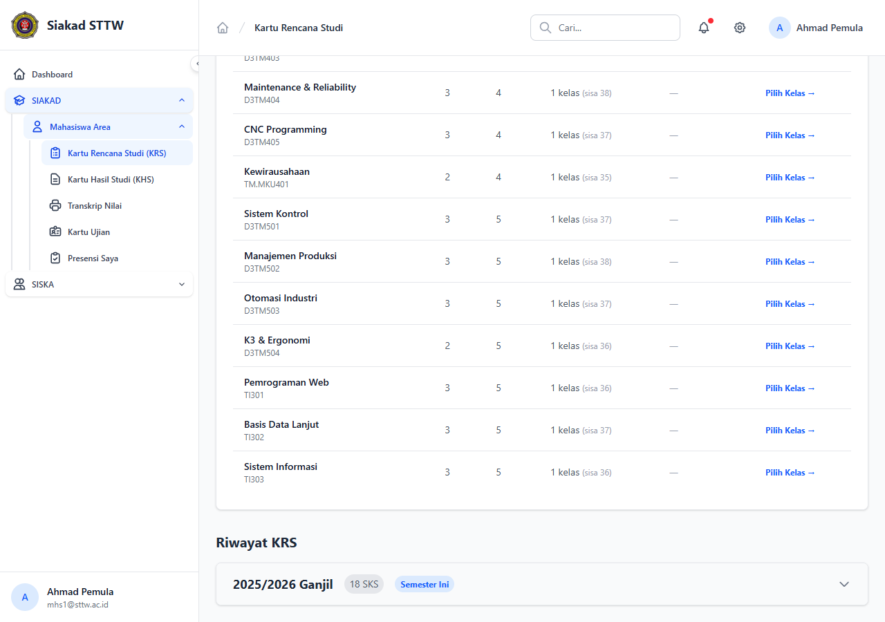
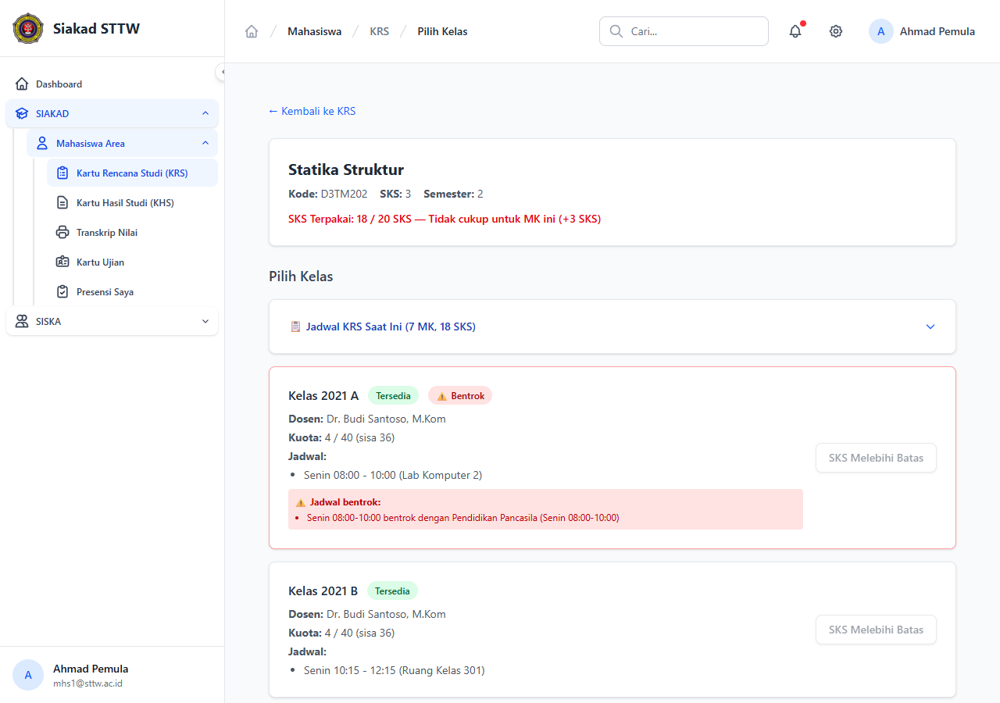
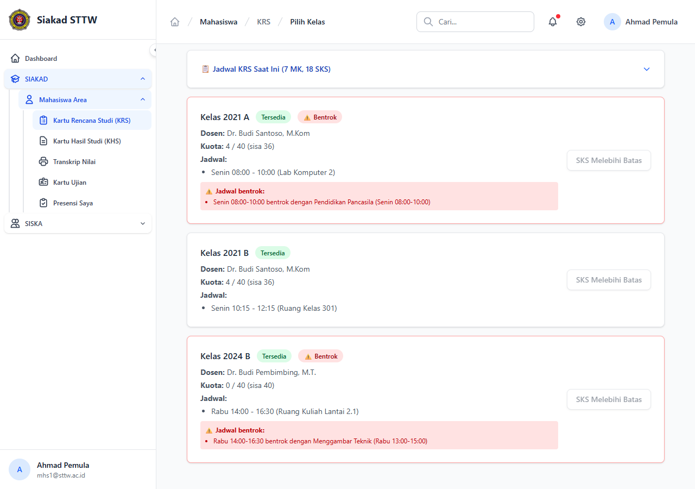
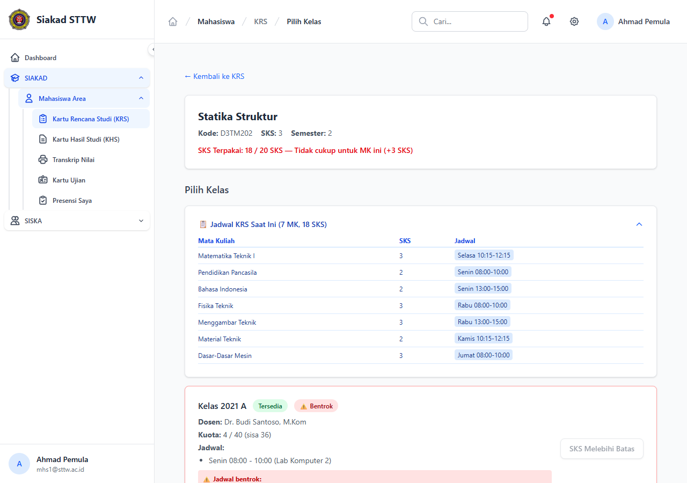
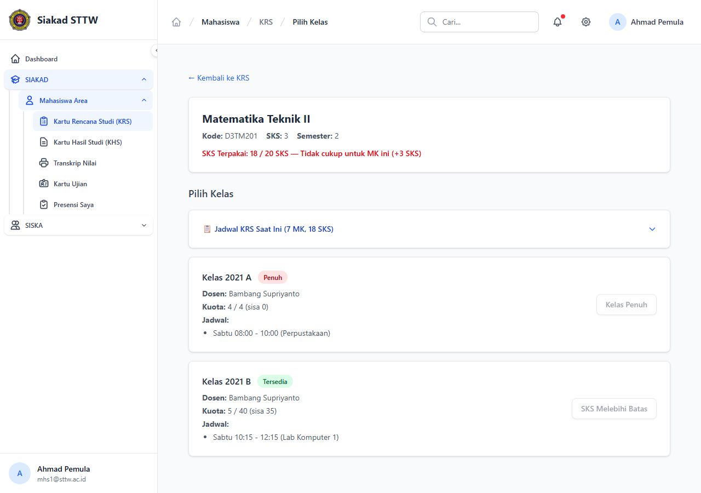
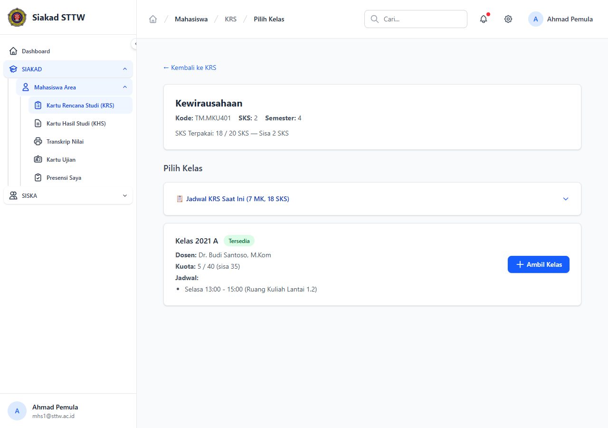
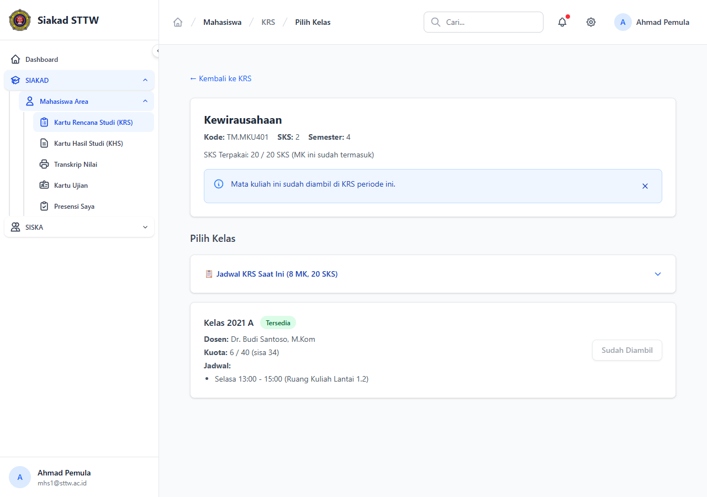
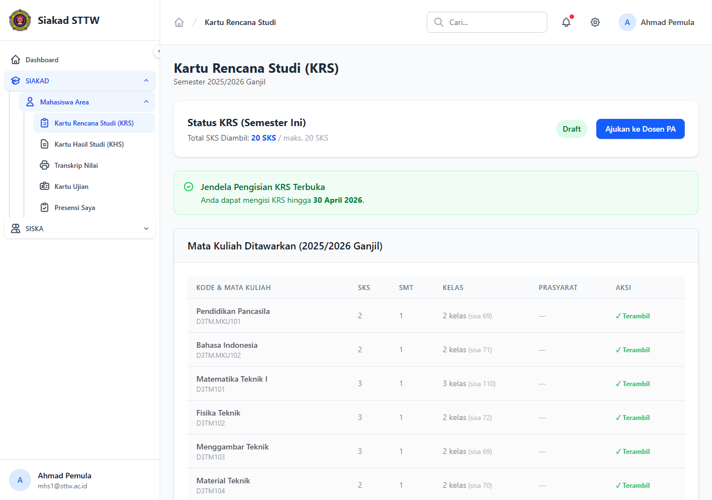
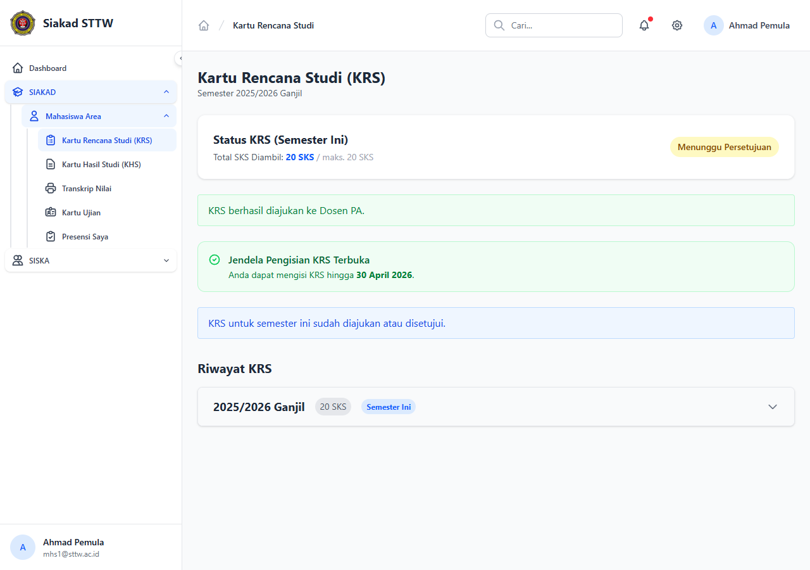

# Workflow Report: Pengisian KRS Mahasiswa

**Tanggal**: 2026-03-25
**Role**: Mahasiswa (Ahmad Pemula / mhs1@sttw.ac.id)
**Modul**: SIAKAD — Kartu Rencana Studi (KRS)
**Status**: ✅ Berhasil

## Ringkasan

Workflow lengkap pengisian KRS oleh mahasiswa, termasuk:
- Melihat daftar mata kuliah yang ditawarkan
- Memilih kelas dengan informasi kuota, jadwal, dan dosen
- Mendeteksi jadwal bentrok secara visual
- Mendeteksi kelas penuh
- Mendeteksi batas SKS terlampaui
- Mengambil kelas yang tersedia
- Mengajukan KRS ke Dosen PA

## Langkah-langkah

### 1. Halaman Utama KRS — Daftar Mata Kuliah

Mahasiswa membuka halaman KRS. Terlihat status **Draft** dengan **18 SKS** terambil dari maksimal 20 SKS. Jendela pengisian KRS terbuka hingga 30 April 2026. Mata kuliah yang sudah diambil ditandai "✓ Terambil".

### 2. Scroll — Mata Kuliah yang Tersedia

Pada bagian bawah, terlihat mata kuliah yang belum diambil dengan link "Pilih Kelas →" untuk memilih kelas. Termasuk Riwayat KRS semester ini (18 SKS).

### 3. Skenario: Jadwal Bentrok + SKS Melebihi Batas

Mahasiswa klik "Pilih Kelas →" pada **Statika Struktur** (3 SKS). Halaman menampilkan:
- **SKS merah**: "18 / 20 SKS — Tidak cukup untuk MK ini (+3 SKS)" karena 18+3=21 > 20
- **Jadwal KRS Saat Ini**: Collapsible card menampilkan 7 MK yang sudah diambil
- **Kelas 2021 A**: Badge "⚠ Bentrok" — jadwal Senin 08:00-10:00 bentrok dengan Pendidikan Pancasila
- Tombol disabled "SKS Melebihi Batas"

### 4. Detail Semua Kelas dengan Indikator Bentrok

Scroll ke bawah menampilkan semua kelas Statika Struktur:
- **Kelas 2021 A**: Bentrok (Senin 08:00-10:00 vs Pendidikan Pancasila)
- **Kelas 2021 B**: Tidak bentrok tapi SKS melebihi batas
- **Kelas 2024 B**: Bentrok (Rabu 14:00-16:30 vs Menggambar Teknik 13:00-15:00)

Setiap konflik ditampilkan detail di box merah di bawah jadwal kelas.

### 5. Jadwal KRS Saat Ini (Expanded)

Mahasiswa membuka card "📋 Jadwal KRS Saat Ini" untuk melihat jadwal lengkap 7 MK yang sudah diambil. Tabel menampilkan nama MK, SKS, dan jadwal dengan badge hari/waktu.

### 6. Skenario: Kelas Penuh

Mahasiswa membuka **Matematika Teknik II** (3 SKS). Terlihat:
- **Kelas 2021 A**: Badge merah "Penuh" — kuota 4/4 (sisa 0), tombol disabled "Kelas Penuh"
- **Kelas 2021 B**: Tersedia (5/40) tapi tombol disabled "SKS Melebihi Batas" karena 18+3 > 20

### 7. Skenario: Mengambil Kelas yang Tersedia

Mahasiswa membuka **Kewirausahaan** (2 SKS). SKS cukup: 18+2=20 ≤ 20, ditampilkan "Sisa 2 SKS". Kelas 2021 A tersedia dengan jadwal Selasa 13:00-15:00, tidak bentrok. Tombol biru "+ Ambil Kelas" aktif.

### 8. Berhasil Mengambil Kelas

Setelah klik "Ambil Kelas" dan konfirmasi, halaman menampilkan:
- Info "Mata kuliah ini sudah diambil di KRS periode ini"
- SKS menjadi "20 / 20 SKS (MK ini sudah termasuk)"
- Jadwal KRS Saat Ini menjadi **8 MK, 20 SKS**
- Tombol berubah menjadi "Sudah Diambil" (disabled)

### 9. KRS Lengkap — Siap Diajukan

Kembali ke halaman utama KRS. Status **Draft** dengan **20 SKS** (maksimal). Semua 8 mata kuliah ditandai "✓ Terambil". Tombol "Ajukan ke Dosen PA" tersedia.

### 10. KRS Diajukan — Menunggu Persetujuan

Setelah klik "Ajukan ke Dosen PA", status berubah menjadi **Menunggu Persetujuan** (badge kuning). Pesan sukses "KRS berhasil diajukan ke Dosen PA" ditampilkan. Mahasiswa menunggu persetujuan dari Dosen Pembimbing Akademik.

## Fitur yang Diuji

| Fitur | Status | Keterangan |
|-------|--------|------------|
| Daftar MK yang ditawarkan | ✅ | Grouped by MK, menampilkan kelas & sisa kuota |
| Pilih kelas (2-page flow) | ✅ | SSR, halaman terpisah per MK |
| Jadwal KRS saat ini | ✅ | Collapsible card, menampilkan semua jadwal |
| Deteksi jadwal bentrok | ✅ | Badge "⚠ Bentrok" + detail box merah |
| Deteksi kelas penuh | ✅ | Badge "Penuh" + tombol disabled |
| Deteksi batas SKS | ✅ | Pesan merah + tombol disabled |
| Ambil kelas | ✅ | Konfirmasi dialog + redirect |
| Status "Sudah Diambil" | ✅ | Tombol disabled, pesan info |
| Ajukan ke Dosen PA | ✅ | Draft → Pending (Menunggu Persetujuan) |
| Info SKS kontekstual | ✅ | Berbeda untuk MK yang sudah/belum diambil |

## Catatan

- Batas SKS ditentukan berdasarkan IPS semester sebelumnya (tabel `batas_sks_rules`)
- Default batas SKS = 20 untuk mahasiswa baru (belum ada IPS)
- Jadwal bentrok dideteksi secara overlap waktu (bukan hanya jam mulai yang sama)
- Self-conflict (bentrok dengan MK sendiri) sudah di-exclude dari deteksi
- Status flow: Draft → Pending (Menunggu Persetujuan) → Disetujui/Ditolak oleh Dosen PA
