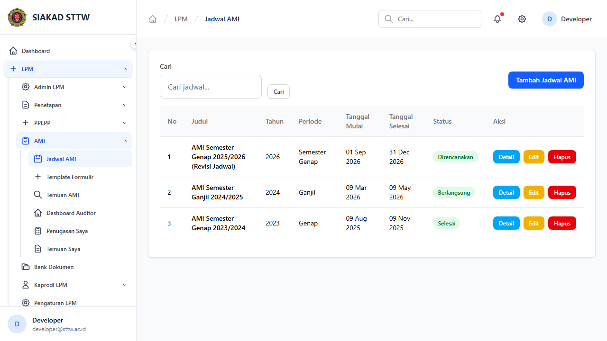
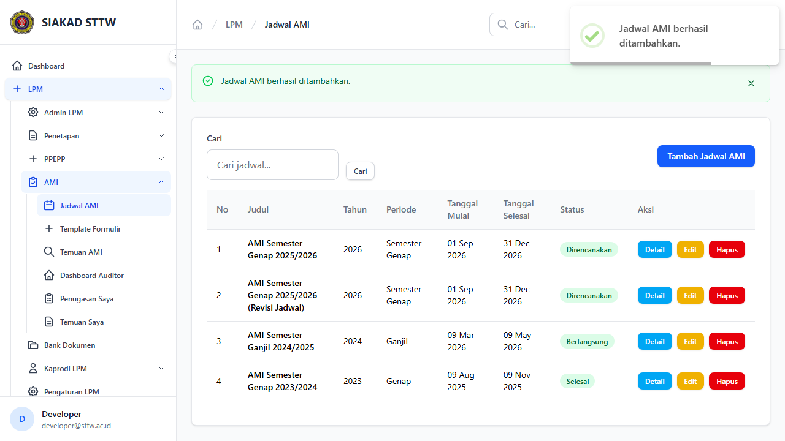
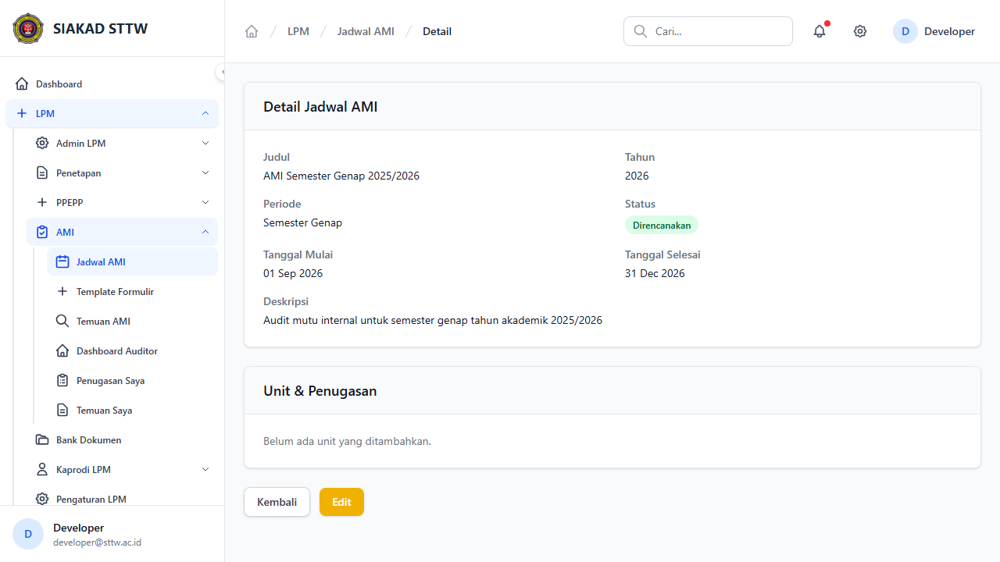
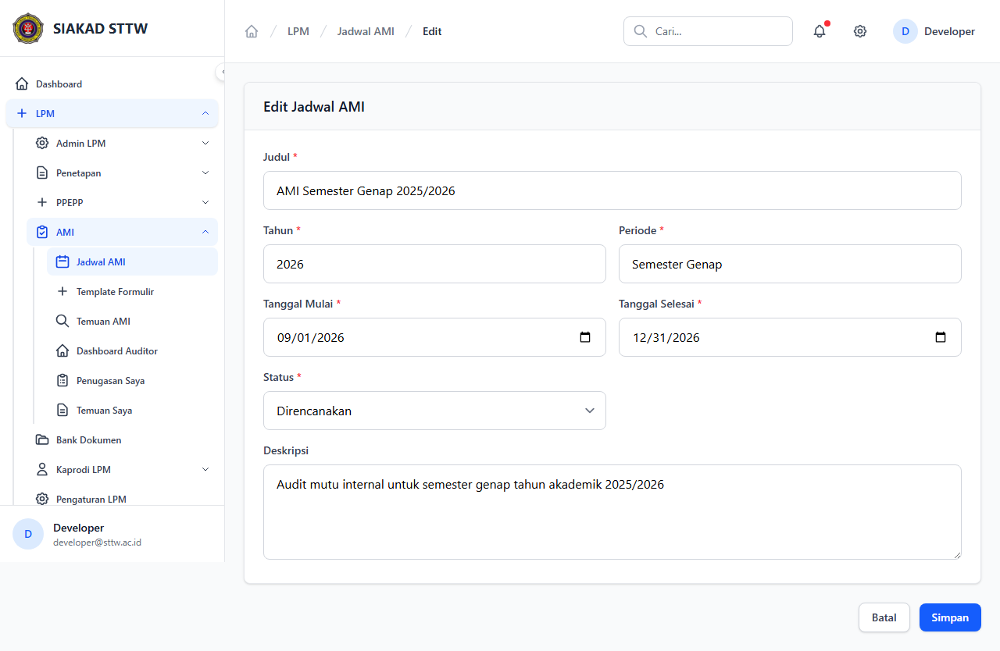
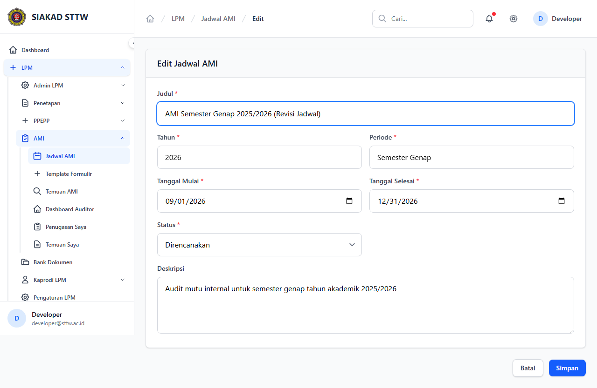
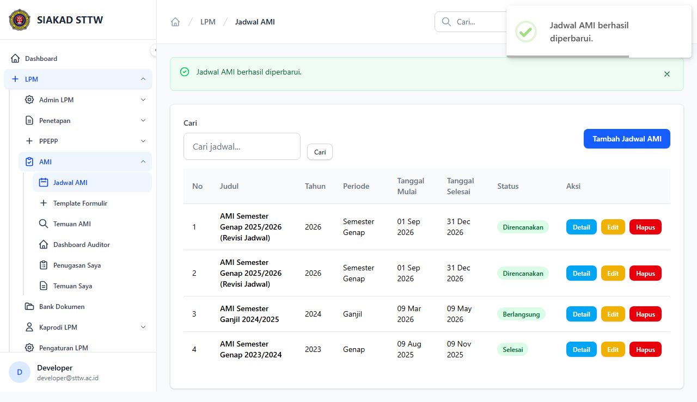

# Workflow Report: Jadwal AMI

**Tanggal**: 2026-04-09  
**Role**: Admin LPM  
**Modul**: LPM > AMI  
**Status**: ✅ Berhasil

## Ringkasan

Mengelola jadwal Audit Mutu Internal (AMI), termasuk unit yang diaudit dan penugasan auditor.

## Langkah-langkah

### 1. Daftar Jadwal AMI

Tabel jadwal AMI dengan tahun, periode, dan status.

### 2. Form Tambah Jadwal (Kosong)

Form pembuatan jadwal AMI baru.

### 3. Form Tambah Jadwal (Terisi)

Form terisi data AMI semester genap.

### 4. Jadwal Berhasil Ditambahkan

Redirect ke index setelah submit.

### 5. Detail Jadwal AMI

Detail jadwal AMI menampilkan daftar unit dan penugasan auditor.

### 6. Form Edit Jadwal

Form edit jadwal AMI.

### 7. Form Edit (Dimodifikasi)

Judul jadwal diperbarui.

### 8. Jadwal Berhasil Diperbarui

Redirect dengan notifikasi sukses.

## Catatan

- Screenshot diambil secara otomatis menggunakan Playwright
- Data yang ditampilkan adalah dummy data dari LpmDummySeeder
