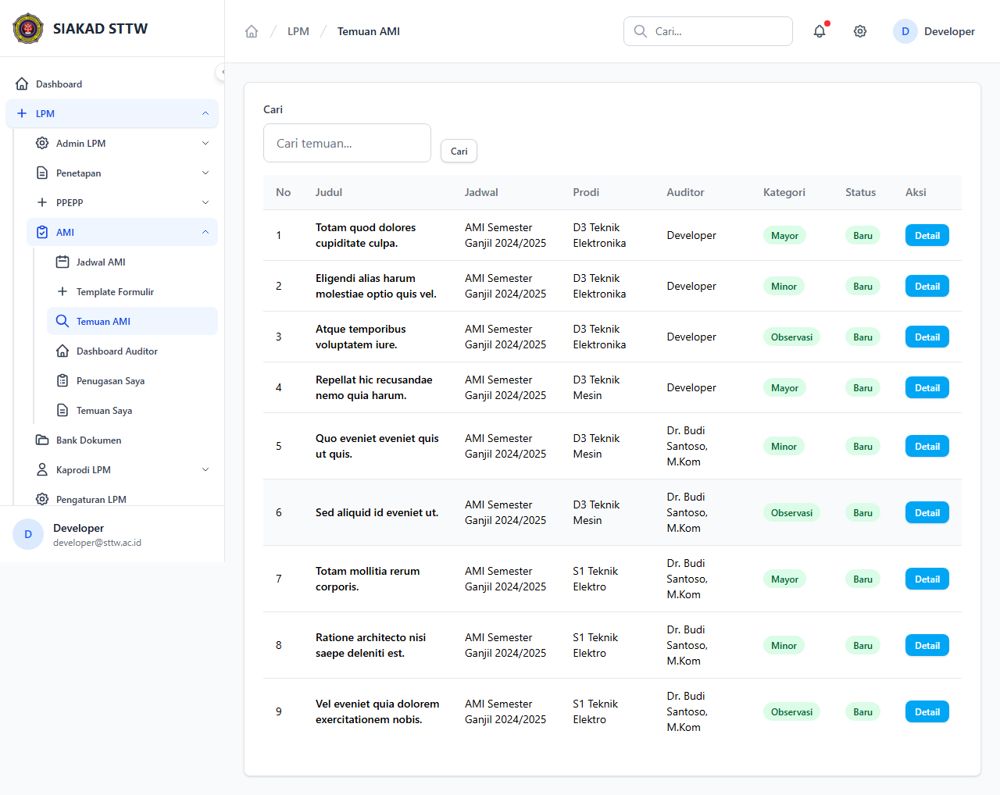
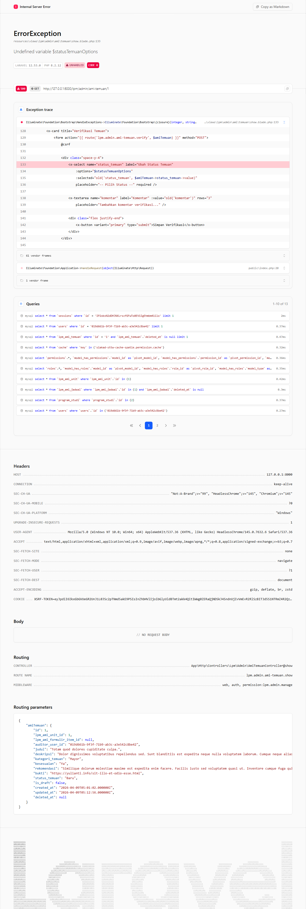

# Workflow Report: Temuan AMI (Admin)

**Tanggal**: 2026-04-09  
**Role**: Admin LPM  
**Modul**: LPM > AMI  
**Status**: ✅ Berhasil

## Ringkasan

Melihat dan memverifikasi seluruh temuan AMI dari semua unit dan jadwal.

## Langkah-langkah

### 1. Daftar Temuan AMI

Tabel seluruh temuan AMI dengan filter status dan kategori.

### 2. Detail Temuan

Detail temuan menampilkan deskripsi, rekomendasi, bukti, dan tindak lanjut.

## Catatan

- Screenshot diambil secara otomatis menggunakan Playwright
- Data yang ditampilkan adalah dummy data dari LpmDummySeeder
