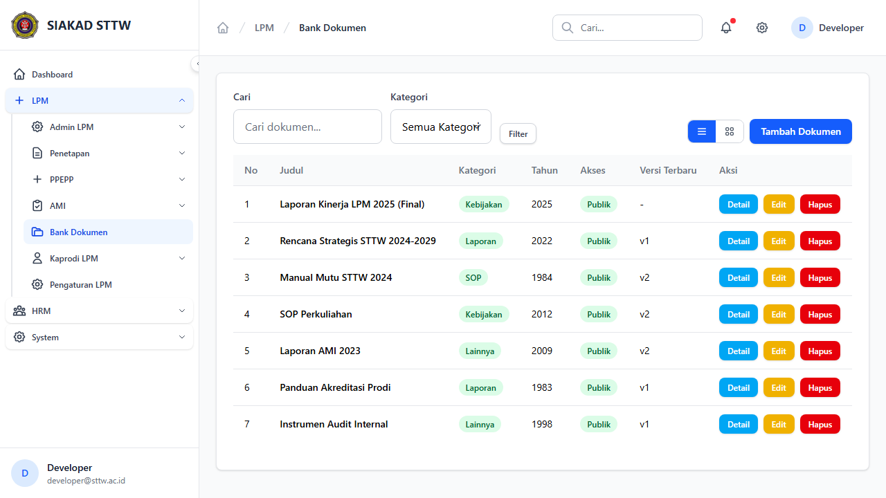
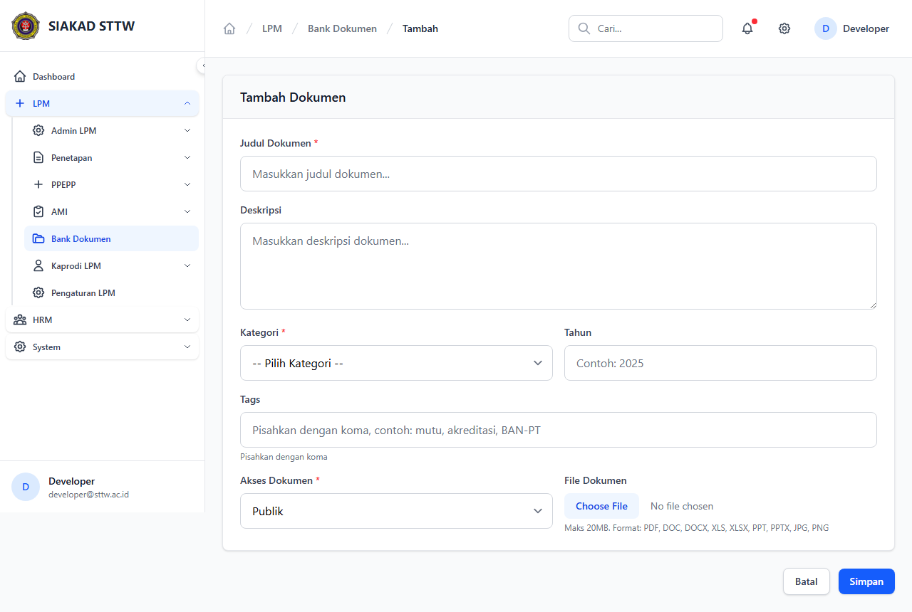
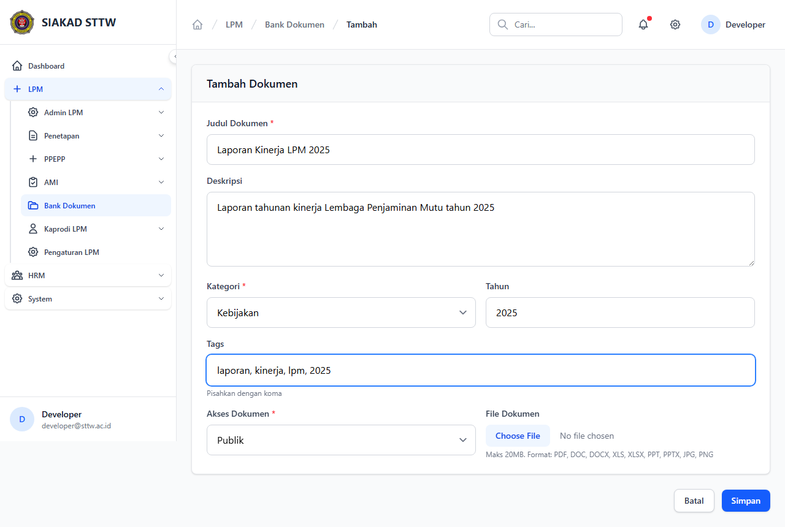
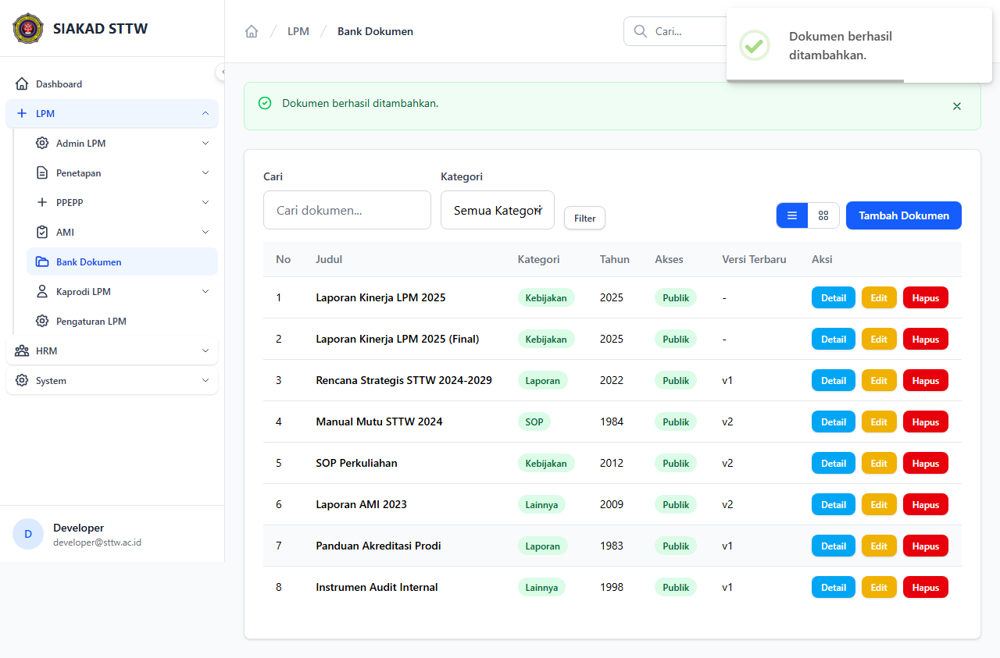
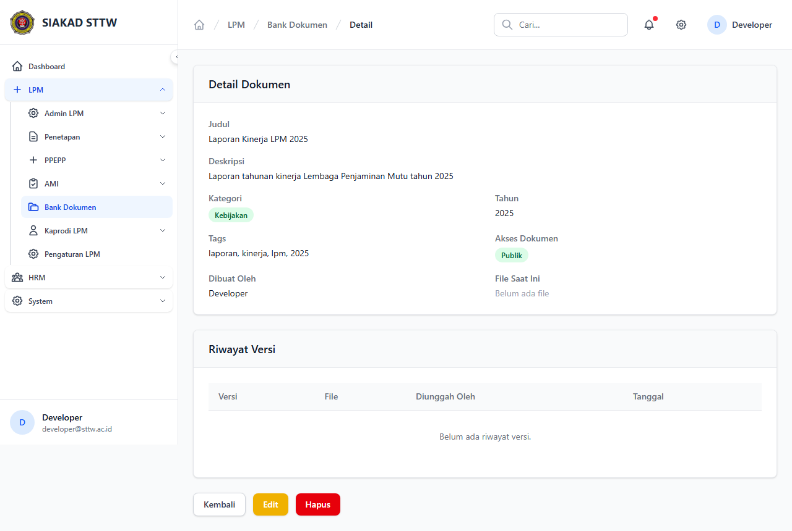
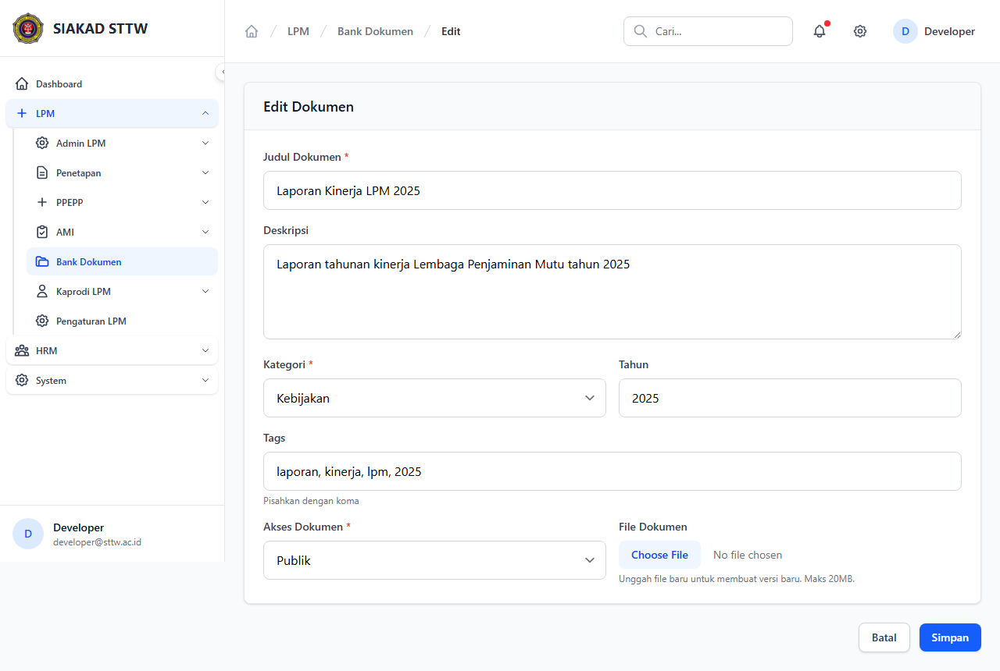
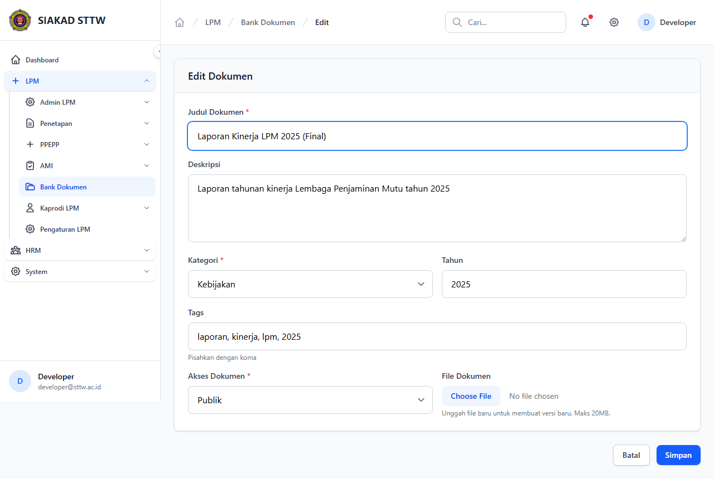
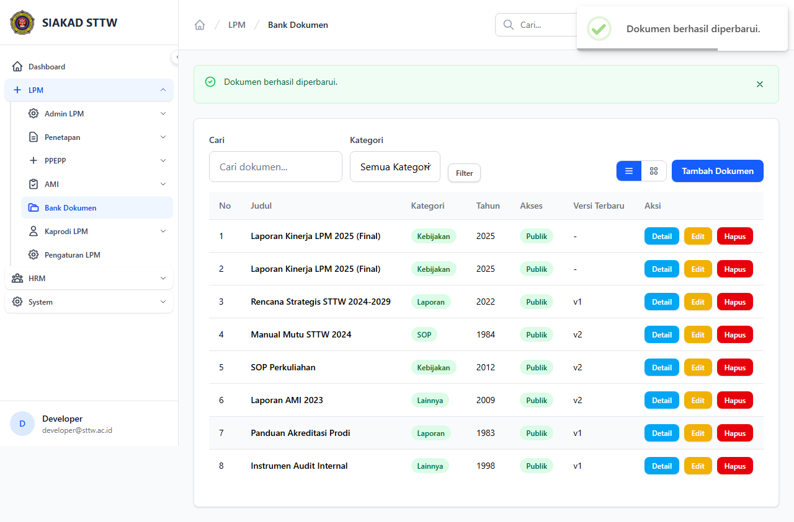

# Workflow Report: Bank Dokumen

**Tanggal**: 2026-04-09  
**Role**: Admin LPM  
**Modul**: LPM > Bank Dokumen  
**Status**: ✅ Berhasil

## Ringkasan

Mengelola bank dokumen LPM dengan kategorisasi, pencarian, dan versioning.

## Langkah-langkah

### 1. Daftar Dokumen

Halaman bank dokumen dengan pencarian, filter kategori, dan daftar dokumen.

### 2. Form Tambah Dokumen (Kosong)

Form upload dokumen baru dengan kategori dan tag.

### 3. Form Tambah Dokumen (Terisi)

Form terisi data laporan kinerja LPM.

### 4. Dokumen Berhasil Ditambahkan

Redirect ke index setelah submit.

### 5. Detail Dokumen

Detail dokumen menampilkan riwayat versi dan informasi lengkap.

### 6. Form Edit Dokumen

Form edit dokumen.

### 7. Form Edit (Dimodifikasi)

Judul dokumen diperbarui.

### 8. Dokumen Berhasil Diperbarui

Redirect dengan notifikasi sukses.

## Catatan

- Screenshot diambil secara otomatis menggunakan Playwright
- Data yang ditampilkan adalah dummy data dari LpmDummySeeder
