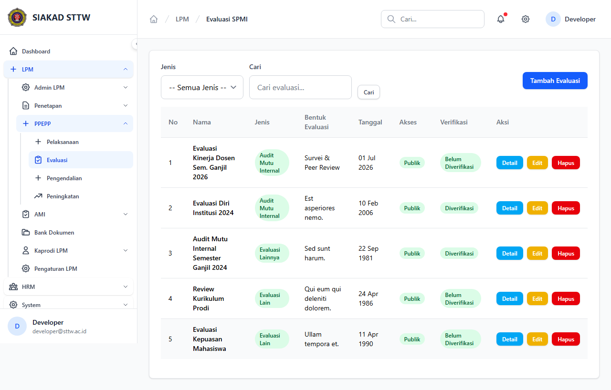
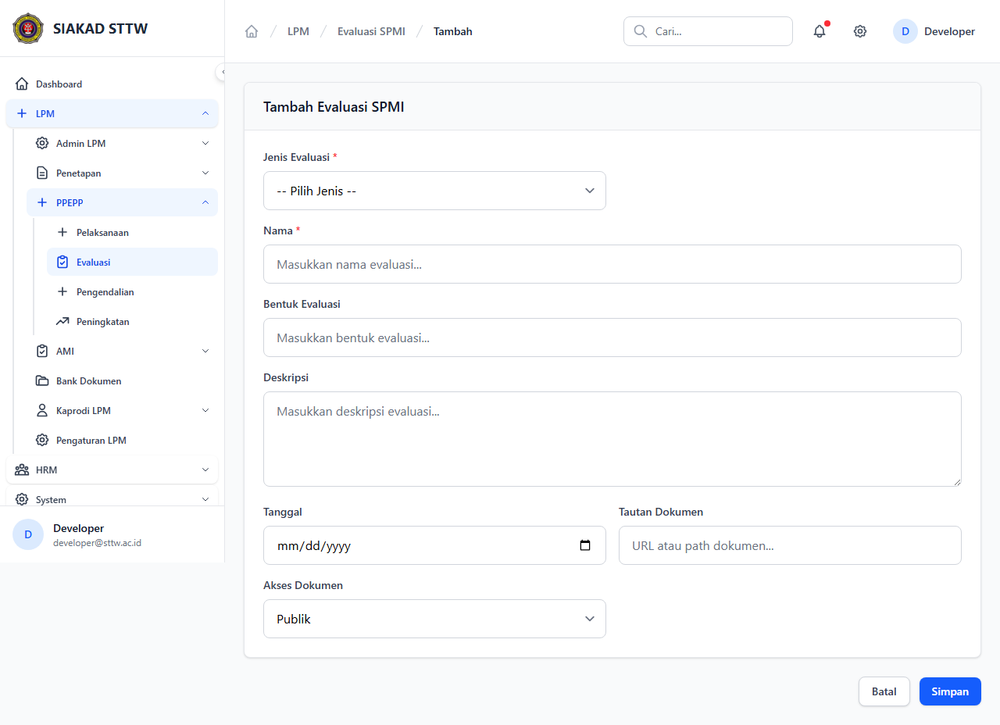
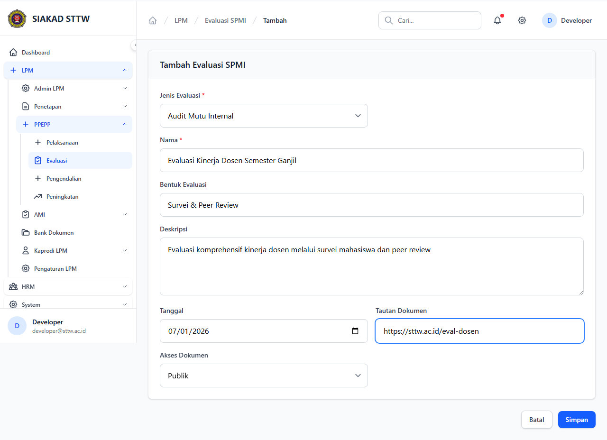
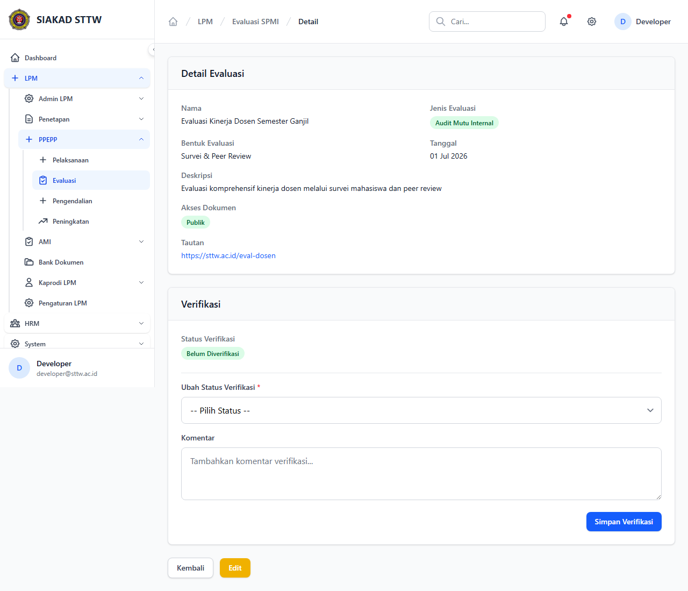
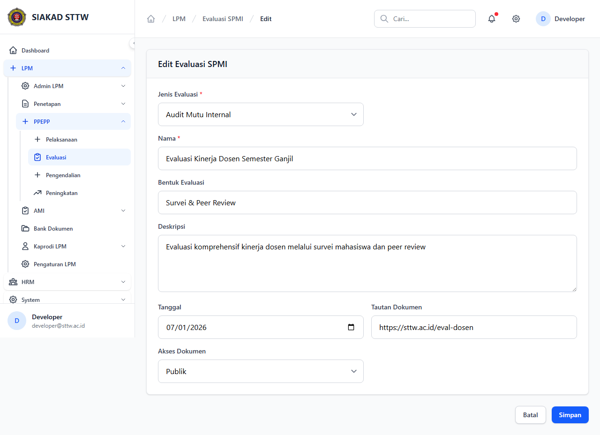
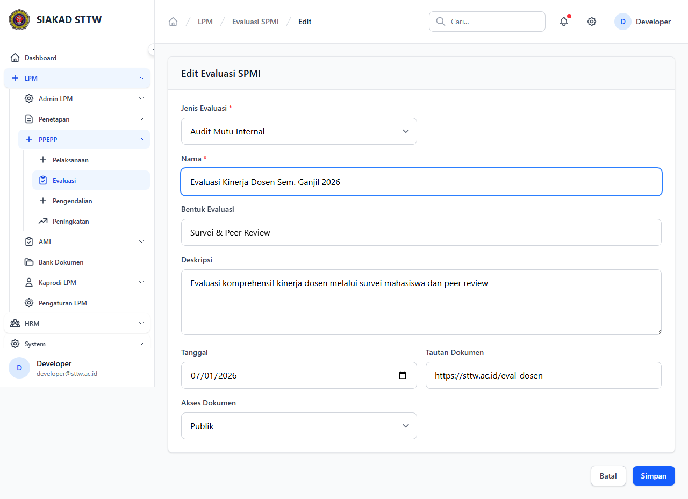
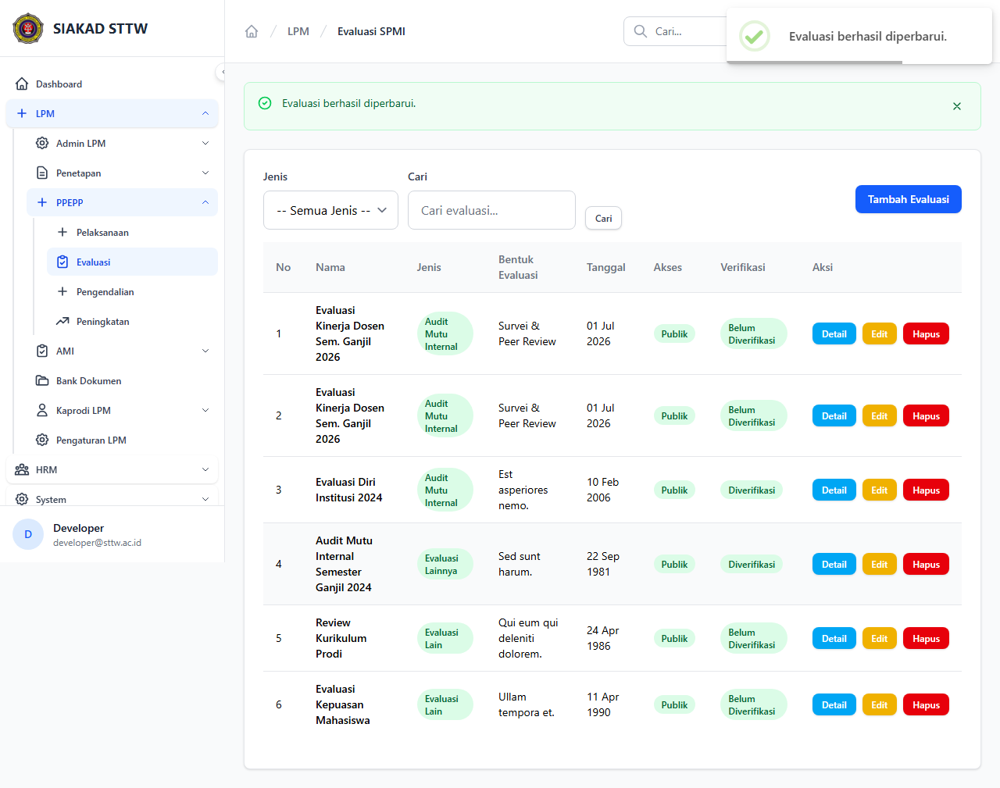

# Workflow Report: Evaluasi

**Tanggal**: 2026-04-09  
**Role**: Admin LPM  
**Modul**: LPM > Evaluasi  
**Status**: ✅ Berhasil

## Ringkasan

Mengelola kegiatan evaluasi mutu, dikategorikan berdasarkan jenis (AMI, Lain, Lainnya).

## Langkah-langkah

### 1. Daftar Evaluasi

Tabel evaluasi dengan tab jenis evaluasi.

### 2. Form Tambah (Kosong)

Form pembuatan evaluasi baru.

### 3. Form Tambah (Terisi)

Form terisi data evaluasi kinerja dosen.

### 4. Berhasil Ditambahkan

Redirect ke index setelah submit.

### 5. Detail Evaluasi

Informasi lengkap kegiatan evaluasi.

### 6. Form Edit

Form edit evaluasi.

### 7. Form Edit (Dimodifikasi)

Nama evaluasi diperbarui.

### 8. Berhasil Diperbarui

Redirect dengan notifikasi sukses.

## Catatan

- Screenshot diambil secara otomatis menggunakan Playwright
- Data yang ditampilkan adalah dummy data dari LpmDummySeeder
