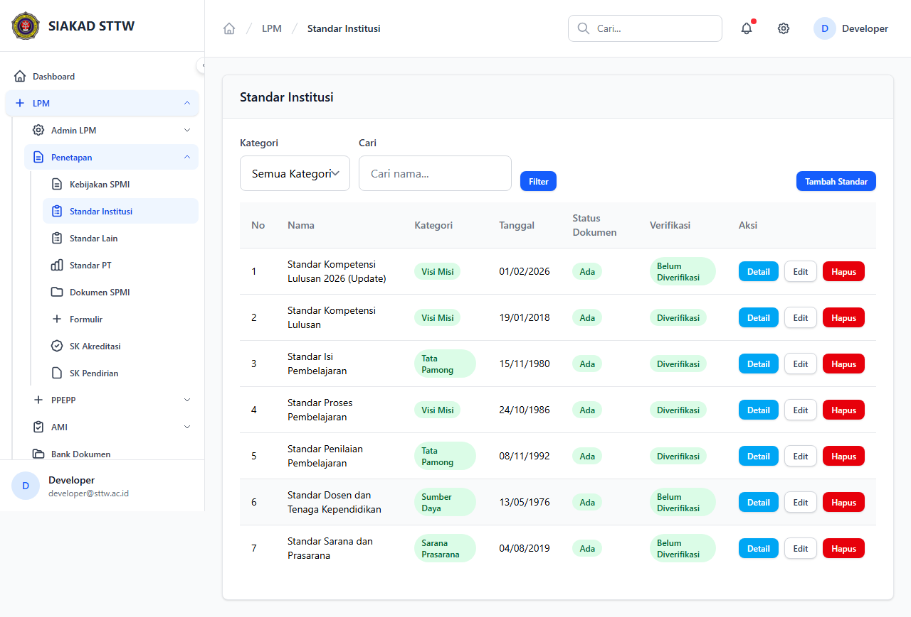
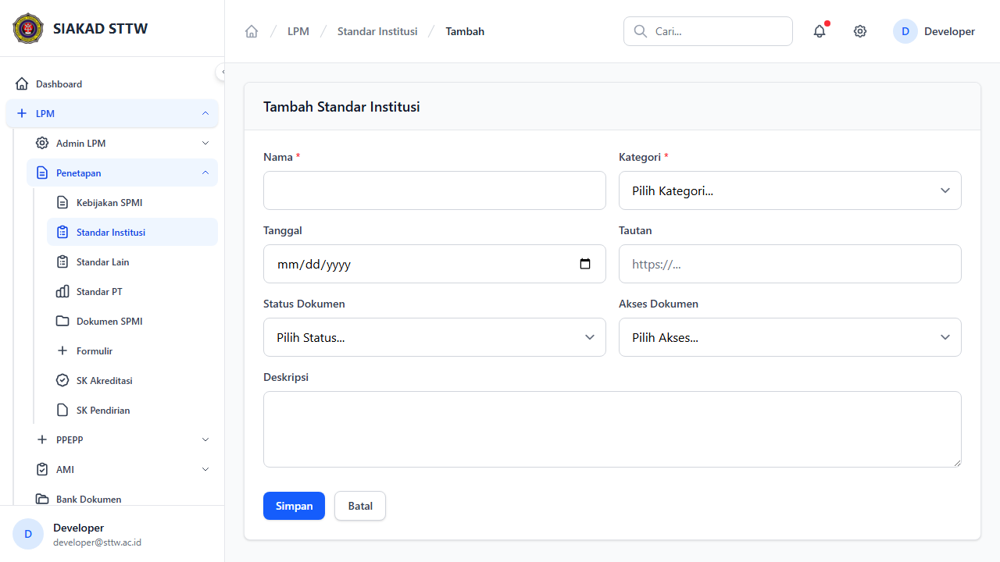
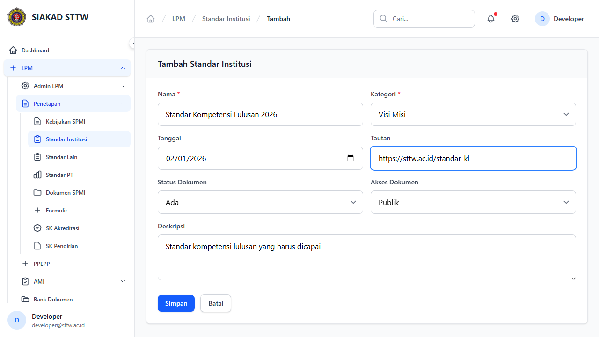
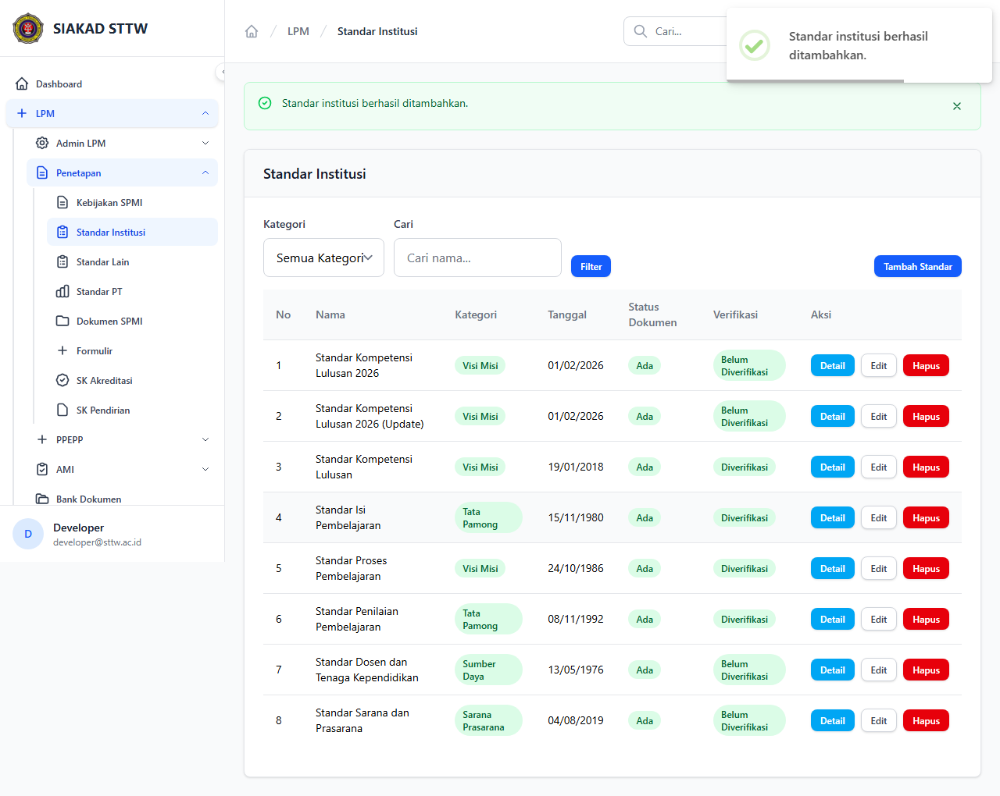
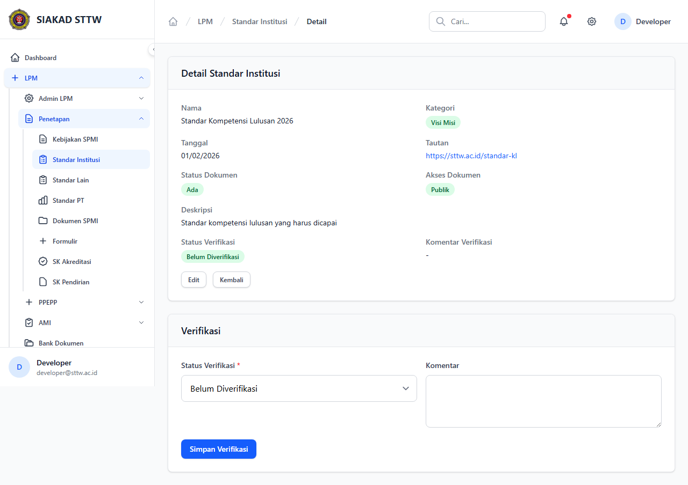
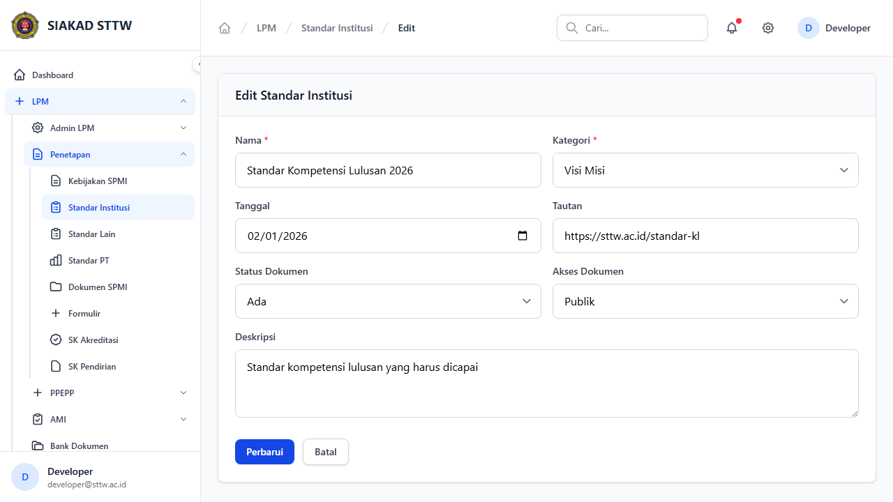
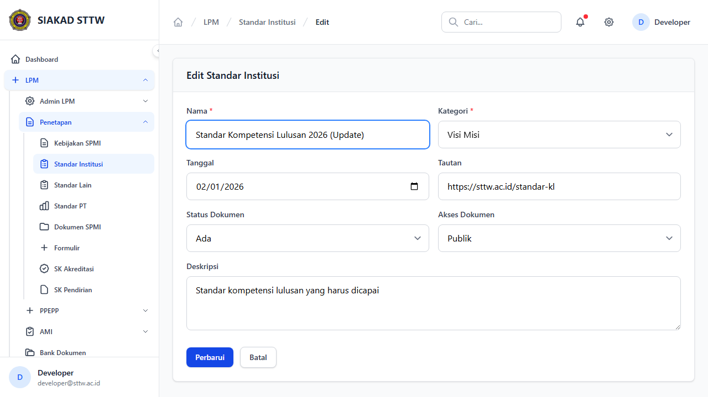

# Workflow Report: Standar Institusi

**Tanggal**: 2026-04-09  
**Role**: Admin LPM  
**Modul**: LPM > Penetapan  
**Status**: ✅ Berhasil

## Ringkasan

Mengelola standar institusi berdasarkan kategori (Visi Misi, Tata Pamong, Sumber Daya, Sarana Prasarana).

## Langkah-langkah

### 1. Daftar Standar Institusi

Tabel standar institusi dengan filter kategori, status dokumen, dan akses dokumen.

### 2. Form Tambah Standar (Kosong)

Form pembuatan standar institusi baru dengan pilihan kategori.

### 3. Form Tambah Standar (Terisi)

Form terisi data standar kompetensi lulusan.

### 4. Standar Berhasil Ditambahkan

Redirect ke index setelah berhasil menyimpan.

### 5. Detail Standar

Informasi lengkap standar institusi.

### 6. Form Edit Standar

Form edit standar dengan data terisi.

### 7. Form Edit (Dimodifikasi)

Nama standar telah diperbarui.

### 8. Standar Berhasil Diperbarui

Redirect dengan notifikasi sukses.

## Catatan

- Screenshot diambil secara otomatis menggunakan Playwright
- Data yang ditampilkan adalah dummy data dari LpmDummySeeder
