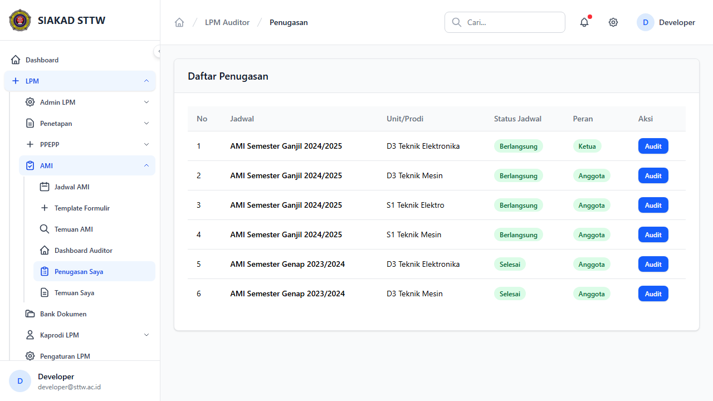

# Workflow Report: Penugasan Auditor

**Tanggal**: 2026-04-09  
**Role**: Auditor Internal  
**Modul**: LPM > Auditor  
**Status**: ✅ Berhasil

## Ringkasan

Daftar penugasan audit yang diberikan kepada auditor.

## Langkah-langkah

### 1. Daftar Penugasan

Tabel penugasan menampilkan jadwal AMI, unit, dan peran (ketua/anggota).

## Catatan

- Screenshot diambil secara otomatis menggunakan Playwright
- Data yang ditampilkan adalah dummy data dari LpmDummySeeder
