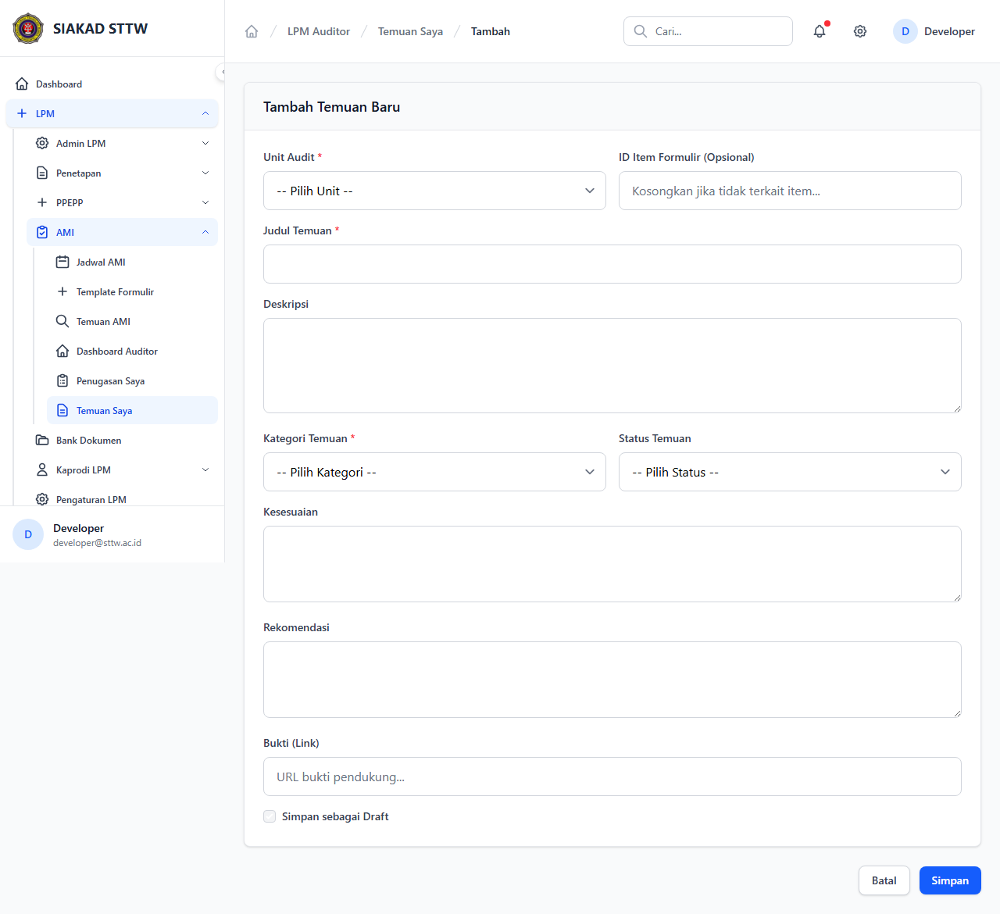
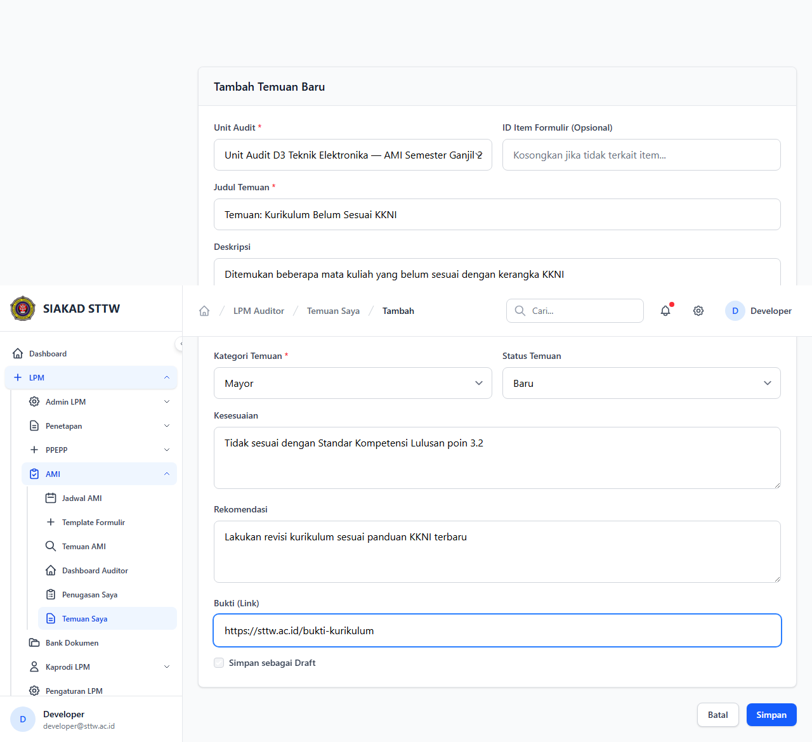
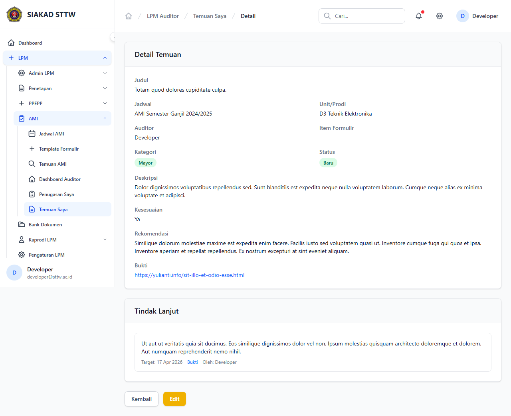
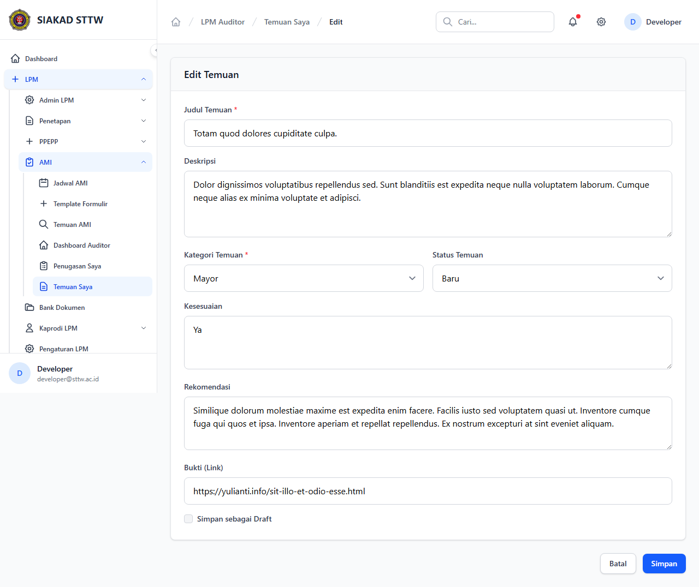
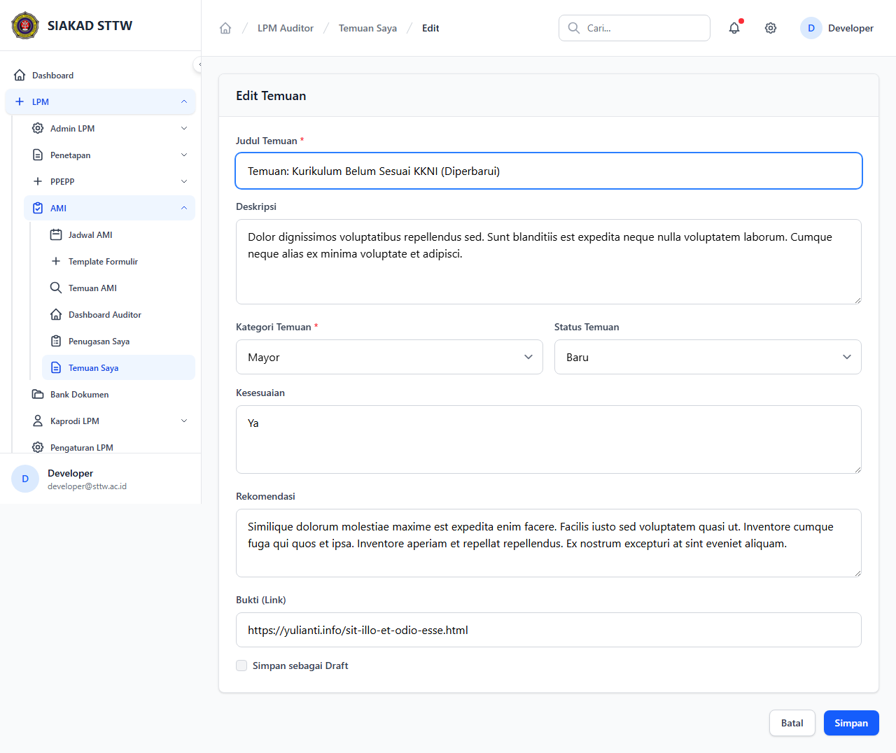
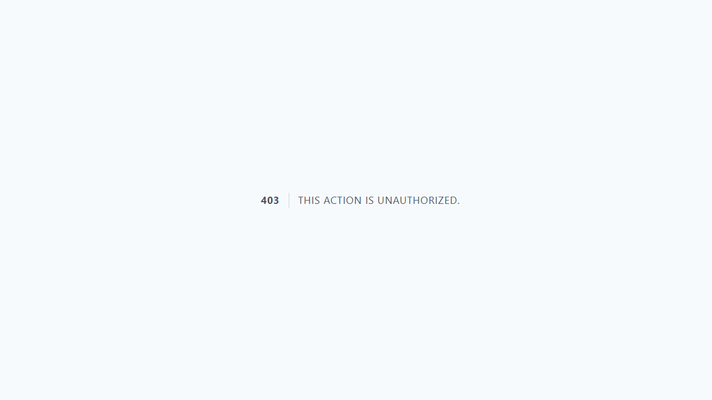

# Workflow Report: Temuan Auditor

**Tanggal**: 2026-04-09  
**Role**: Auditor Internal  
**Modul**: LPM > Auditor  
**Status**: ✅ Berhasil

## Ringkasan

Auditor mencatat dan mengelola temuan audit (Mayor, Minor, Observasi, Peluang Peningkatan).

## Langkah-langkah

### 1. Daftar Temuan

Tabel temuan yang dicatat oleh auditor.

### 2. Form Tambah Temuan (Kosong)

Form pencatatan temuan baru dengan unit, kategori, kesesuaian, dan rekomendasi.

### 3. Form Tambah Temuan (Terisi)

Form terisi data temuan terkait kurikulum.

### 4. Temuan Berhasil Dicatat

Redirect ke index setelah submit.

### 5. Detail Temuan

Informasi lengkap temuan termasuk rekomendasi dan bukti.

### 6. Form Edit Temuan

Form edit temuan.

### 7. Form Edit (Dimodifikasi)

Judul temuan diperbarui.

### 8. Temuan Berhasil Diperbarui

Redirect dengan notifikasi sukses.

## Catatan

- Screenshot diambil secara otomatis menggunakan Playwright
- Data yang ditampilkan adalah dummy data dari LpmDummySeeder
