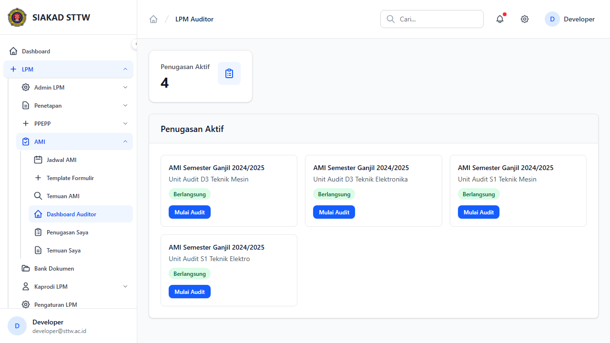
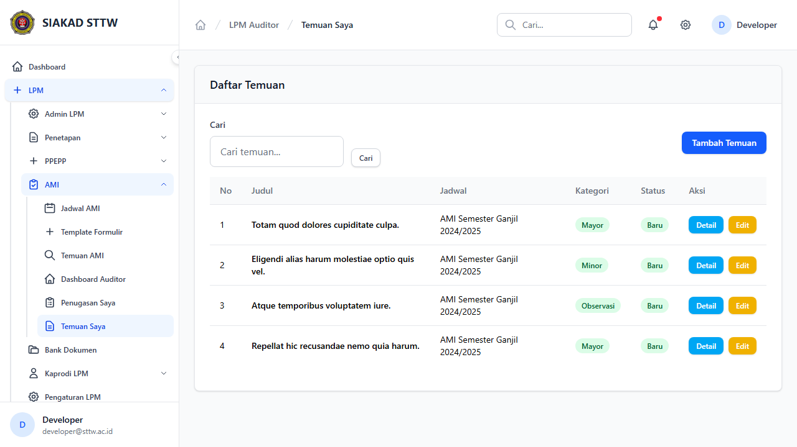

# Workflow Report: LPM — Auditor Internal

**Tanggal**: 2026-04-12
**Role**: Auditor Internal
**Modul**: LPM (Lembaga Penjaminan Mutu)
**Status**: ✅ Berhasil

## Ringkasan

Laporan ini mendokumentasikan halaman-halaman modul LPM yang dapat diakses oleh role Auditor Internal. Mencakup dashboard penugasan, daftar penugasan audit, dan daftar temuan. Total 3 halaman berhasil diverifikasi.

## Langkah-langkah

### 1. Dashboard Auditor
Dashboard auditor menampilkan 4 kartu penugasan aktif untuk AMI Semester Ganjil 2024/2025 dengan unit auditee: D3 Teknik Mesin, D3 Teknik Elektronika, S1 Teknik Mesin, dan S1 Teknik Elektro. Setiap kartu memiliki tombol "Mulai Audit" dan badge status "Berlangsung".

### 2. Daftar Penugasan Auditor
Halaman daftar seluruh penugasan audit dalam format tabel, menampilkan riwayat dan status masing-masing penugasan.

### 3. Daftar Temuan Auditor
Daftar temuan yang telah dicatat oleh auditor selama proses audit, lengkap dengan detail kategori dan status tindak lanjut.

## Catatan
- Terdapat 4 penugasan aktif yang terlihat di dashboard, menunjukkan audit sedang berjalan untuk 4 program studi
- Workflow audit siap digunakan: auditor dapat langsung memulai audit melalui tombol "Mulai Audit" pada setiap kartu penugasan
- Auditor dapat mencatat temuan dan mengelola hasil audit melalui halaman temuan
- Semua penugasan menampilkan badge "Berlangsung" yang menandakan periode AMI sedang aktif
