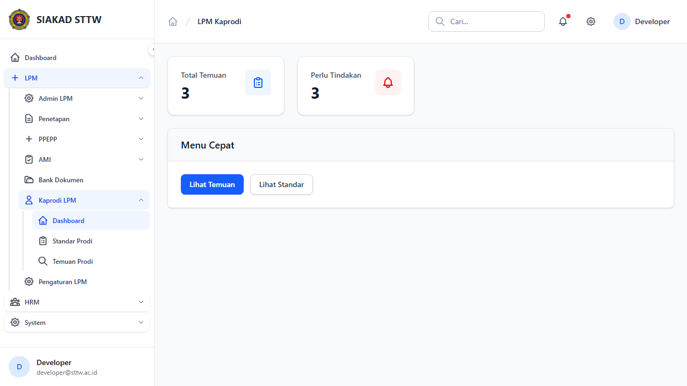
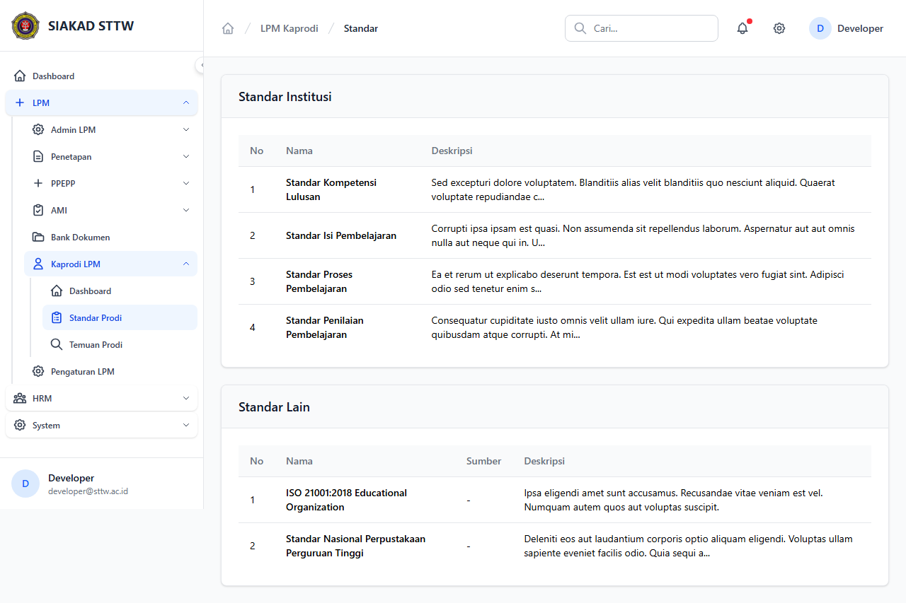
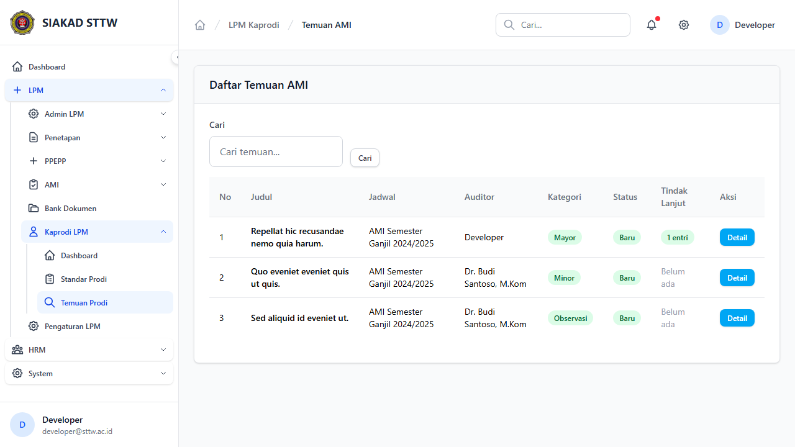

# Workflow Report: LPM — Kaprodi

**Tanggal**: 2026-04-12
**Role**: Kaprodi
**Modul**: LPM (Lembaga Penjaminan Mutu)
**Status**: ✅ Berhasil

## Ringkasan

Laporan ini mendokumentasikan halaman-halaman modul LPM yang dapat diakses oleh role Kaprodi (Ketua Program Studi). Mencakup dashboard ringkasan temuan, daftar standar yang berlaku, dan manajemen temuan beserta tindak lanjut. Total 3 halaman berhasil diverifikasi.

## Langkah-langkah

### 1. Dashboard Kaprodi
Dashboard kaprodi menampilkan kartu statistik: Total Temuan 3 dan Perlu Tindakan 3. Tersedia menu cepat berupa tombol "Lihat Temuan" dan "Lihat Standar" untuk navigasi langsung.

### 2. Standar Program Studi
Halaman daftar standar yang berlaku untuk program studi milik kaprodi, sebagai acuan dalam penjaminan mutu di tingkat prodi.

### 3. Temuan Program Studi
Daftar temuan AMI yang berkaitan dengan program studi kaprodi, dilengkapi opsi tindak lanjut untuk setiap temuan yang harus ditangani.

## Catatan
- Workflow temuan dan tindak lanjut beroperasi dengan baik — kaprodi dapat melihat temuan dan memberikan respons tindak lanjut
- Dashboard menampilkan notifikasi jelas bahwa terdapat 3 temuan yang memerlukan tindakan segera
- Kaprodi memiliki akses ke standar yang relevan dengan prodinya sebagai referensi dalam menyusun tindak lanjut
- Menu cepat pada dashboard memudahkan navigasi langsung ke halaman temuan dan standar
