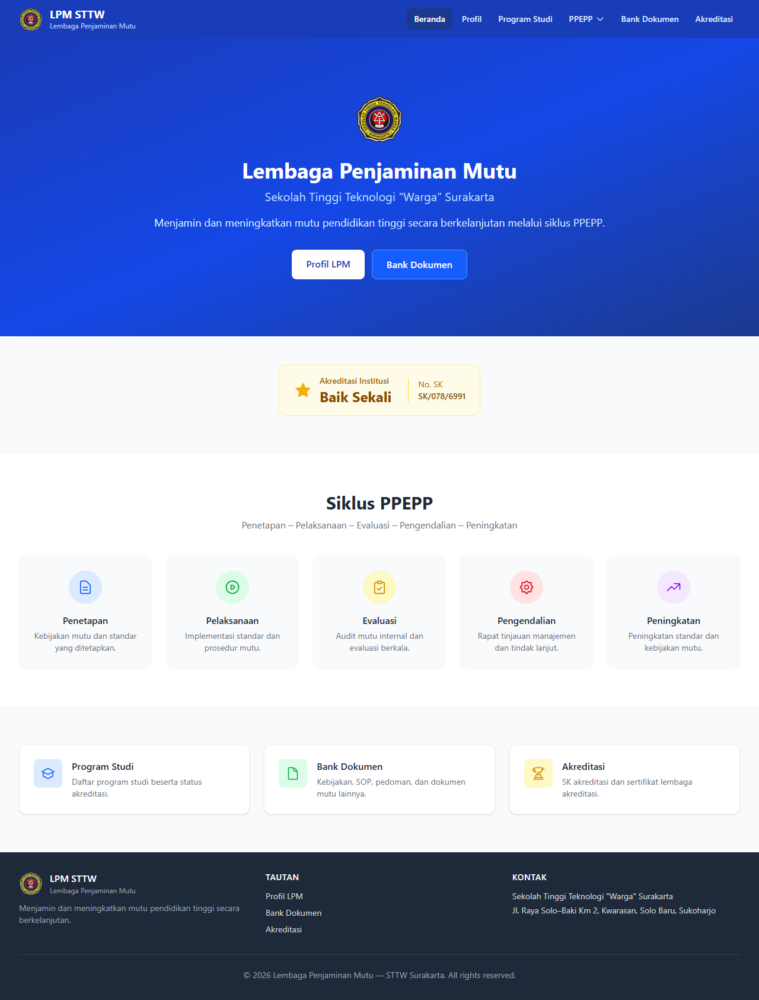

# Workflow Report: Portal LPM - Beranda

**Tanggal**: 2026-04-09  
**Role**: Publik  
**Modul**: LPM Portal  
**Status**: ✅ Berhasil

## Ringkasan

Halaman beranda portal publik LPM.

## Langkah-langkah

### 1. Beranda Portal

Landing page portal LPM menampilkan informasi umum dan navigasi ke bagian-bagian portal.

## Catatan

- Screenshot diambil secara otomatis menggunakan Playwright
- Data yang ditampilkan adalah dummy data dari LpmDummySeeder
- Halaman ini dapat diakses tanpa login (portal publik)
- Hanya menampilkan dokumen dengan akses "Publik"
