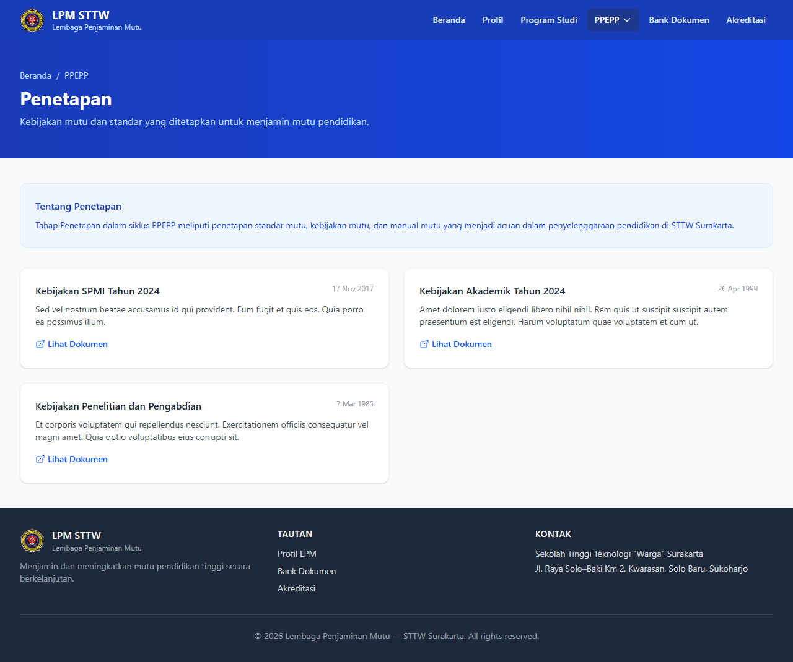

# Workflow Report: Portal LPM - Penetapan

**Tanggal**: 2026-04-09  
**Role**: Publik  
**Modul**: LPM Portal  
**Status**: ✅ Berhasil

## Ringkasan

Halaman penetapan SPMI pada portal publik (hanya dokumen dengan akses Publik).

## Langkah-langkah

### 1. Penetapan SPMI

Daftar kebijakan, standar, dan dokumen SPMI yang bersifat publik.

## Catatan

- Screenshot diambil secara otomatis menggunakan Playwright
- Data yang ditampilkan adalah dummy data dari LpmDummySeeder
- Halaman ini dapat diakses tanpa login (portal publik)
- Hanya menampilkan dokumen dengan akses "Publik"
