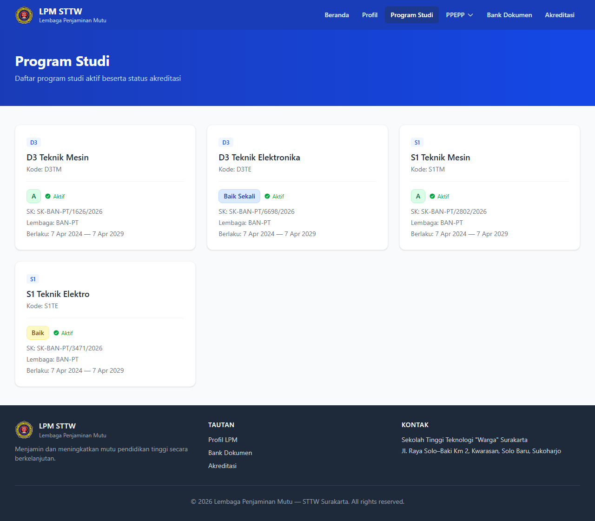

# Workflow Report: Portal LPM - Program Studi

**Tanggal**: 2026-04-09  
**Role**: Publik  
**Modul**: LPM Portal  
**Status**: ✅ Berhasil

## Ringkasan

Daftar program studi dan status akreditasi pada portal publik.

## Langkah-langkah

### 1. Program Studi

Informasi program studi beserta status akreditasi masing-masing.

## Catatan

- Screenshot diambil secara otomatis menggunakan Playwright
- Data yang ditampilkan adalah dummy data dari LpmDummySeeder
- Halaman ini dapat diakses tanpa login (portal publik)
- Hanya menampilkan dokumen dengan akses "Publik"
