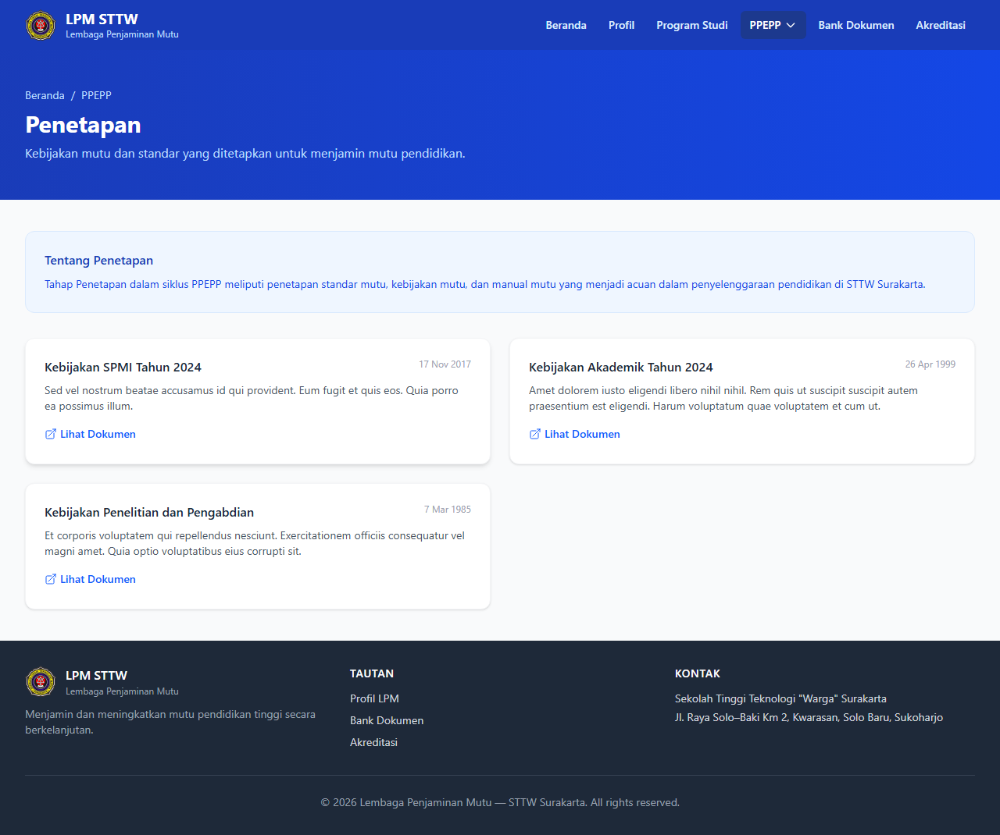
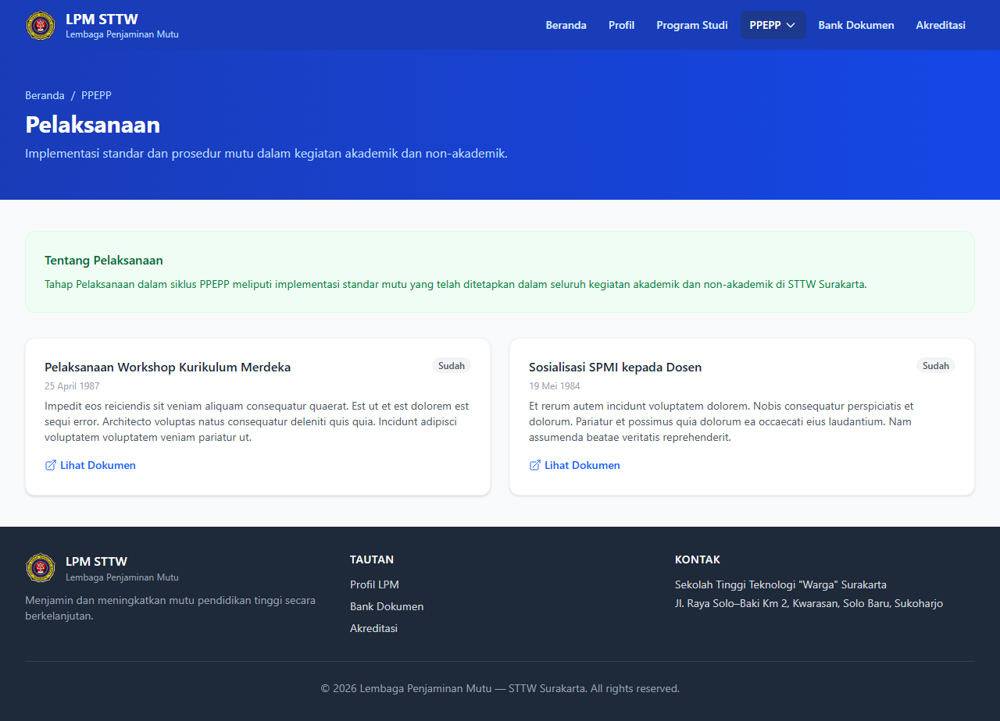
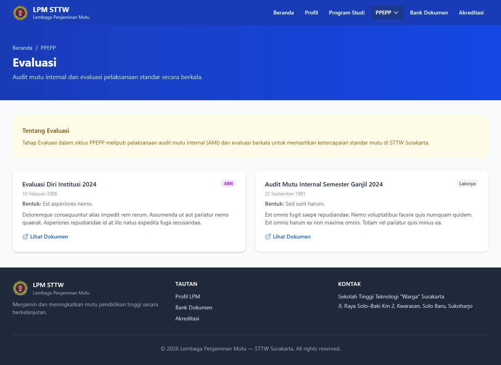
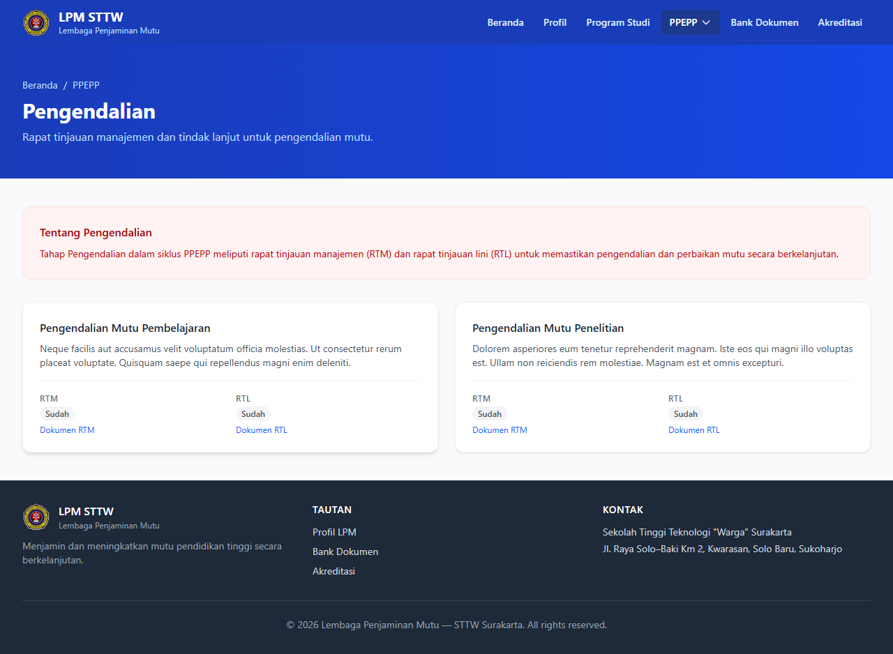
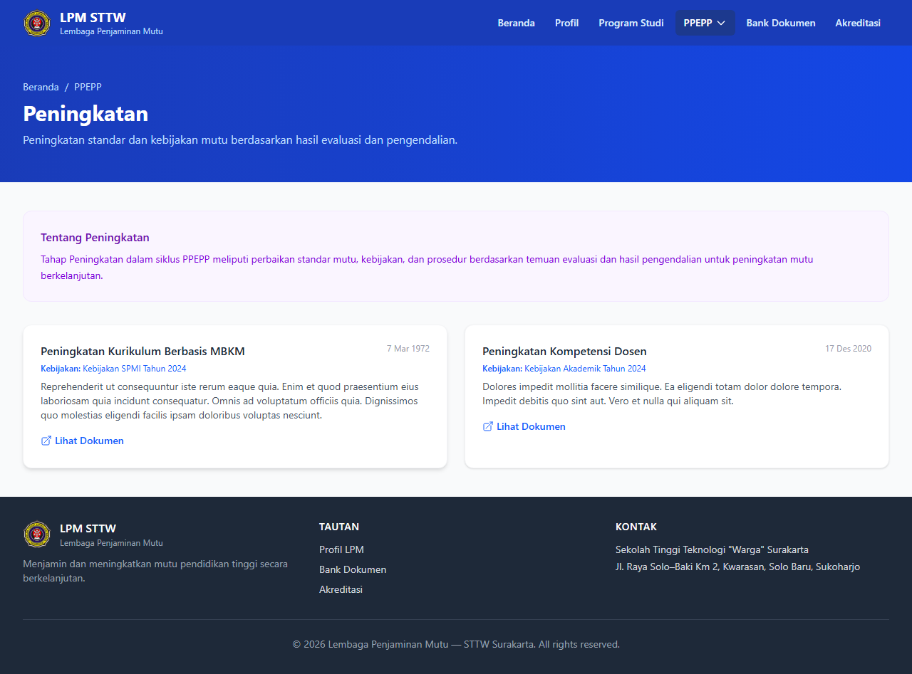
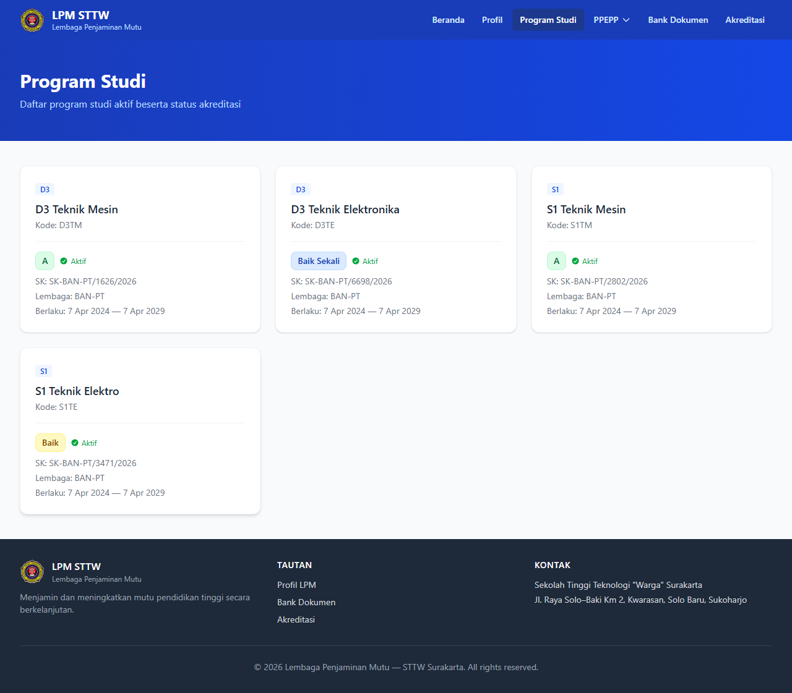
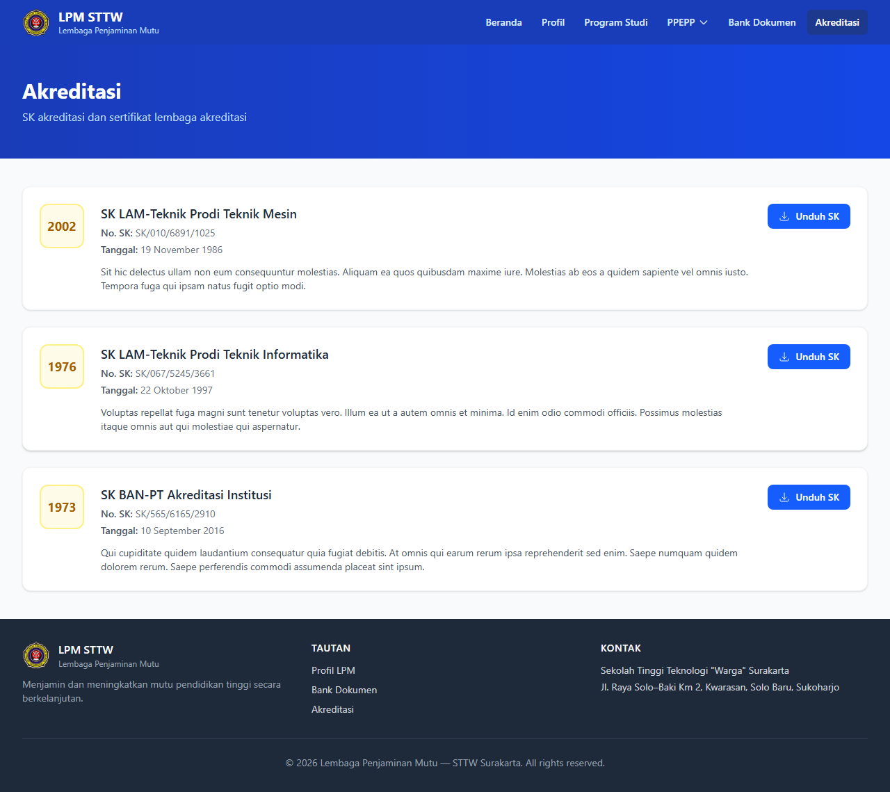
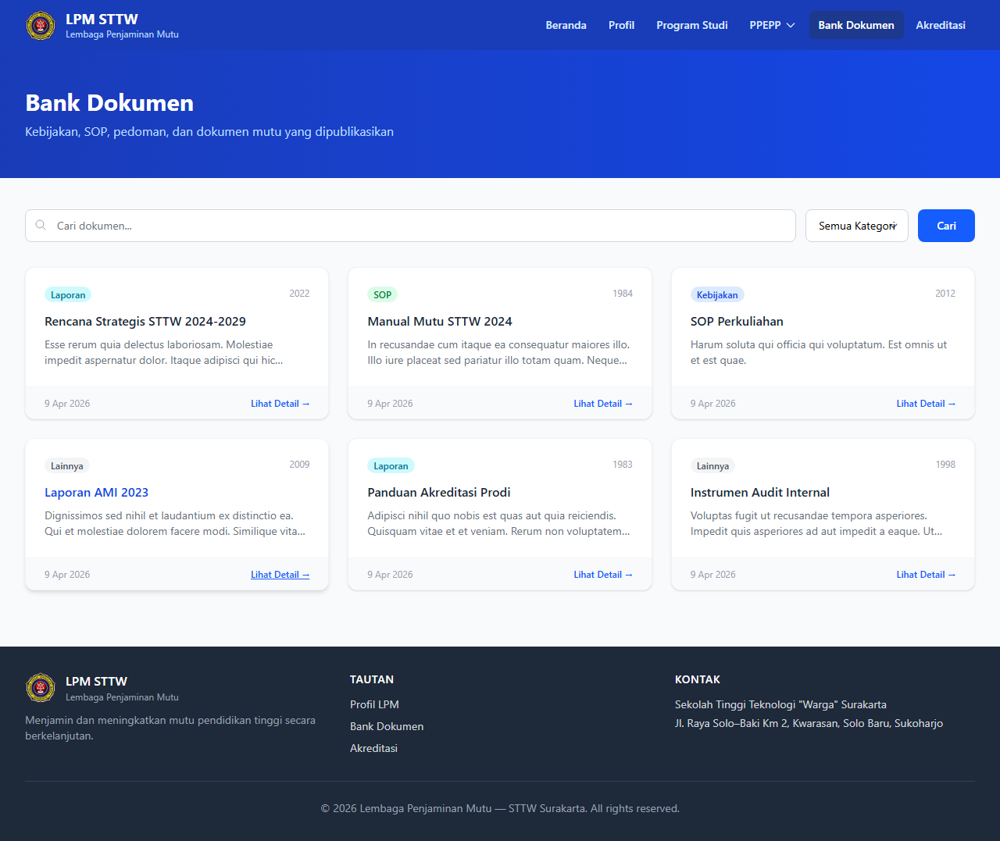

# Workflow Report: LPM — Portal Publik

**Tanggal**: 2026-04-12
**Role**: Publik (Tanpa Autentikasi)
**Modul**: LPM (Lembaga Penjaminan Mutu)
**Status**: ✅ Berhasil

## Ringkasan

Laporan ini mendokumentasikan seluruh halaman portal publik LPM yang dapat diakses tanpa login. Mencakup landing page, profil institusi, siklus PPEPP lengkap, data program studi, akreditasi, dan bank dokumen. Total 10 halaman berhasil diverifikasi.

## Langkah-langkah

### 1. Landing Page Portal
Halaman utama portal LPM dengan desain profesional: hero section bergradien biru, logo STTW, judul "Lembaga Penjaminan Mutu", badge Akreditasi Institusi "Baik Sekali", section Siklus PPEPP dengan 5 kartu, tautan ke Program Studi/Bank Dokumen/Akreditasi, dan footer.

### 2. Profil Institusi
Halaman profil perguruan tinggi yang menampilkan informasi publik meliputi nama PT, alamat, status akreditasi, dan data kelembagaan lainnya.

### 3. Penetapan
Halaman penetapan yang menampilkan kebijakan SPMI dan standar mutu yang telah ditetapkan oleh institusi untuk akses publik.

### 4. Pelaksanaan
Daftar kegiatan pelaksanaan penjaminan mutu yang dapat diakses publik sebagai bentuk transparansi institusi.

### 5. Evaluasi
Halaman evaluasi publik yang menampilkan hasil-hasil evaluasi mutu yang telah dilakukan oleh institusi.

### 6. Pengendalian
Halaman pengendalian publik yang menampilkan upaya pengendalian mutu yang dilakukan institusi.

### 7. Peningkatan
Halaman peningkatan publik yang menampilkan program dan kegiatan peningkatan mutu berkelanjutan.

### 8. Program Studi
Daftar program studi yang tersedia di STTW beserta status akreditasi masing-masing prodi.

### 9. Akreditasi
Halaman daftar SK Akreditasi dan SK Pendirian yang dipublikasikan untuk transparansi kepada masyarakat.

### 10. Bank Dokumen
Bank dokumen publik dengan fitur pencarian dan filter kategori untuk memudahkan akses dokumen mutu oleh publik.

## Catatan
- Tampilan portal publik profesional dan representatif dengan desain modern bergradien biru dan layout yang rapi
- Seluruh dokumen dan informasi publik dapat diakses tanpa memerlukan autentikasi (login)
- Siklus PPEPP lengkap tersaji di portal: Penetapan, Pelaksanaan, Evaluasi, Pengendalian, dan Peningkatan
- Bank dokumen dilengkapi fitur pencarian dan filter kategori untuk kemudahan akses
- Landing page menampilkan badge akreditasi "Baik Sekali" sebagai highlight utama institusi
- Informasi program studi dan status akreditasi dapat diakses publik untuk transparansi
