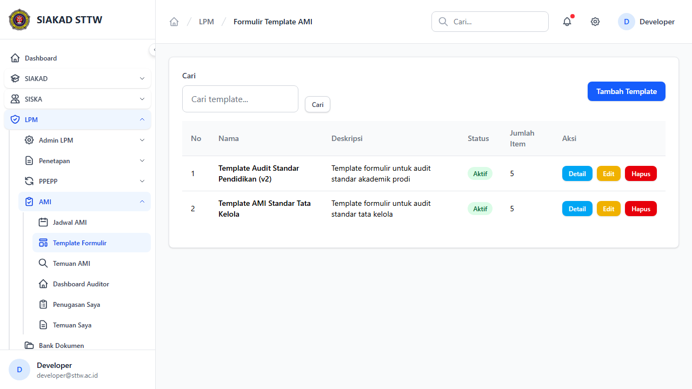
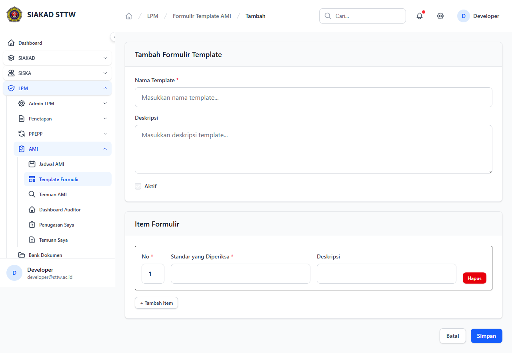
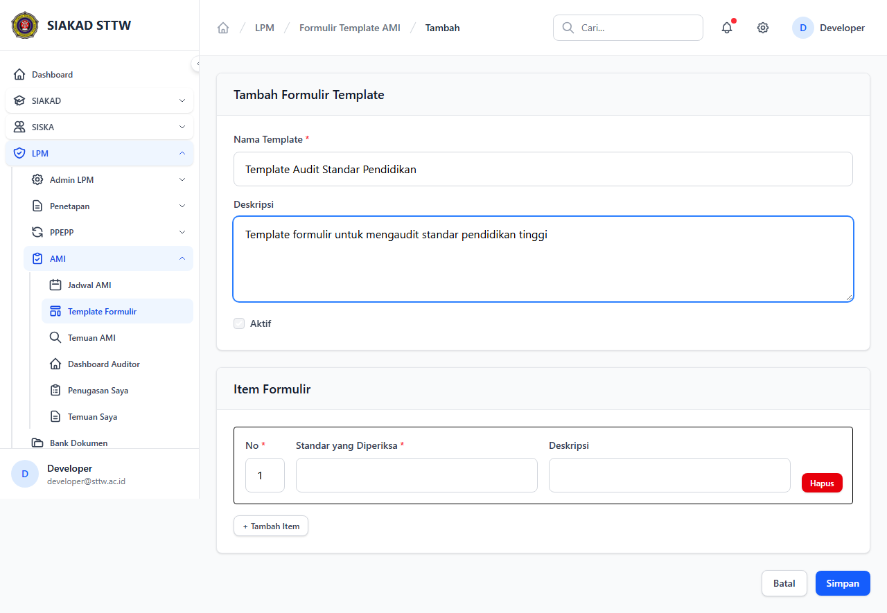
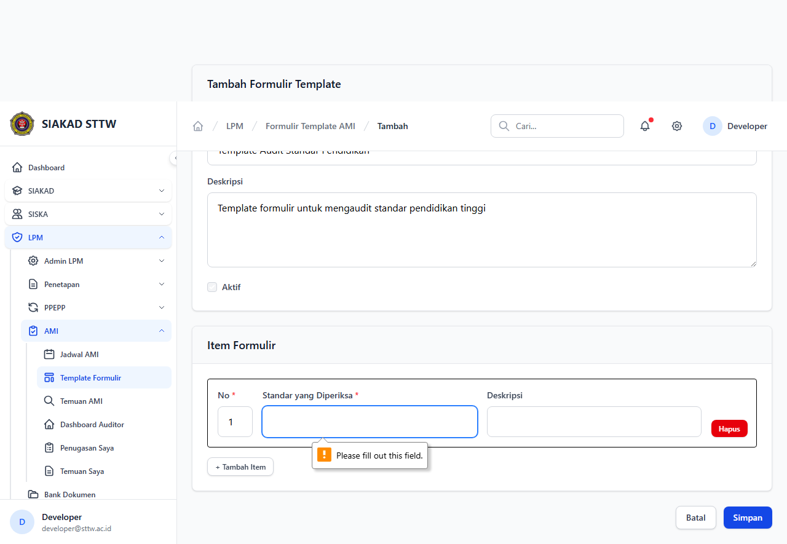
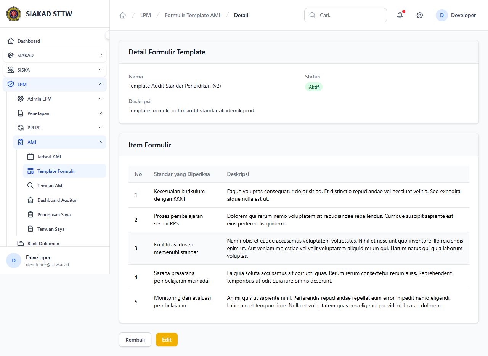
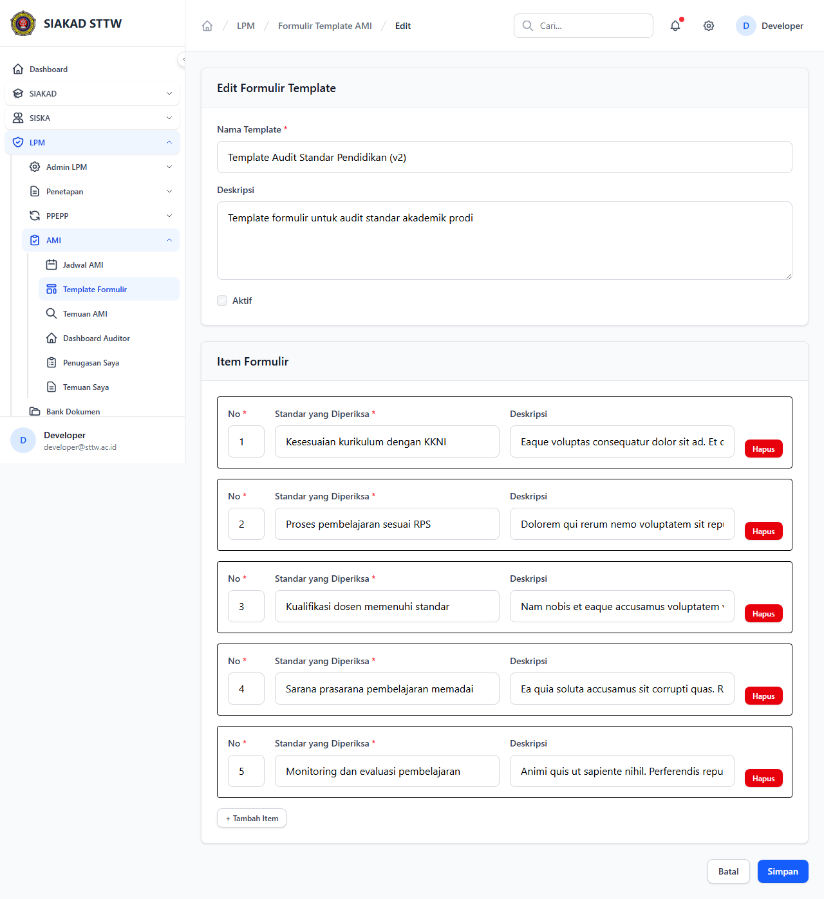
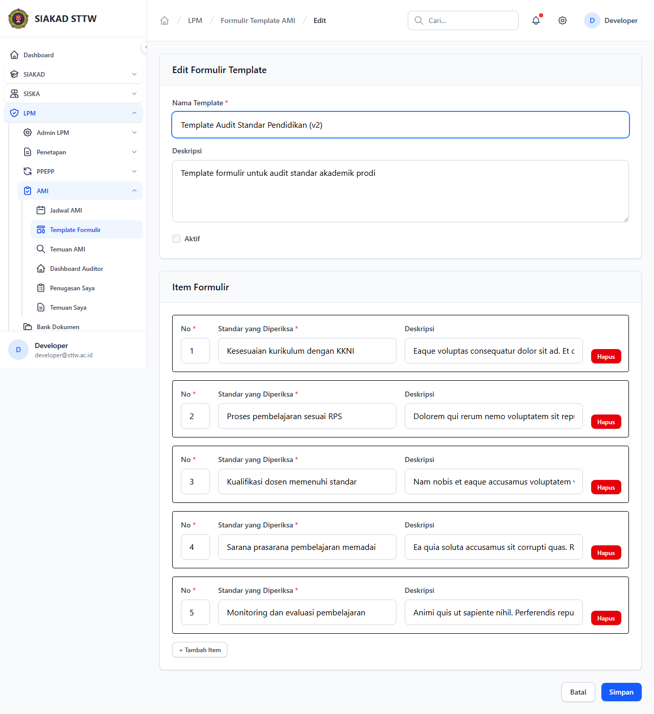

# Workflow Report: Template Formulir AMI

**Tanggal**: 2026-04-18  
**Role**: Admin LPM  
**Modul**: LPM > AMI  
**Status**: ✅ Berhasil

## Ringkasan

Mengelola template formulir audit yang digunakan oleh auditor internal saat melakukan AMI.

## Langkah-langkah

### 1. Daftar Template Formulir

Tabel template formulir AMI dengan status aktif/nonaktif.

### 2. Form Tambah Template (Kosong)

Form pembuatan template formulir baru dengan item standar yang diperiksa.

### 3. Form Tambah Template (Terisi)

Form terisi data template audit standar pendidikan.

### 4. Template Berhasil Ditambahkan

Redirect ke index setelah submit.

### 5. Detail Template

Detail template menampilkan daftar item standar yang diperiksa.

### 6. Form Edit Template

Form edit template dengan item yang bisa ditambah/hapus.

### 7. Form Edit (Dimodifikasi)

Nama template diperbarui.

### 8. Template Berhasil Diperbarui

Redirect dengan notifikasi sukses.

## Catatan

- Screenshot diambil secara otomatis menggunakan Playwright
- Data yang ditampilkan adalah dummy data dari LpmDummySeeder

