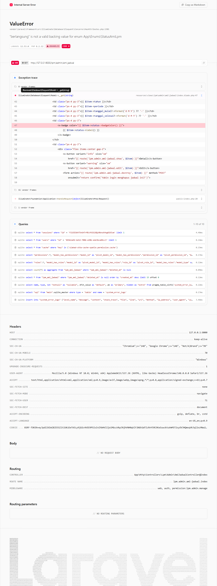
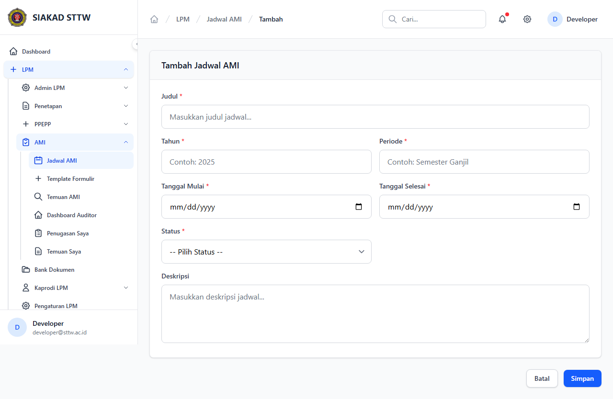
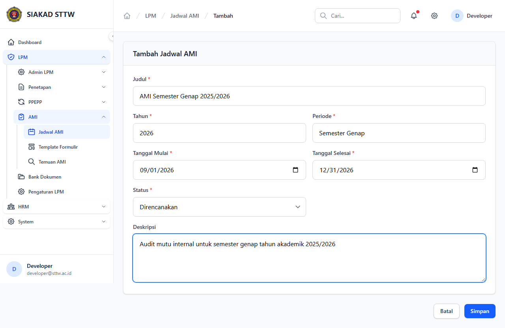
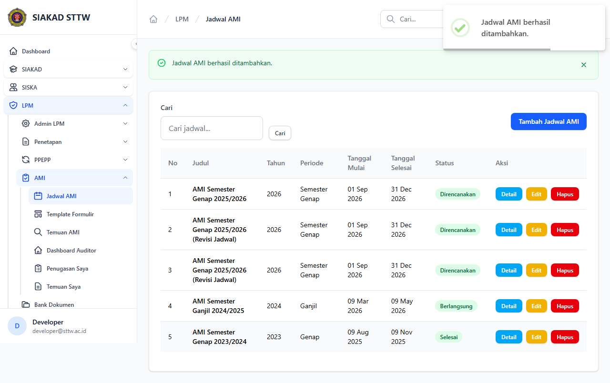
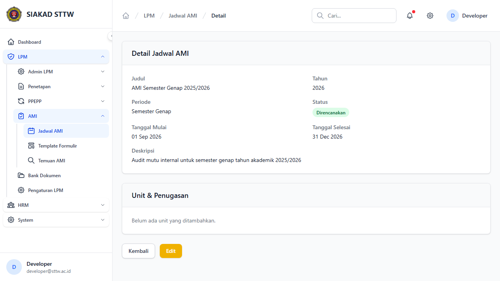
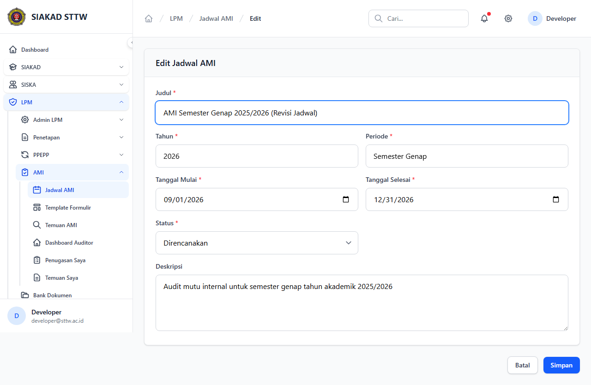
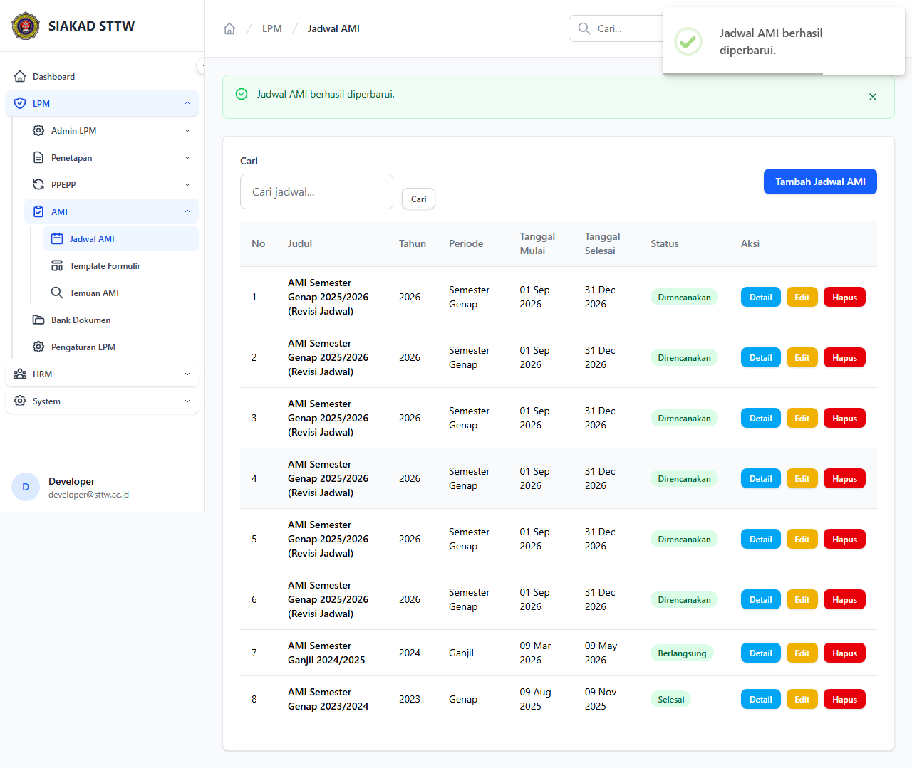

# Workflow Report: Jadwal AMI

**Tanggal**: 2026-04-18  
**Role**: Admin LPM  
**Modul**: LPM > AMI  
**Fitur**: Jadwal AMI  
**Status**: ✅ Berhasil

## Ringkasan

Mengelola jadwal Audit Mutu Internal (AMI), termasuk unit yang diaudit dan penugasan auditor.

Semua 8 langkah pada scan ini lolos tanpa error.

## Langkah-langkah

### 1. Daftar Jadwal AMI

Tabel jadwal AMI dengan tahun, periode, dan status.

### 2. Form Tambah Jadwal (Kosong)

Form pembuatan jadwal AMI baru.

### 3. Form Tambah Jadwal (Terisi)

Form terisi data AMI semester genap.

### 4. Jadwal Berhasil Ditambahkan

Redirect ke index setelah submit.

### 5. Detail Jadwal AMI

Detail jadwal AMI menampilkan daftar unit dan penugasan auditor.

### 6. Form Edit Jadwal

Form edit jadwal AMI.

### 7. Form Edit (Dimodifikasi)

Judul jadwal diperbarui.

### 8. Jadwal Berhasil Diperbarui

Redirect dengan notifikasi sukses.

## Temuan & Masalah

Tidak ada temuan kritis pada scan ini.

## Catatan

- Screenshot diambil secara otomatis menggunakan Playwright.
- Data yang ditampilkan berasal dari data dummy/seeder yang tersedia pada saat scan.
- Status report mengikuti hasil scan aktual; langkah yang gagal tidak lagi ditandai sebagai sukses.
