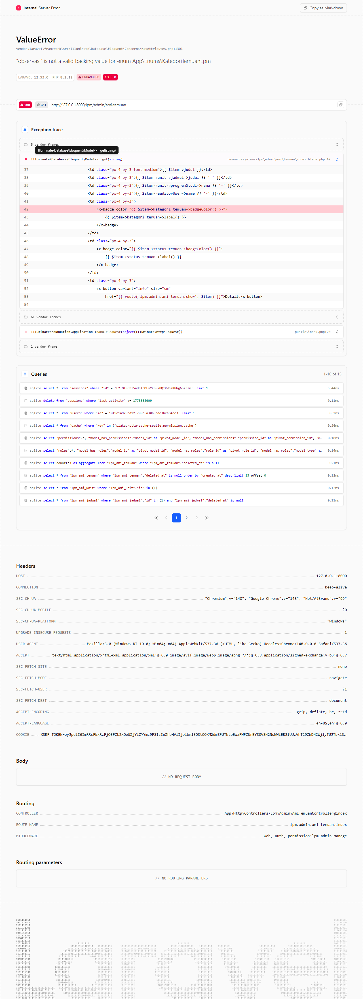

# Workflow Report: Temuan AMI (Admin)

**Tanggal**: 2026-04-18  
**Role**: Admin LPM  
**Modul**: LPM > AMI  
**Fitur**: Temuan AMI (Admin)  
**Status**: ✅ Berhasil

## Ringkasan

Melihat dan memverifikasi seluruh temuan AMI dari semua unit dan jadwal.

Semua 2 langkah pada scan ini lolos tanpa error.

## Langkah-langkah

### 1. Daftar Temuan AMI

Tabel seluruh temuan AMI dengan filter status dan kategori.

### 2. Detail Temuan

Detail temuan menampilkan deskripsi, rekomendasi, bukti, dan tindak lanjut.

## Temuan & Masalah

Tidak ada temuan kritis pada scan ini.

## Catatan

- Screenshot diambil secara otomatis menggunakan Playwright.
- Data yang ditampilkan berasal dari data dummy/seeder yang tersedia pada saat scan.
- Status report mengikuti hasil scan aktual; langkah yang gagal tidak lagi ditandai sebagai sukses.
