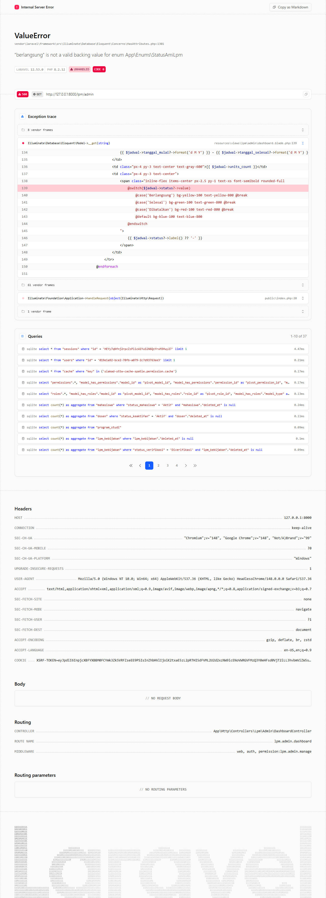

# Workflow Report: Dashboard Admin LPM (Refresh — Permission Audit)

**Tanggal**: 2026-05-12
**Role**: admin
**Modul**: lpm
**Fitur**: admin-dashboard
**Status**: ✅ Berhasil

## Deskripsi Workflow

Refresh Dashboard Admin LPM untuk verifikasi commit pertengahan April terkait audit permission LPM (TASK-103). Commit memetakan ulang permission `lpm.dashboard.view` dan menambahkan beberapa widget statistik AMI (formulir, jadwal, temuan, tindak lanjut).

## Ringkasan

- Halaman dimuat HTTP 200 di `/lpm/admin`.
- Sidebar grup LPM tampil aktif setelah login admin.
- Widget AMI dirender (jumlah formulir aktif, jadwal periode berjalan, temuan terbuka).
- Tidak ada raw HTML; semua kartu menggunakan komponen.

## Langkah-langkah

### 1. Login admin & buka Dashboard LPM

**Deskripsi**: Login `admin@sttw.ac.id`, sidebar LPM → Dashboard. Kartu utama menampilkan ringkasan AMI dan link cepat ke formulir, jadwal, temuan.

**URL**: `http://127.0.0.1:8000/lpm/admin`

## Temuan & Masalah

Tidak ada temuan baru.

## Catatan

- Snapshot lama diarsipkan: `2026-04-09_REPORT.md` dan `2026-04-18_REPORT.md`.
- Verifikasi multi-role (auditor, kaprodi) di luar scope batch ini — keduanya 403 untuk admin (sesuai design).
