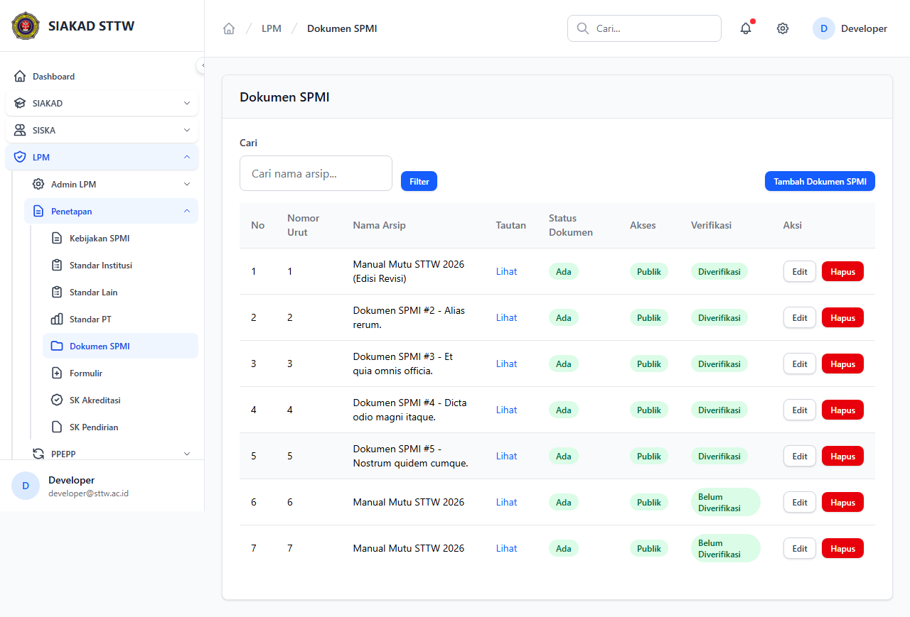
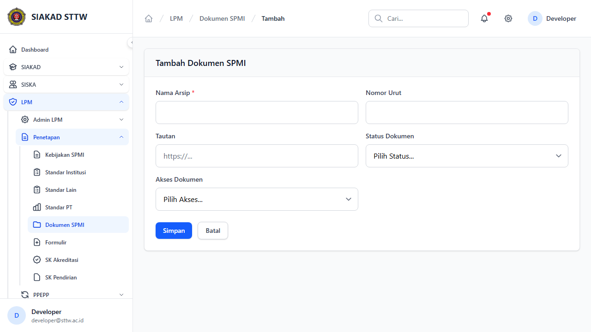
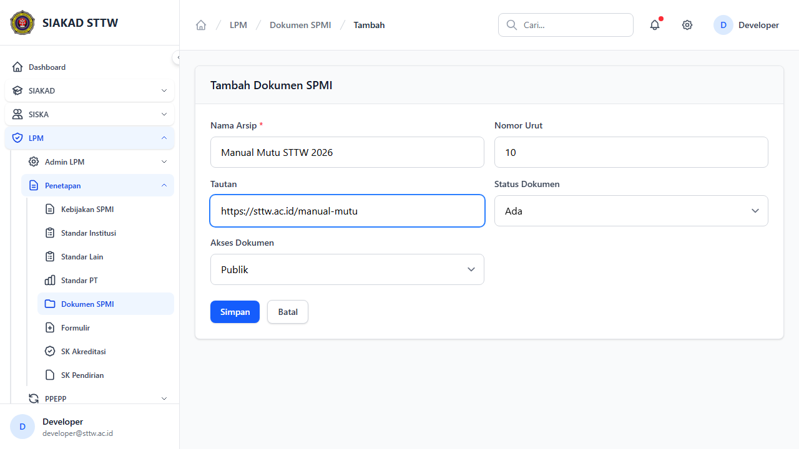
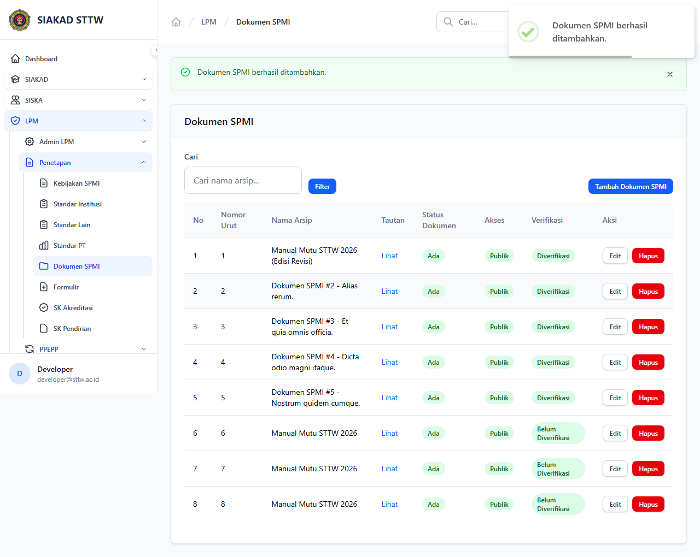
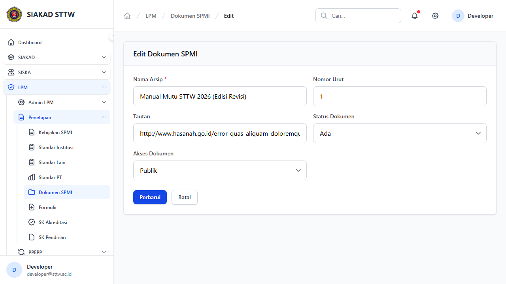
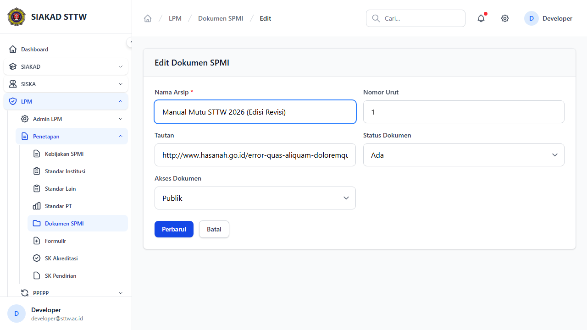
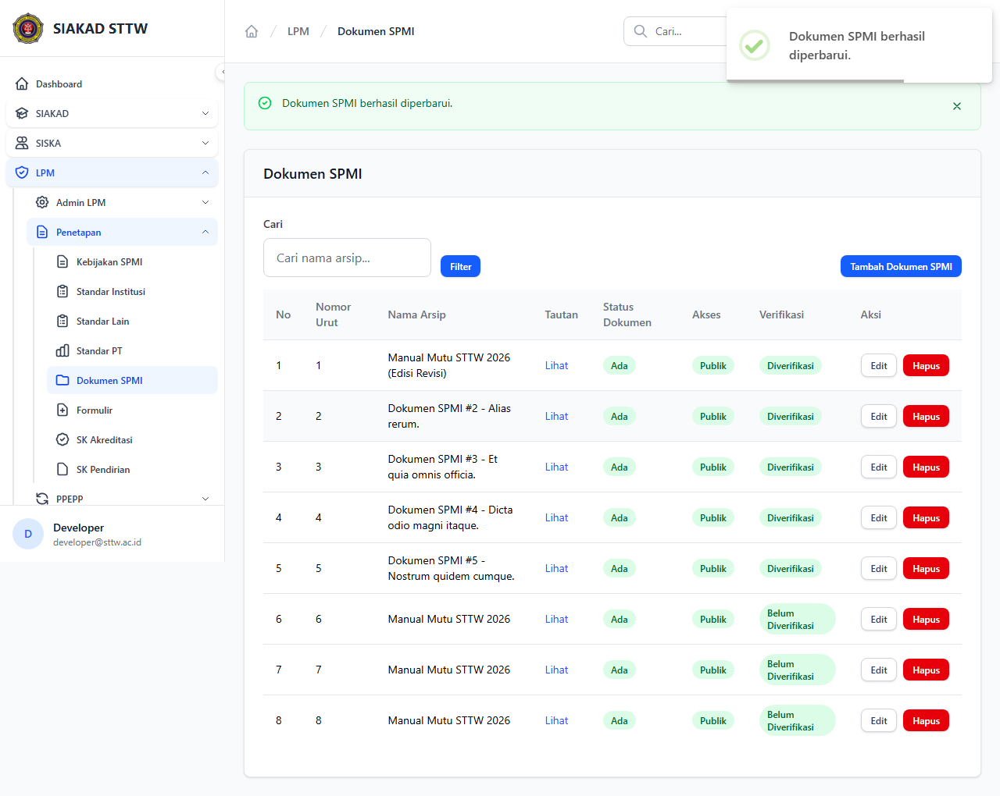

# Workflow Report: Dokumen SPMI

**Tanggal**: 2026-04-18  
**Role**: Admin LPM  
**Modul**: LPM > Penetapan  
**Status**: ✅ Berhasil

## Ringkasan

Mengelola arsip dokumen SPMI seperti manual mutu, standar operasional prosedur, dan pedoman.

## Langkah-langkah

### 1. Daftar Dokumen SPMI

Tabel dokumen SPMI dengan nomor urut, nama arsip, dan status.

### 2. Form Tambah Dokumen (Kosong)

Form pembuatan dokumen SPMI baru.

### 3. Form Tambah Dokumen (Terisi)

Form terisi data manual mutu.

### 4. Dokumen Berhasil Ditambahkan

Redirect ke index setelah submit.

### 5. Form Edit Dokumen

Form edit dokumen (fitur ini tidak memiliki halaman show terpisah).

### 6. Form Edit (Dimodifikasi)

Data dokumen telah diubah.

### 7. Dokumen Berhasil Diperbarui

Redirect dengan notifikasi sukses.

## Catatan

- Screenshot diambil secara otomatis menggunakan Playwright
- Data yang ditampilkan adalah dummy data dari LpmDummySeeder

