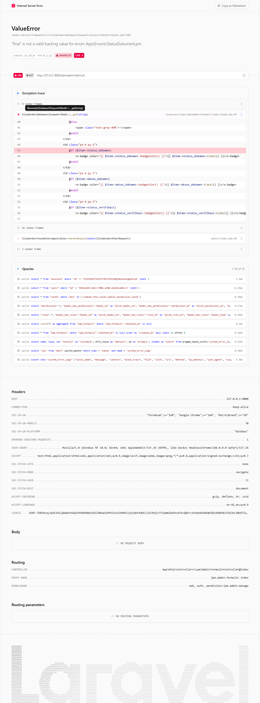
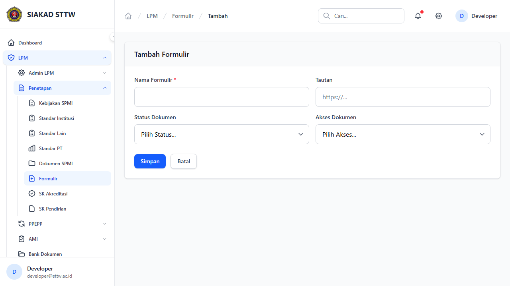
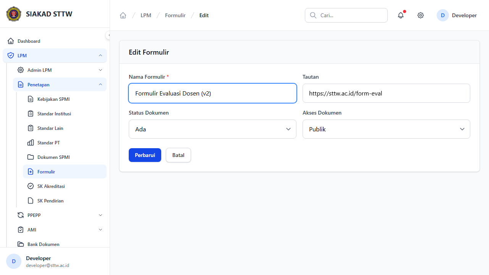

# Workflow Report: Formulir LPM

**Tanggal**: 2026-04-18  
**Role**: Admin LPM  
**Modul**: LPM > Penetapan  
**Fitur**: Formulir LPM  
**Status**: ✅ Berhasil

## Ringkasan

Mengelola formulir-formulir yang digunakan dalam proses penjaminan mutu.

Semua 8 langkah pada scan ini lolos tanpa error.

## Langkah-langkah

### 1. Daftar Formulir

Tabel formulir LPM dengan status dan akses dokumen.

### 2. Form Tambah Formulir (Kosong)

Form pembuatan formulir baru.

### 3. Form Tambah Formulir (Terisi)

Form terisi data formulir evaluasi dosen.

### 4. Formulir Berhasil Ditambahkan

Redirect ke index setelah submit.

### 5. Form Edit Formulir

Form edit formulir (tanpa halaman show terpisah).

### 6. Form Edit (Dimodifikasi)

Nama formulir diperbarui.

### 7. Formulir Berhasil Diperbarui

Redirect dengan notifikasi sukses.

## Temuan & Masalah

Tidak ada temuan kritis pada scan ini.

## Catatan

- Screenshot diambil secara otomatis menggunakan Playwright.
- Data yang ditampilkan berasal dari data dummy/seeder yang tersedia pada saat scan.
- Status report mengikuti hasil scan aktual; langkah yang gagal tidak lagi ditandai sebagai sukses.
