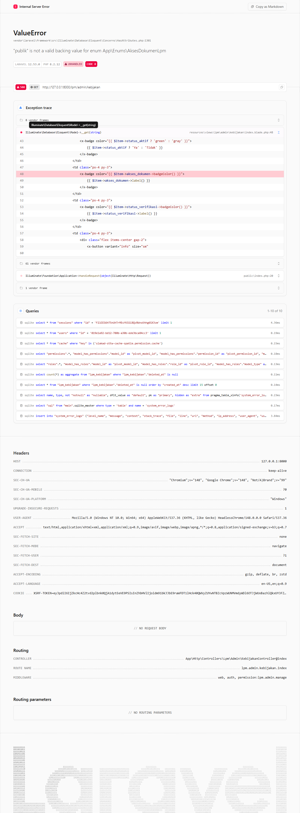
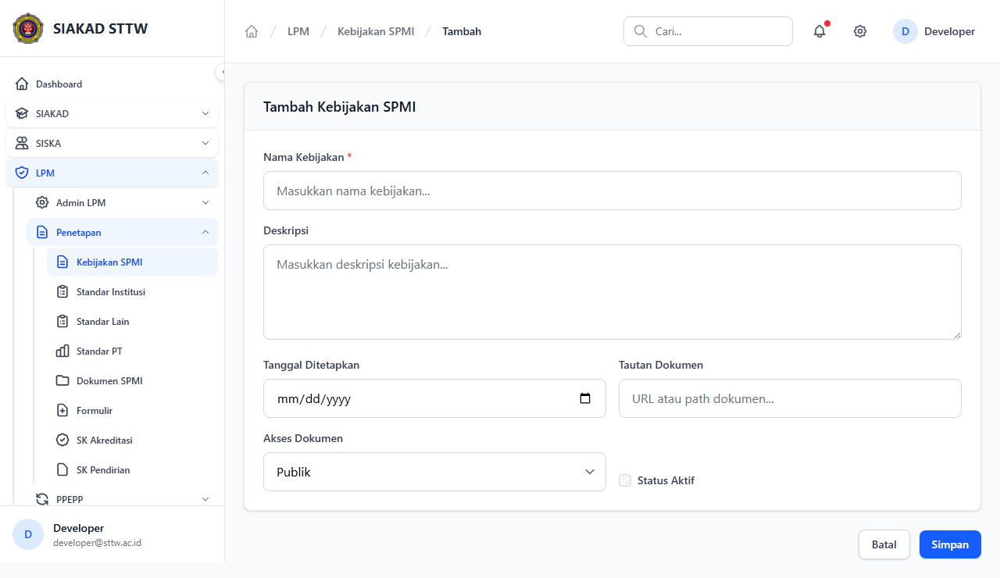
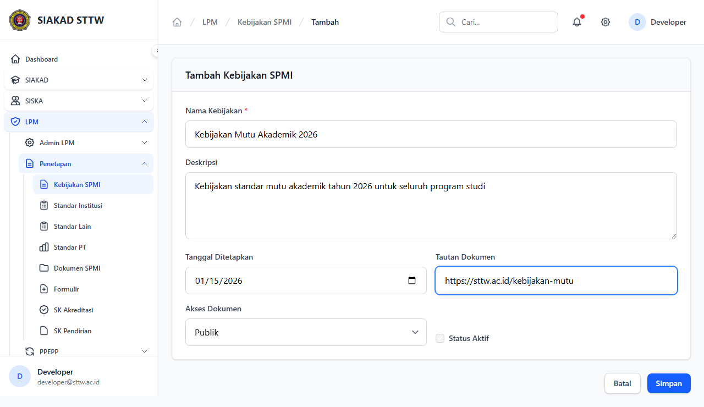
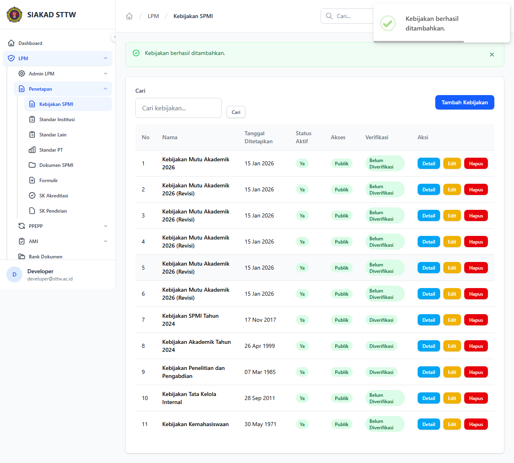
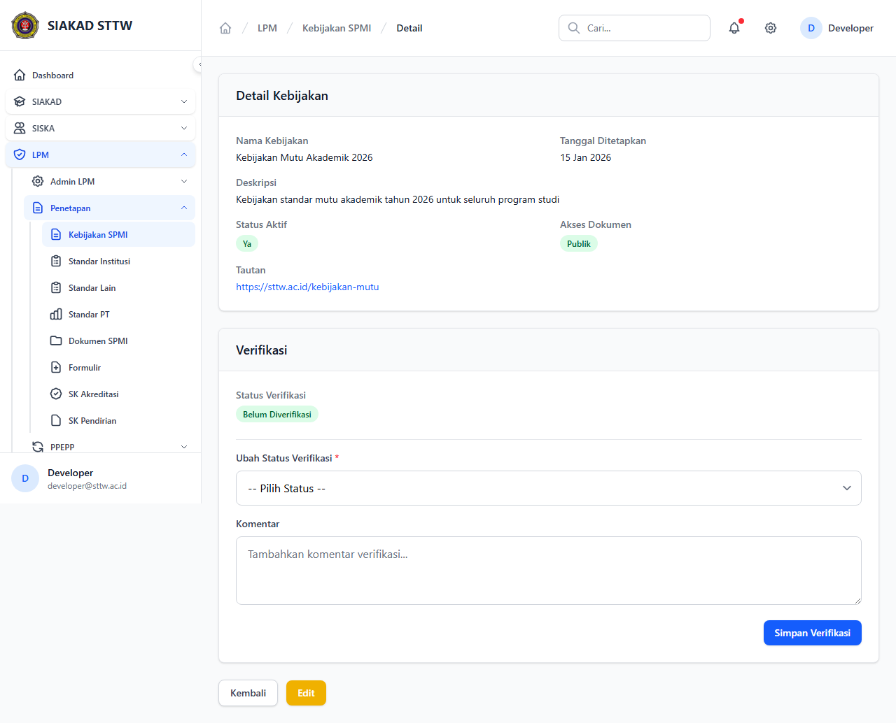
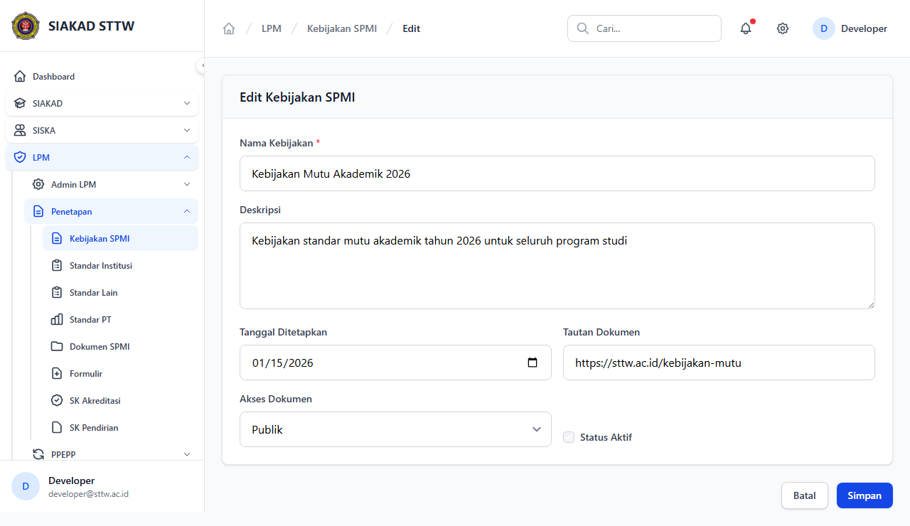
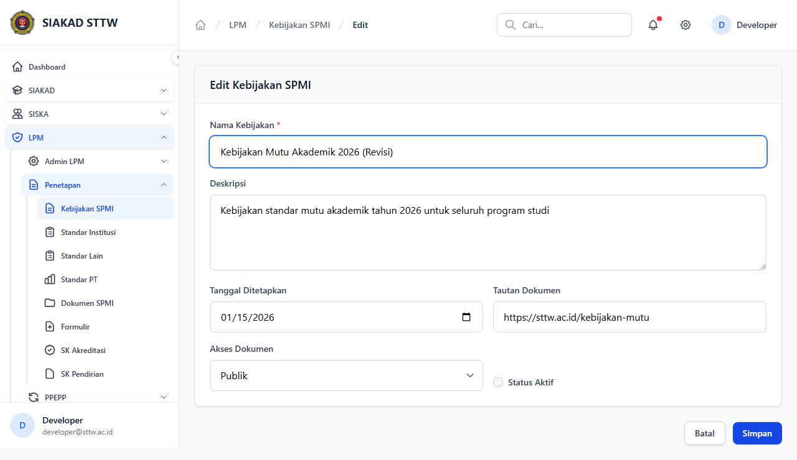
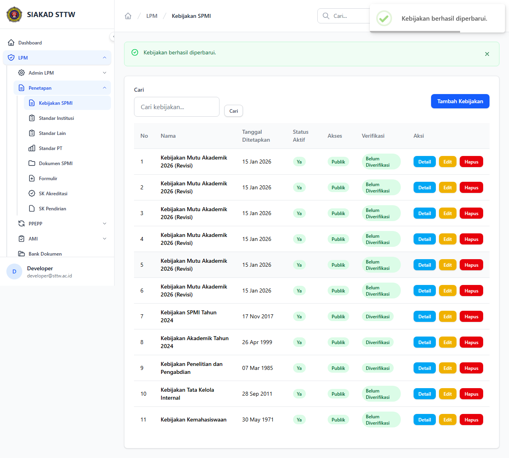

# Workflow Report: Kebijakan SPMI

**Tanggal**: 2026-04-18  
**Role**: Admin LPM  
**Modul**: LPM > Penetapan  
**Fitur**: Kebijakan SPMI  
**Status**: ✅ Berhasil

## Ringkasan

Mengelola kebijakan SPMI (Sistem Penjaminan Mutu Internal) institusi. Mendukung operasi CRUD lengkap dengan verifikasi dokumen.

Semua 8 langkah pada scan ini lolos tanpa error.

## Langkah-langkah

### 1. Daftar Kebijakan

Halaman utama menampilkan daftar seluruh kebijakan SPMI dengan informasi status, tanggal penetapan, dan aksi.

### 2. Form Tambah Kebijakan (Kosong)

Form pembuatan kebijakan baru dalam keadaan kosong, menampilkan field nama, deskripsi, tanggal, tautan, akses dokumen, dan status aktif.

### 3. Form Tambah Kebijakan (Terisi)

Form telah diisi dengan data kebijakan mutu akademik baru.

### 4. Kebijakan Berhasil Ditambahkan

Setelah submit, redirect ke halaman index dengan flash message sukses.

### 5. Detail Kebijakan

Halaman detail menampilkan informasi lengkap kebijakan termasuk status verifikasi dan opsi verifikasi.

### 6. Form Edit Kebijakan

Form edit dengan data kebijakan yang sudah terisi untuk dimodifikasi.

### 7. Form Edit (Dimodifikasi)

Nama kebijakan telah diubah untuk menandai revisi.

### 8. Kebijakan Berhasil Diperbarui

Setelah submit edit, redirect dengan flash message sukses.

## Temuan & Masalah

Tidak ada temuan kritis pada scan ini.

## Catatan

- Screenshot diambil secara otomatis menggunakan Playwright.
- Data yang ditampilkan berasal dari data dummy/seeder yang tersedia pada saat scan.
- Status report mengikuti hasil scan aktual; langkah yang gagal tidak lagi ditandai sebagai sukses.
