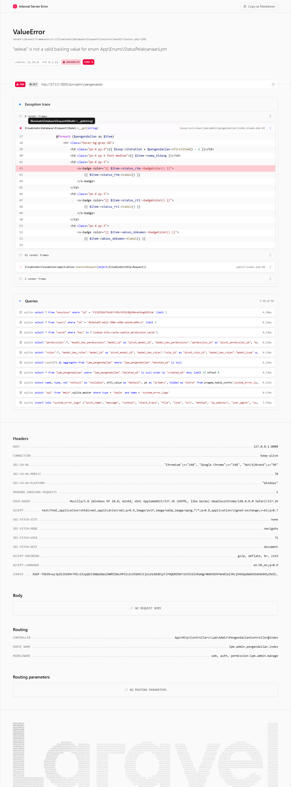
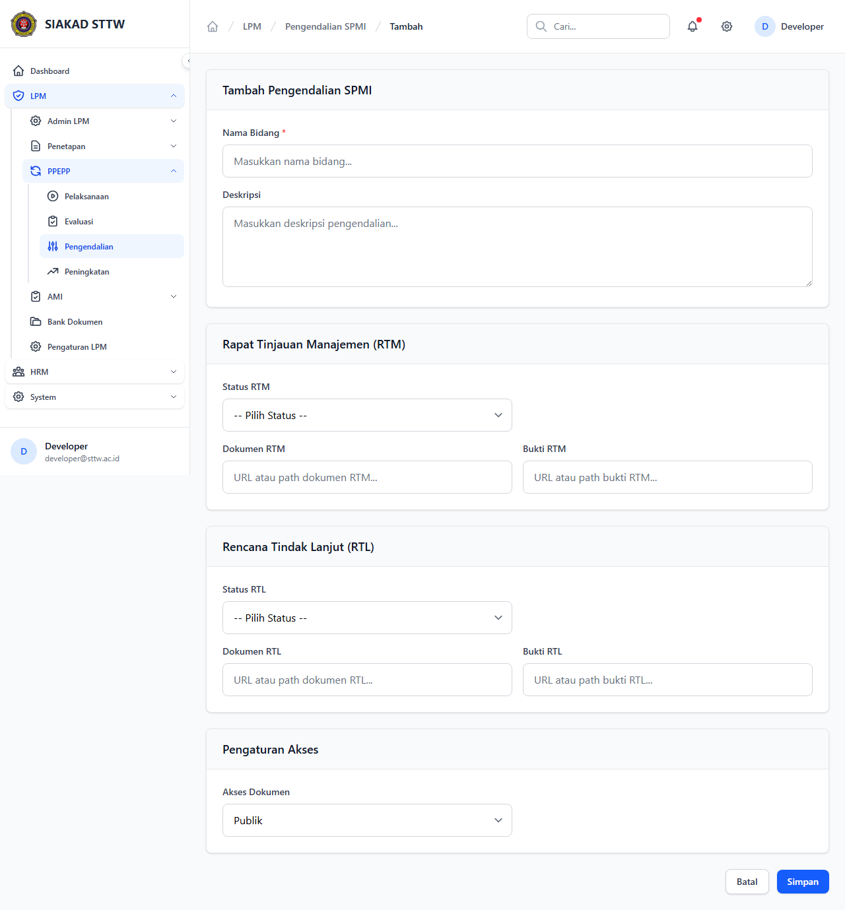
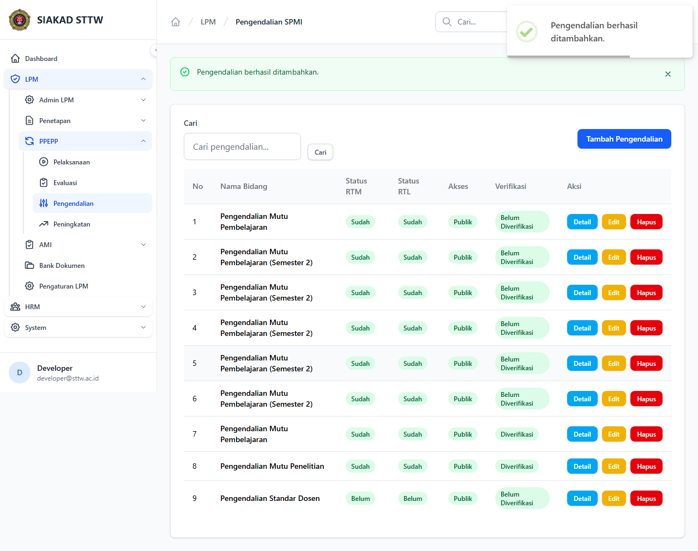
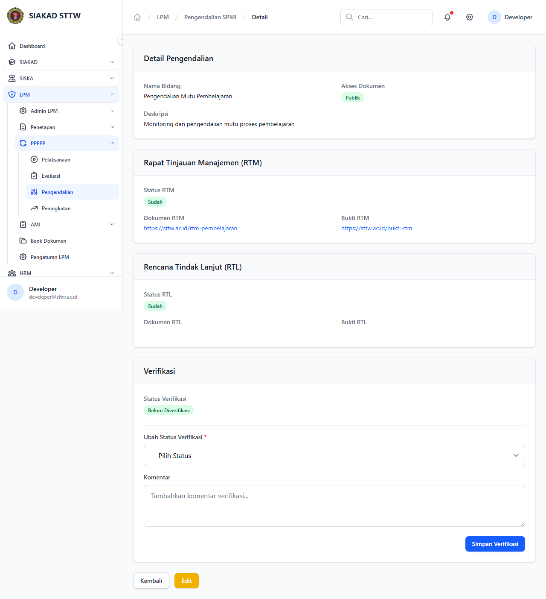
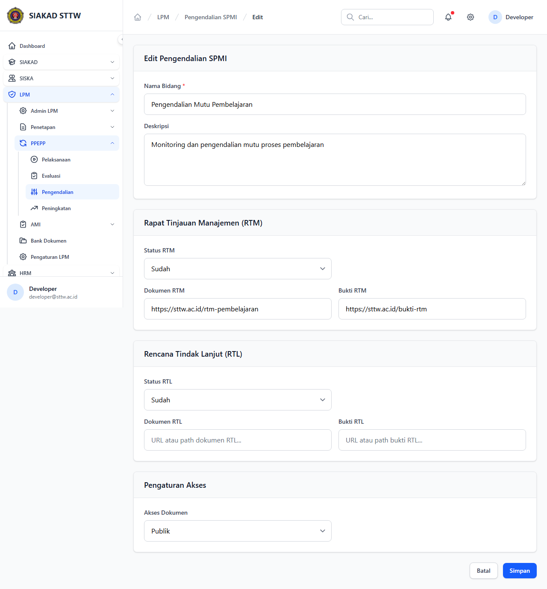
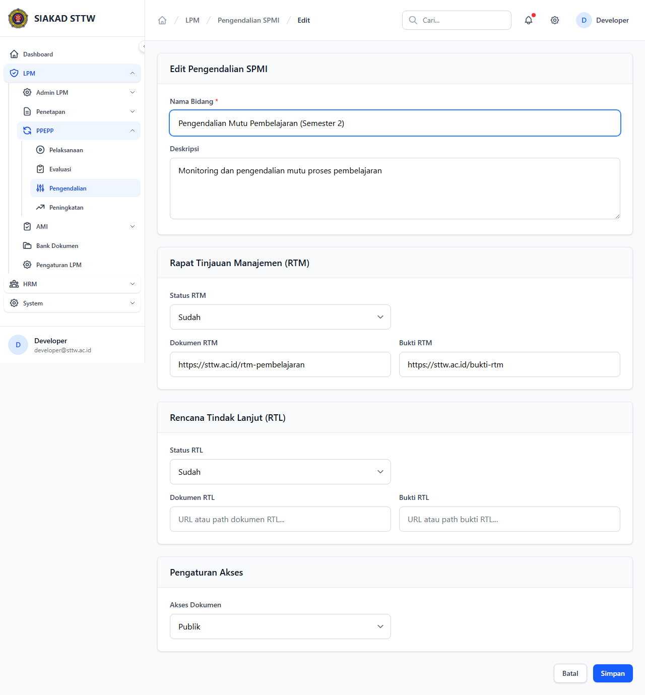
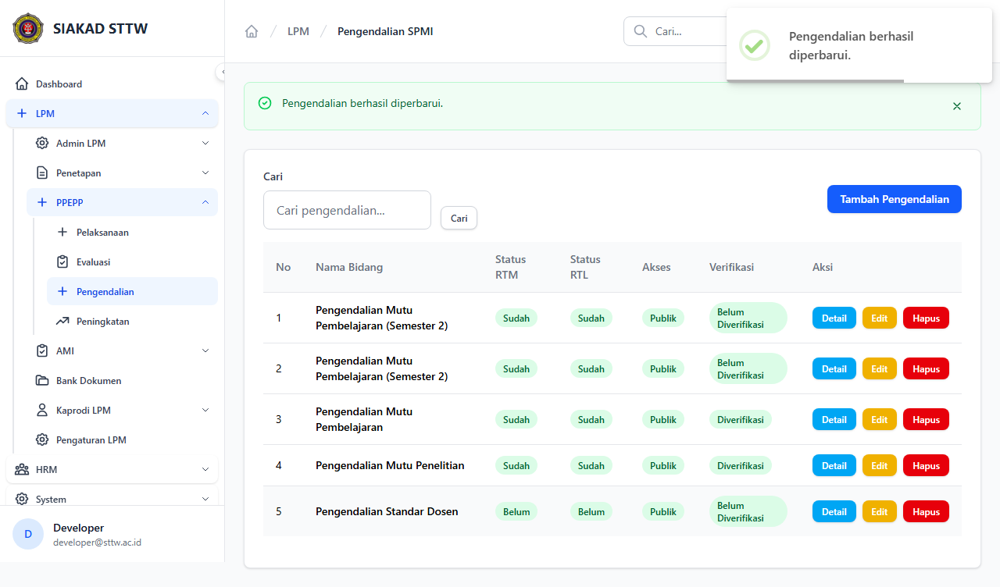

# Workflow Report: Pengendalian

**Tanggal**: 2026-04-18  
**Role**: Admin LPM  
**Modul**: LPM > Pengendalian  
**Fitur**: Pengendalian  
**Status**: ✅ Berhasil

## Ringkasan

Mengelola kegiatan pengendalian mutu, termasuk RTM (Rapat Tinjauan Manajemen) dan RTL (Rencana Tindak Lanjut).

Semua 8 langkah pada scan ini lolos tanpa error.

## Langkah-langkah

### 1. Daftar Pengendalian

Tabel pengendalian dengan status RTM dan RTL.

### 2. Form Tambah (Kosong)

Form pembuatan pengendalian baru.

### 3. Form Tambah (Terisi)

Form terisi data pengendalian mutu pembelajaran.

### 4. Berhasil Ditambahkan

Redirect ke index setelah submit.

### 5. Detail Pengendalian

Informasi lengkap termasuk status RTM dan RTL.

### 6. Form Edit

Form edit pengendalian.

### 7. Form Edit (Dimodifikasi)

Nama bidang diperbarui.

### 8. Berhasil Diperbarui

Redirect dengan notifikasi sukses.

## Temuan & Masalah

Tidak ada temuan kritis pada scan ini.

## Catatan

- Screenshot diambil secara otomatis menggunakan Playwright.
- Data yang ditampilkan berasal dari data dummy/seeder yang tersedia pada saat scan.
- Status report mengikuti hasil scan aktual; langkah yang gagal tidak lagi ditandai sebagai sukses.
