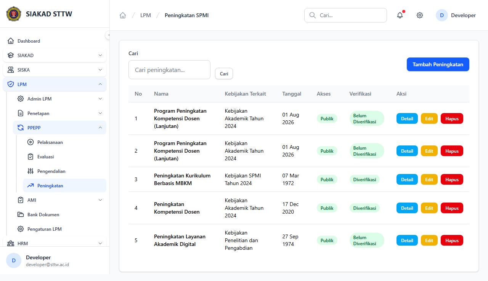
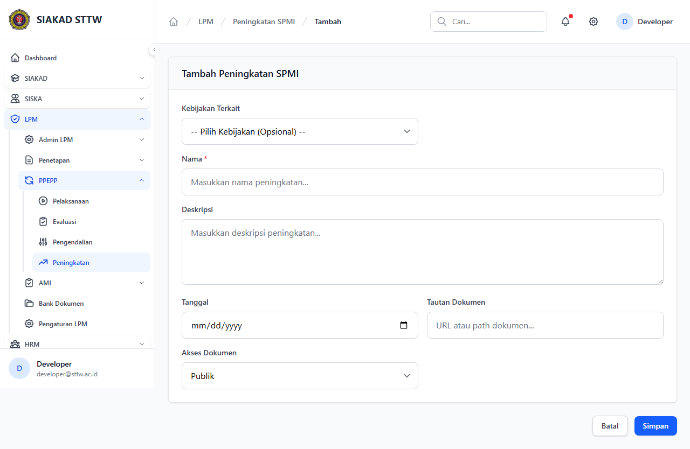
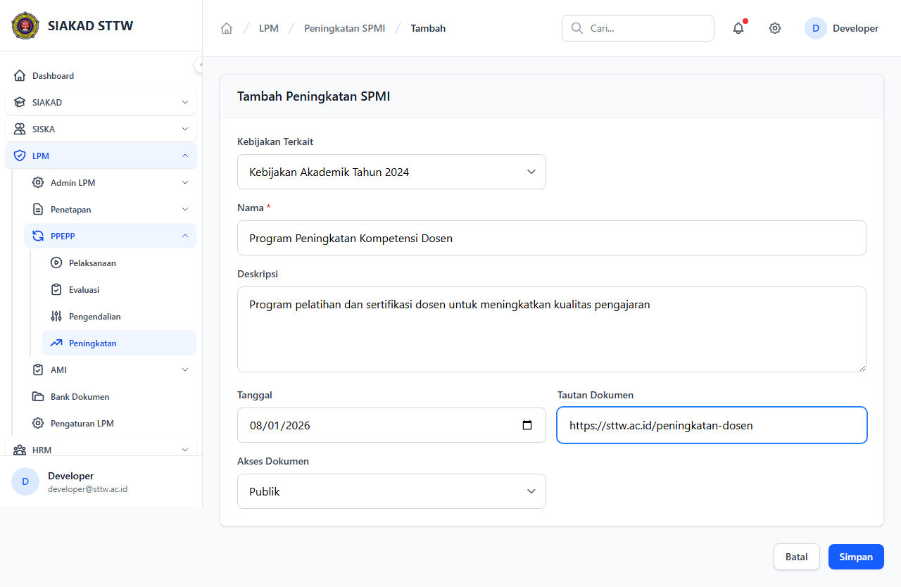
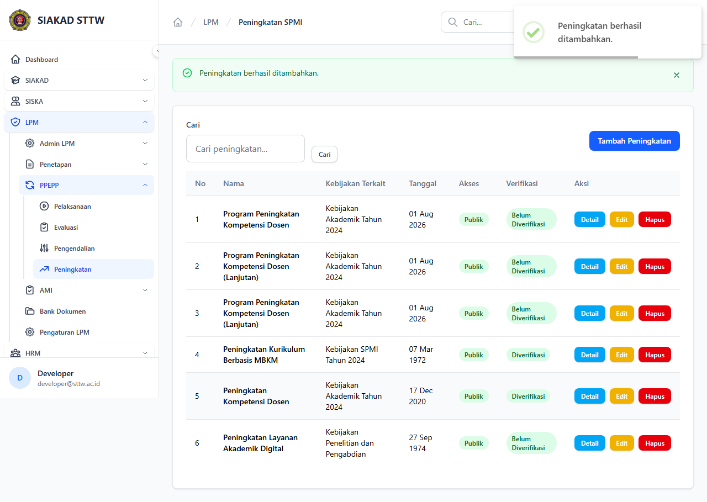
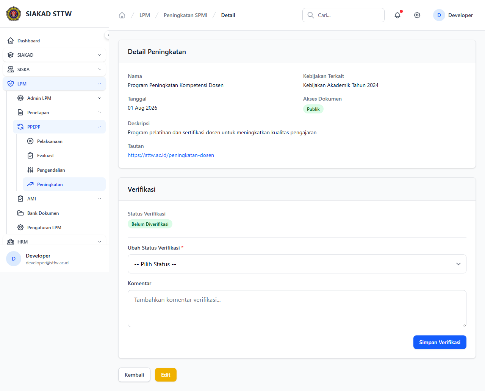
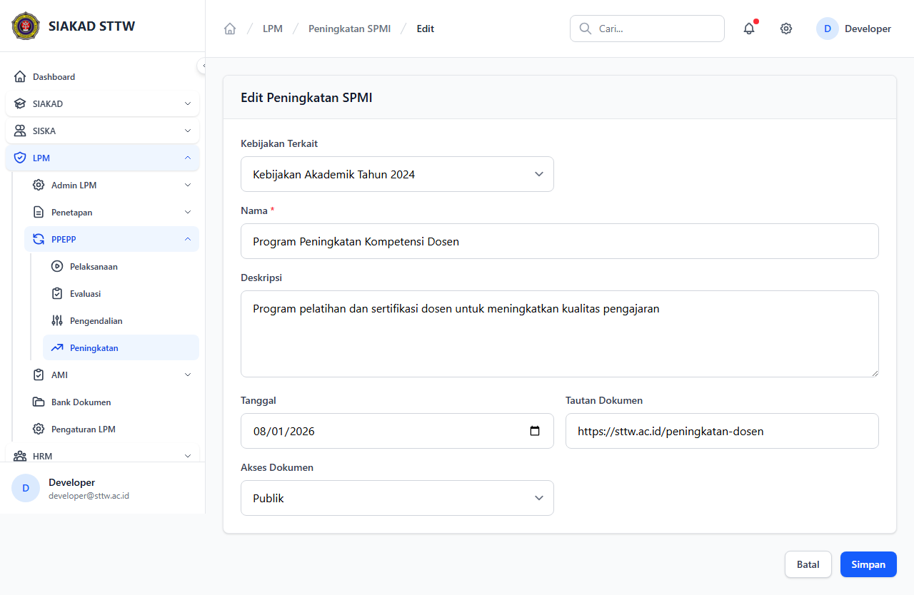
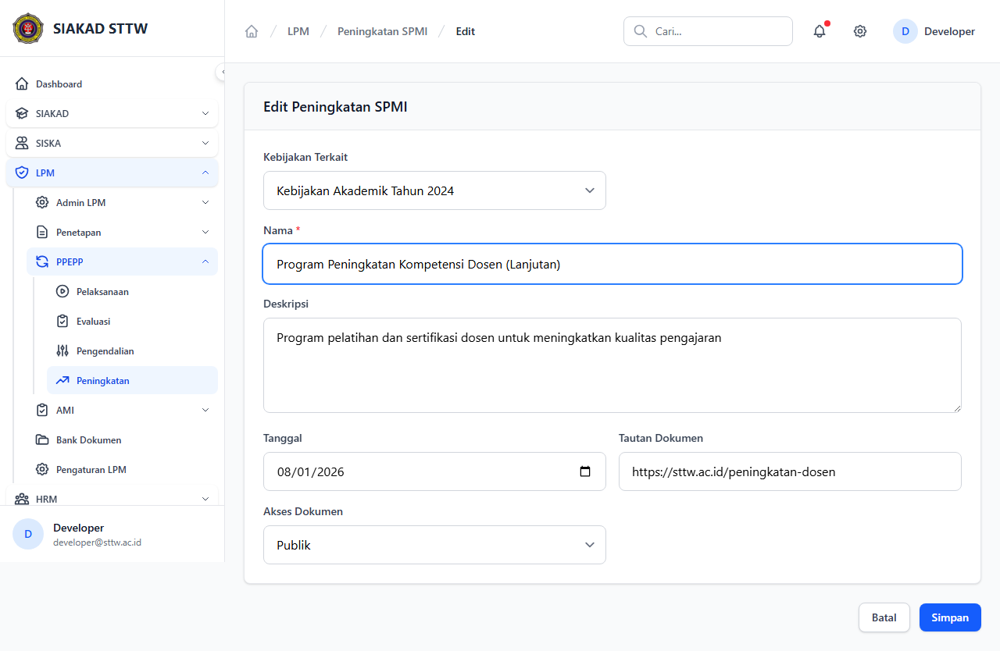
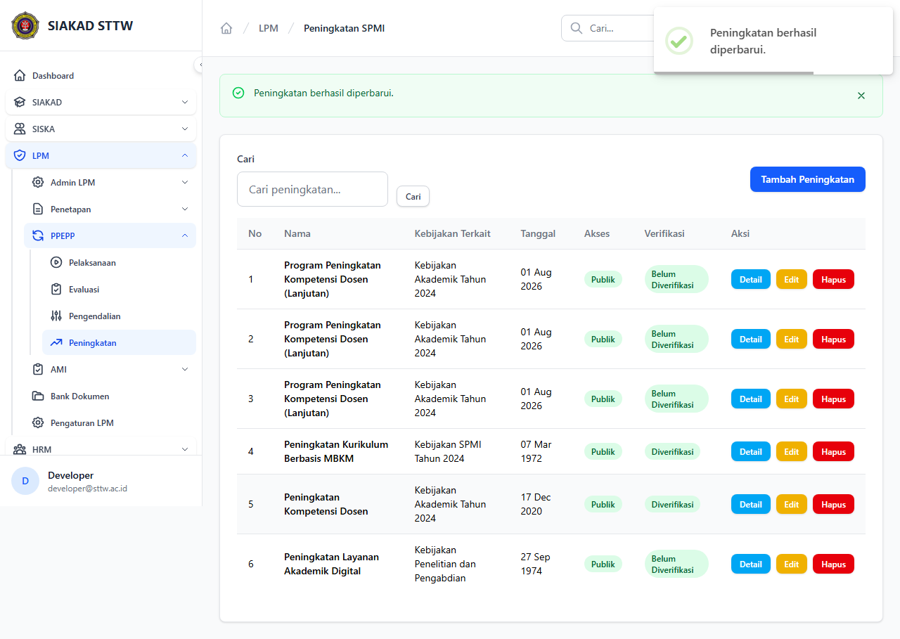

# Workflow Report: Peningkatan

**Tanggal**: 2026-04-18  
**Role**: Admin LPM  
**Modul**: LPM > Peningkatan  
**Status**: ✅ Berhasil

## Ringkasan

Mengelola kegiatan peningkatan mutu, dengan relasi opsional ke kebijakan SPMI terkait.

## Langkah-langkah

### 1. Daftar Peningkatan

Tabel kegiatan peningkatan mutu.

### 2. Form Tambah (Kosong)

Form pembuatan peningkatan baru dengan pilihan kebijakan terkait.

### 3. Form Tambah (Terisi)

Form terisi data program peningkatan kompetensi dosen.

### 4. Berhasil Ditambahkan

Redirect ke index setelah submit.

### 5. Detail Peningkatan

Informasi lengkap termasuk kebijakan terkait.

### 6. Form Edit

Form edit peningkatan.

### 7. Form Edit (Dimodifikasi)

Nama program diperbarui.

### 8. Berhasil Diperbarui

Redirect dengan notifikasi sukses.

## Catatan

- Screenshot diambil secara otomatis menggunakan Playwright
- Data yang ditampilkan adalah dummy data dari LpmDummySeeder

