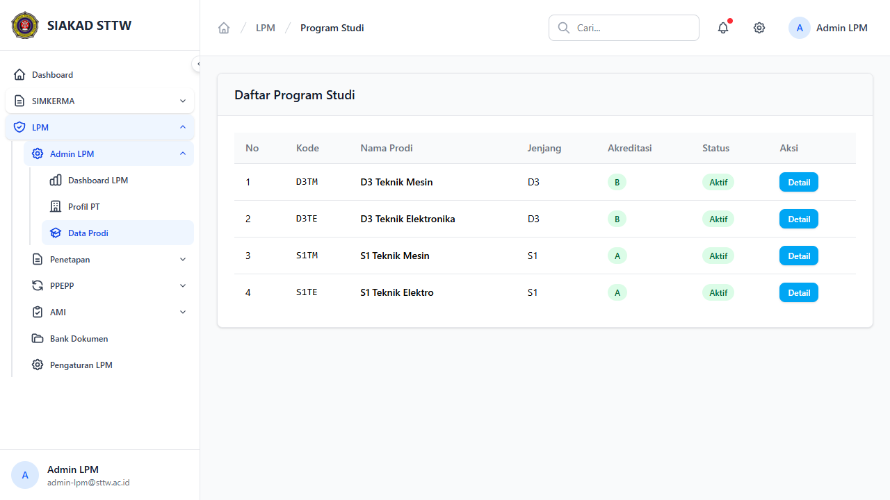
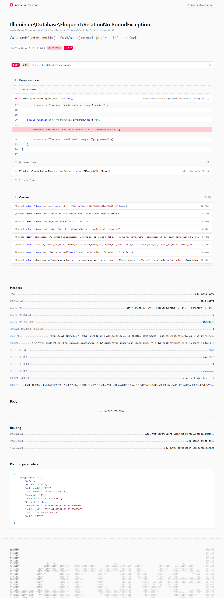

# Workflow Report: Data Program Studi

**Tanggal**: 2026-04-18  
**Role**: Admin LPM  
**Modul**: LPM  
**Fitur**: Data Program Studi  
**Status**: ✅ Berhasil

## Ringkasan

Menampilkan data program studi dari SIAKAD (read-only) dengan catatan internal dari LPM.

Semua 2 langkah pada scan ini lolos tanpa error.

## Langkah-langkah

### 1. Daftar Program Studi

Tabel program studi dengan jenjang, kode, dan status akreditasi.

### 2. Detail Program Studi

Detail prodi menampilkan informasi lengkap dan catatan LPM.

## Temuan & Masalah

Tidak ada temuan kritis pada scan ini.

## Catatan

- Screenshot diambil secara otomatis menggunakan Playwright.
- Data yang ditampilkan berasal dari data dummy/seeder yang tersedia pada saat scan.
- Status report mengikuti hasil scan aktual; langkah yang gagal tidak lagi ditandai sebagai sukses.
