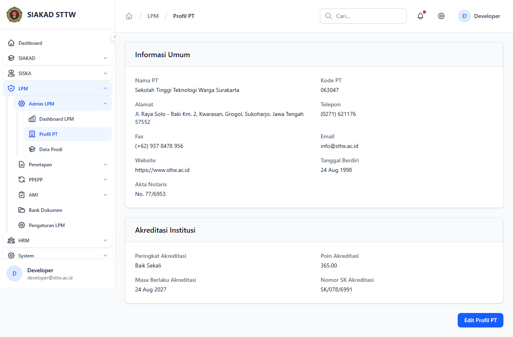
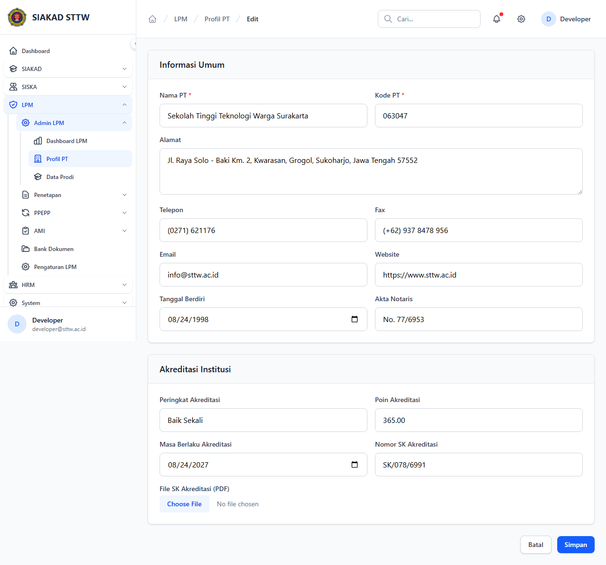
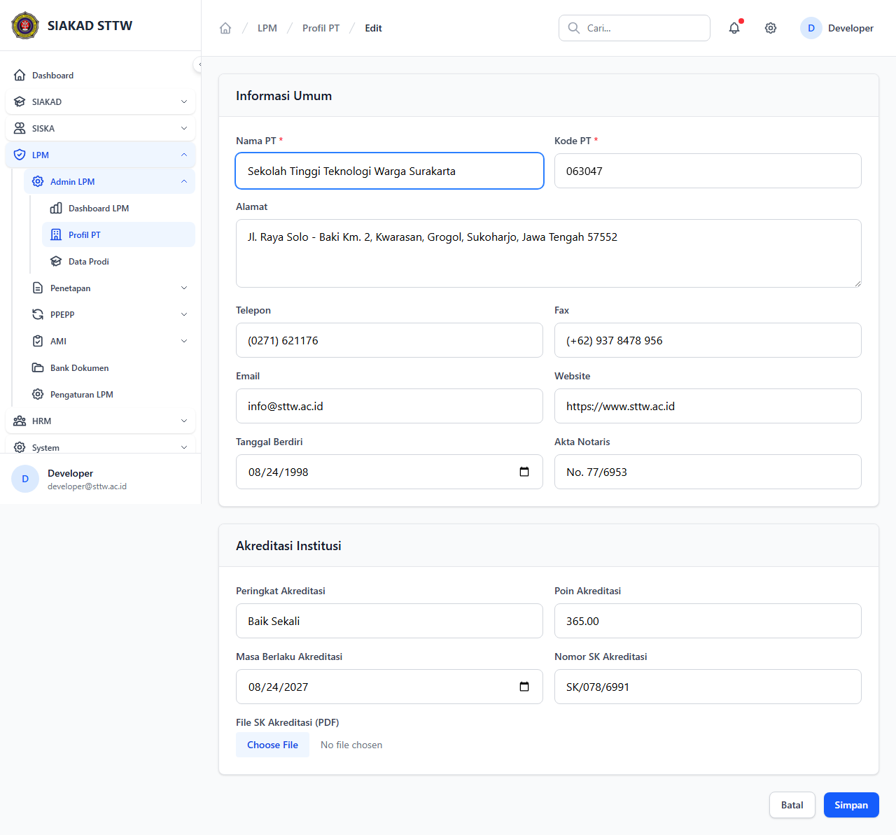
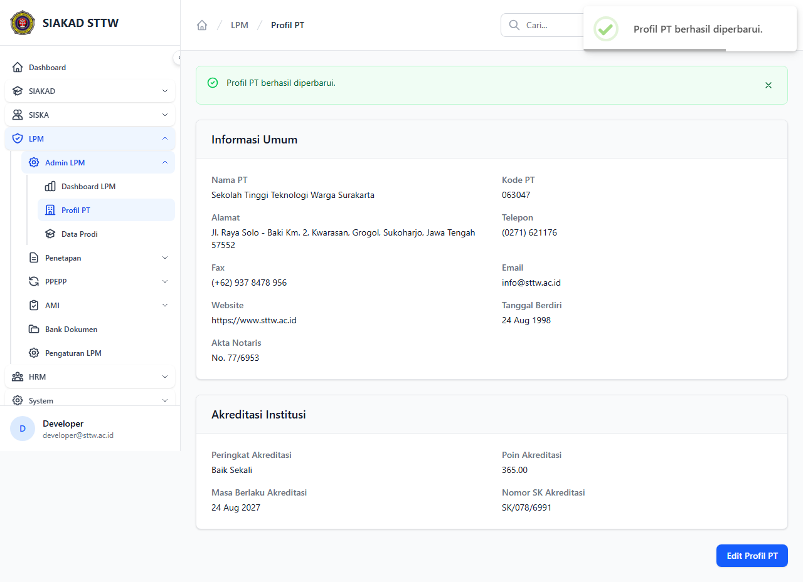

# Workflow Report: Profil Perguruan Tinggi

**Tanggal**: 2026-04-18  
**Role**: Admin LPM  
**Modul**: LPM  
**Status**: ✅ Berhasil

## Ringkasan

Mengelola profil institusi Perguruan Tinggi (nama, alamat, akreditasi, dll). Hanya satu record.

## Langkah-langkah

### 1. Profil PT

Halaman menampilkan profil institusi lengkap.

### 2. Form Edit Profil

Form edit profil perguruan tinggi.

### 3. Form Edit (Dimodifikasi)

Data profil telah diubah.

### 4. Profil Berhasil Diperbarui

Redirect ke profil dengan notifikasi sukses.

## Catatan

- Screenshot diambil secara otomatis menggunakan Playwright
- Data yang ditampilkan adalah dummy data dari LpmDummySeeder

