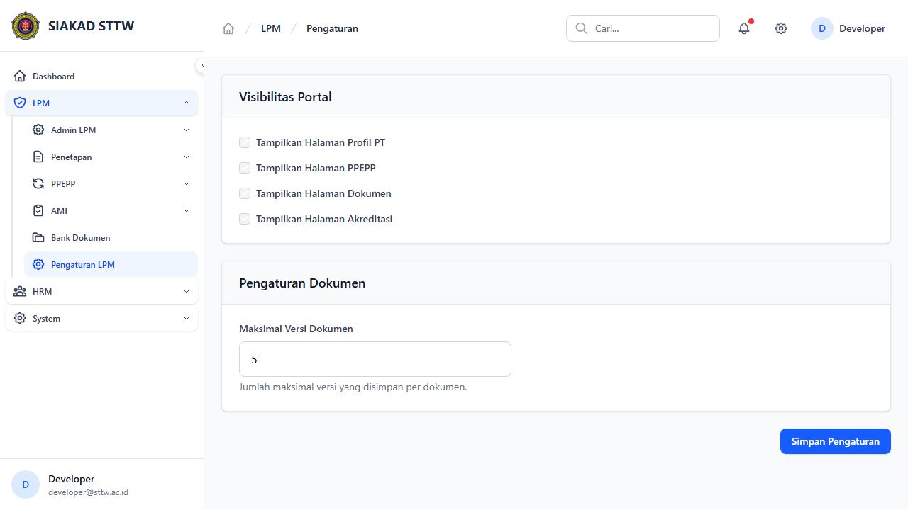
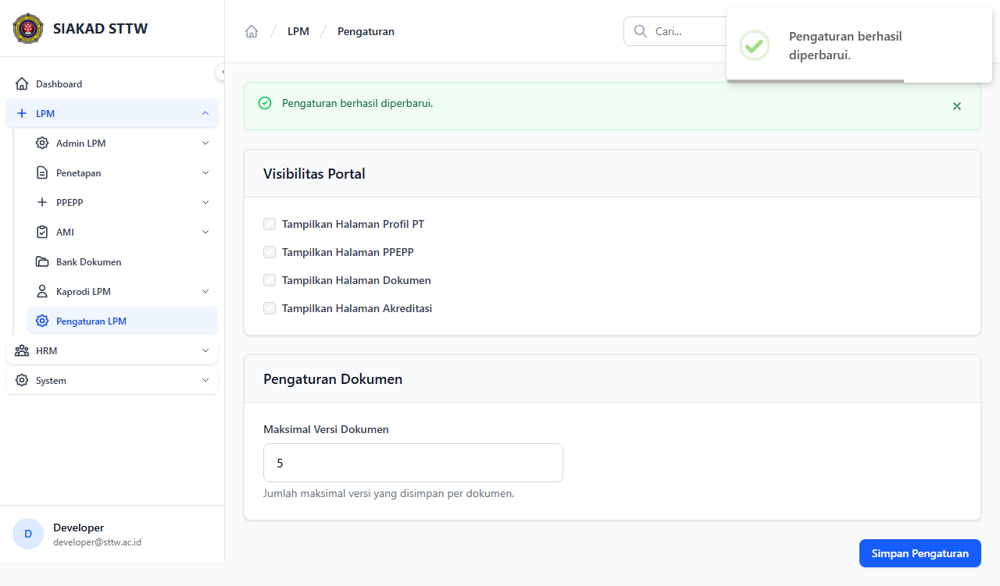

# Workflow Report: Pengaturan LPM

**Tanggal**: 2026-04-18  
**Role**: Admin LPM  
**Modul**: LPM  
**Fitur**: Pengaturan LPM  
**Status**: ✅ Berhasil

## Ringkasan

Mengelola pengaturan modul LPM seperti visibilitas portal, batas versi dokumen, dll.

Semua 2 langkah pada scan ini lolos tanpa error.

## Langkah-langkah

### 1. Halaman Pengaturan

Form pengaturan modul LPM dengan toggle dan input konfigurasi.

### 2. Pengaturan Tersimpan

Pengaturan berhasil disimpan dengan notifikasi sukses.

## Temuan & Masalah

Tidak ada temuan kritis pada scan ini.

## Catatan

- Screenshot diambil secara otomatis menggunakan Playwright.
- Data yang ditampilkan berasal dari data dummy/seeder yang tersedia pada saat scan.
- Status report mengikuti hasil scan aktual; langkah yang gagal tidak lagi ditandai sebagai sukses.
