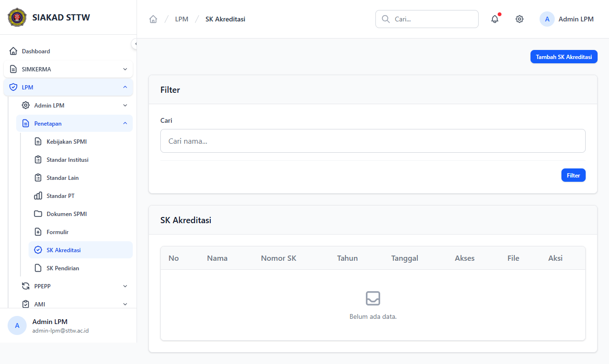
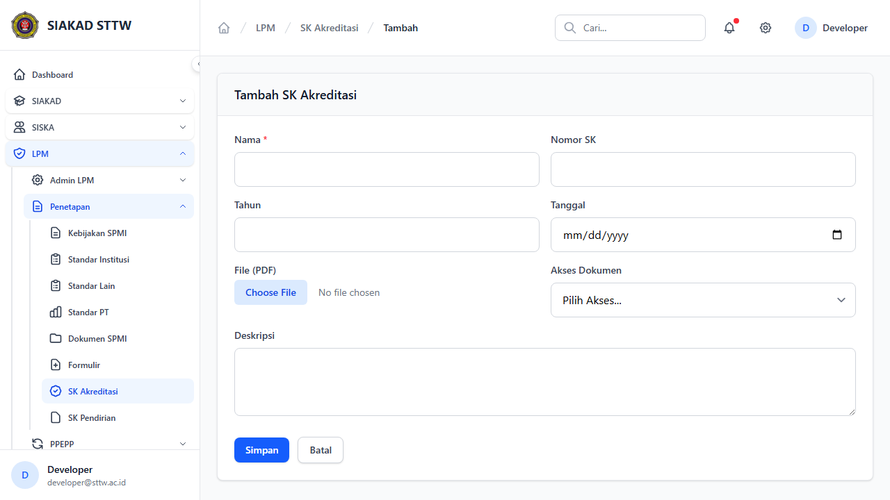
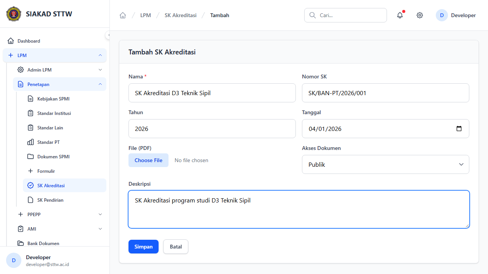
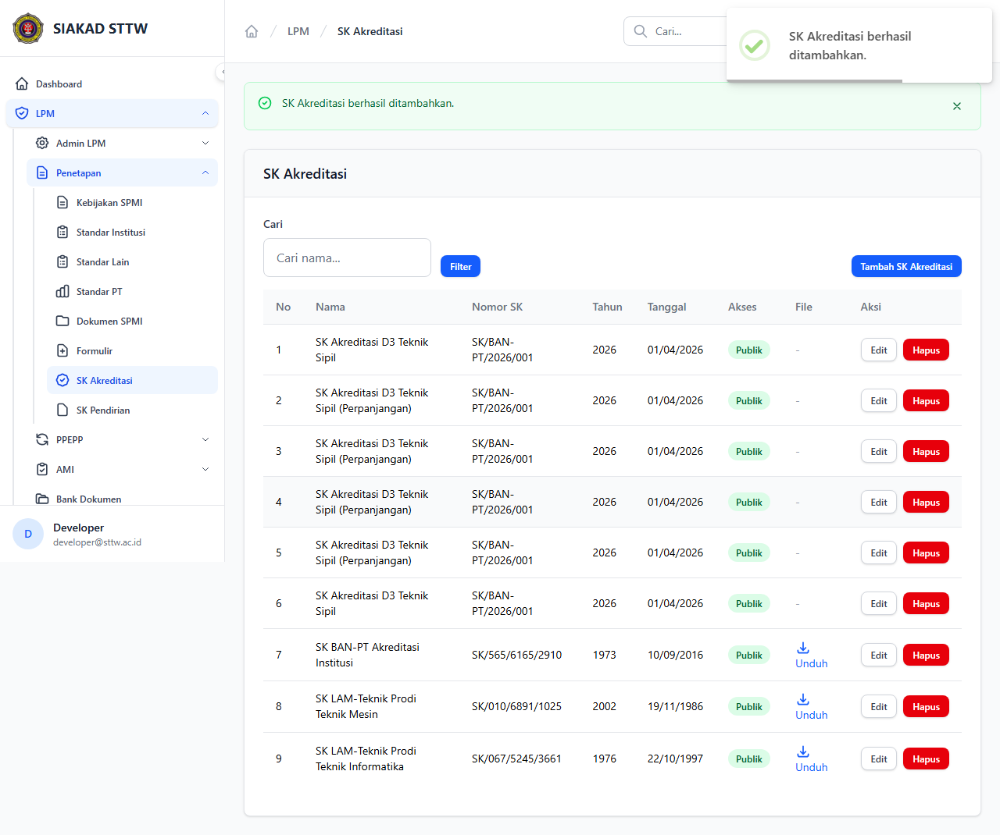
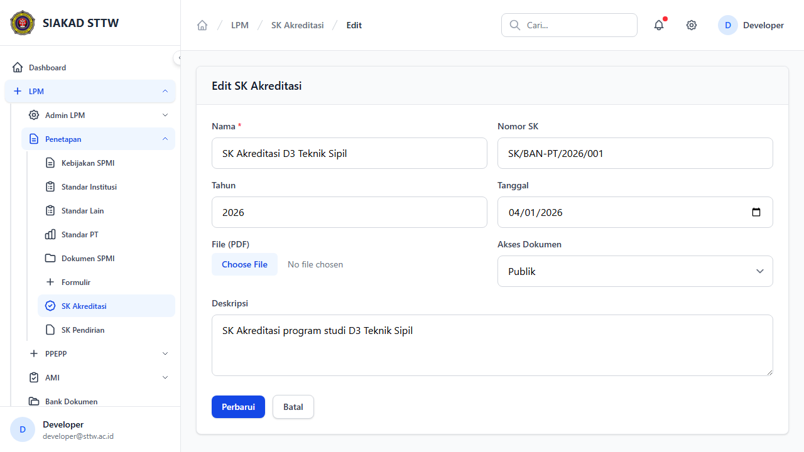
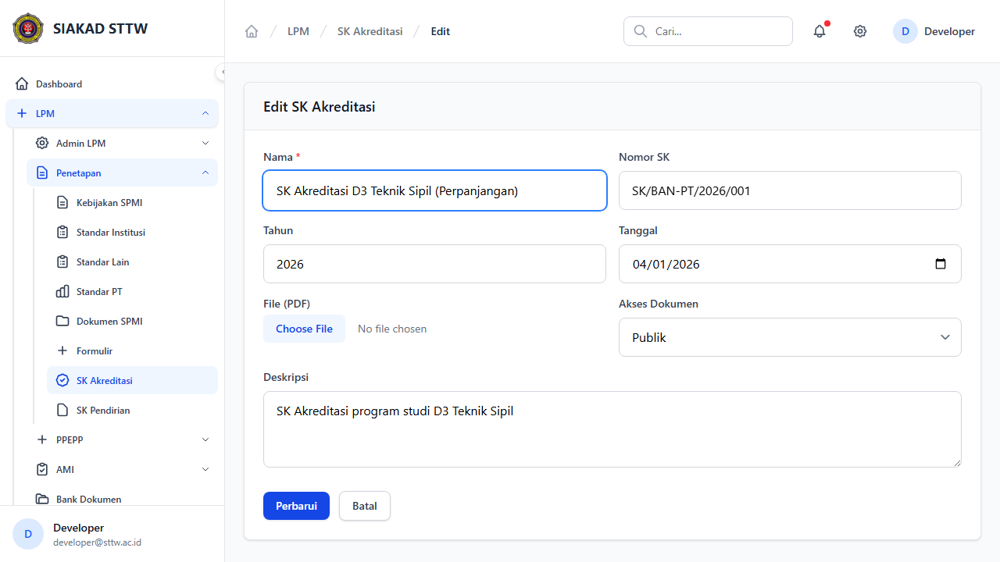
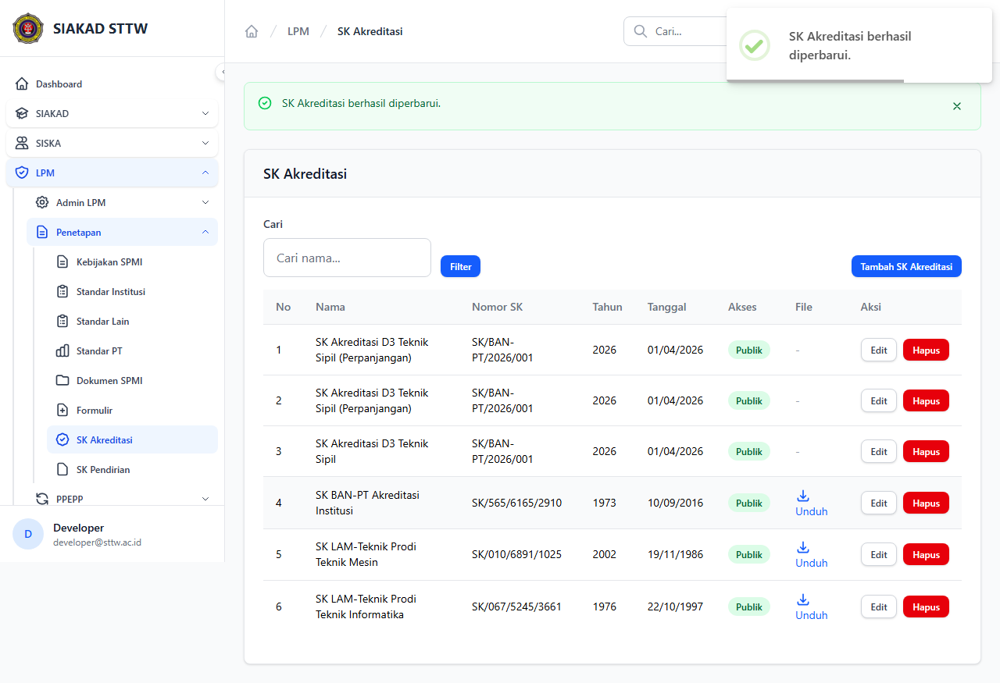

# Workflow Report: SK Akreditasi

**Tanggal**: 2026-04-18  
**Role**: Admin LPM  
**Modul**: LPM > Penetapan  
**Fitur**: SK Akreditasi  
**Status**: ✅ Berhasil

## Ringkasan

Mengelola Surat Keputusan (SK) Akreditasi program studi dan institusi.

Semua 8 langkah pada scan ini lolos tanpa error.

## Langkah-langkah

### 1. Daftar SK Akreditasi

Tabel SK akreditasi dengan nomor SK, tahun, dan tanggal.

### 2. Form Tambah SK (Kosong)

Form pembuatan SK akreditasi baru.

### 3. Form Tambah SK (Terisi)

Form terisi data SK akreditasi D3 Teknik Sipil.

### 4. SK Berhasil Ditambahkan

Redirect ke index setelah submit.

### 5. Form Edit SK

Form edit SK akreditasi (tanpa halaman show terpisah).

### 6. Form Edit (Dimodifikasi)

Nama SK diperbarui.

### 7. SK Berhasil Diperbarui

Redirect dengan notifikasi sukses.

## Temuan & Masalah

Tidak ada temuan kritis pada scan ini.

## Catatan

- Screenshot diambil secara otomatis menggunakan Playwright.
- Data yang ditampilkan berasal dari data dummy/seeder yang tersedia pada saat scan.
- Status report mengikuti hasil scan aktual; langkah yang gagal tidak lagi ditandai sebagai sukses.
