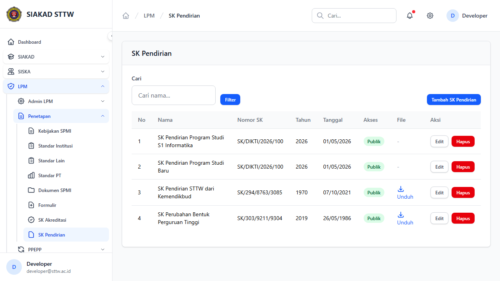
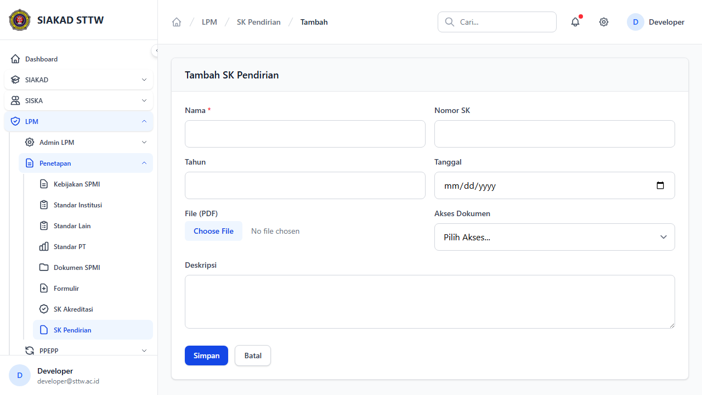
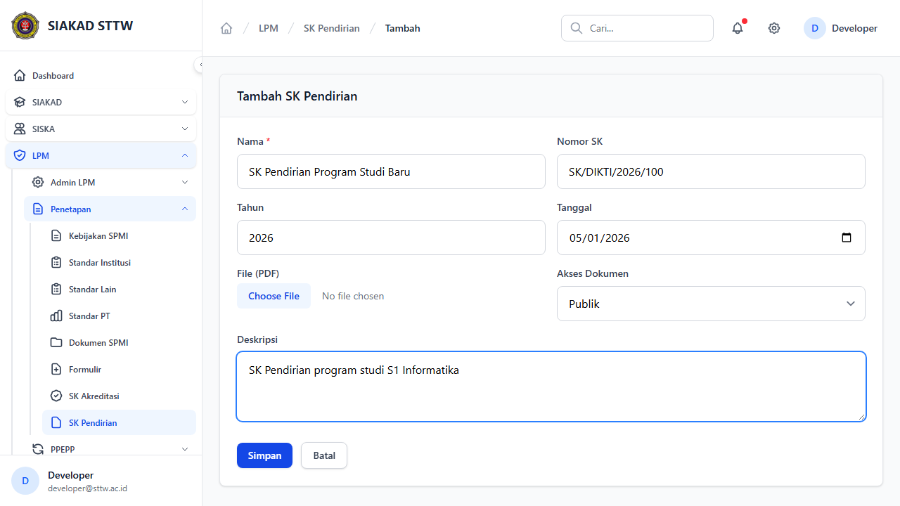
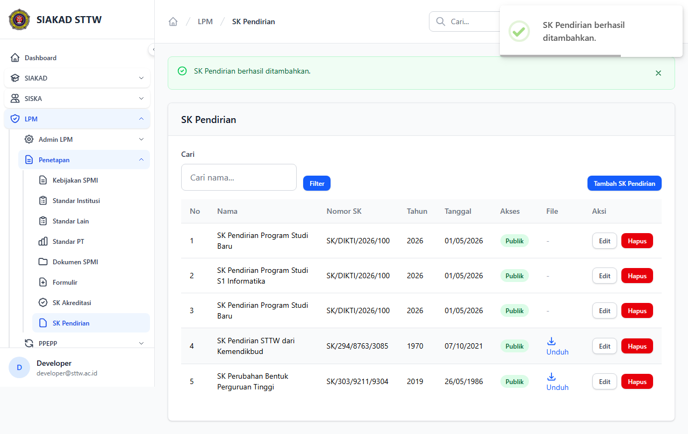
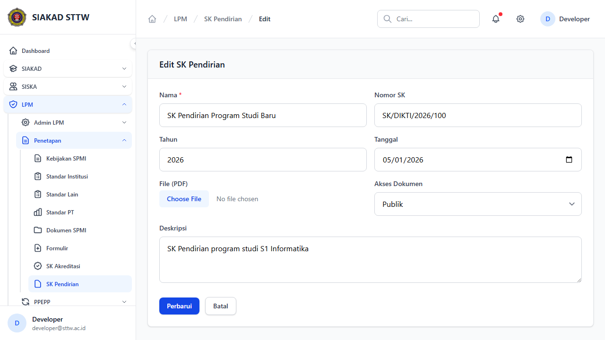
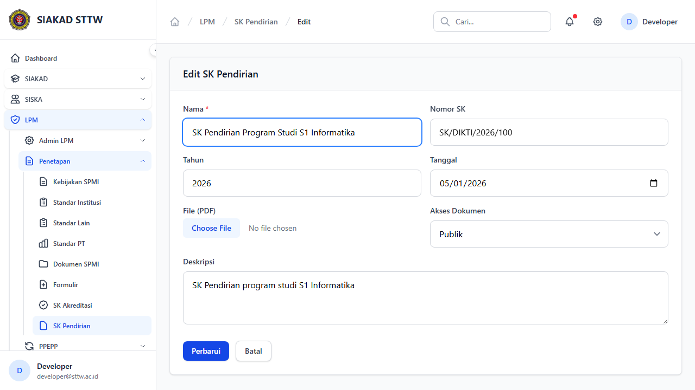
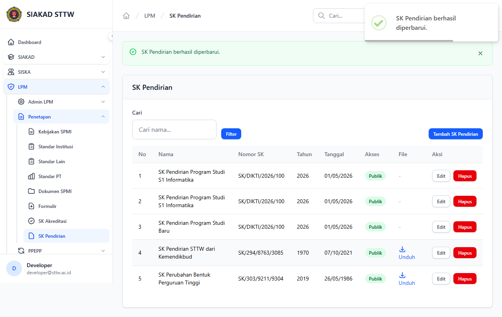

# Workflow Report: SK Pendirian

**Tanggal**: 2026-04-18  
**Role**: Admin LPM  
**Modul**: LPM > Penetapan  
**Status**: ✅ Berhasil

## Ringkasan

Mengelola Surat Keputusan (SK) Pendirian program studi dan institusi.

## Langkah-langkah

### 1. Daftar SK Pendirian

Tabel SK pendirian dengan detail lengkap.

### 2. Form Tambah SK (Kosong)

Form pembuatan SK pendirian baru.

### 3. Form Tambah SK (Terisi)

Form terisi data SK pendirian program studi baru.

### 4. SK Berhasil Ditambahkan

Redirect ke index setelah submit.

### 5. Form Edit SK

Form edit SK pendirian (tanpa halaman show terpisah).

### 6. Form Edit (Dimodifikasi)

Nama SK diperbarui.

### 7. SK Berhasil Diperbarui

Redirect dengan notifikasi sukses.

## Catatan

- Screenshot diambil secara otomatis menggunakan Playwright
- Data yang ditampilkan adalah dummy data dari LpmDummySeeder

