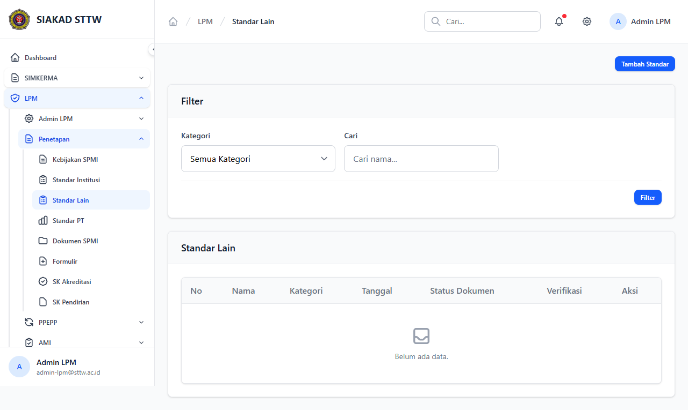
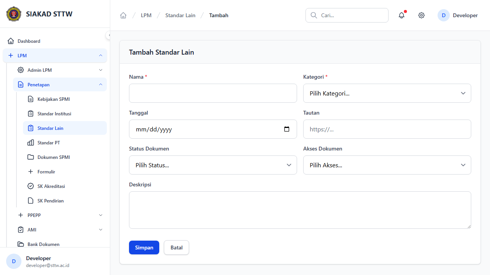
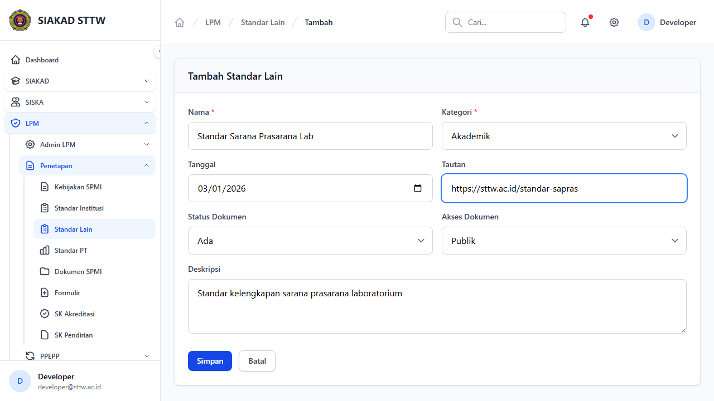
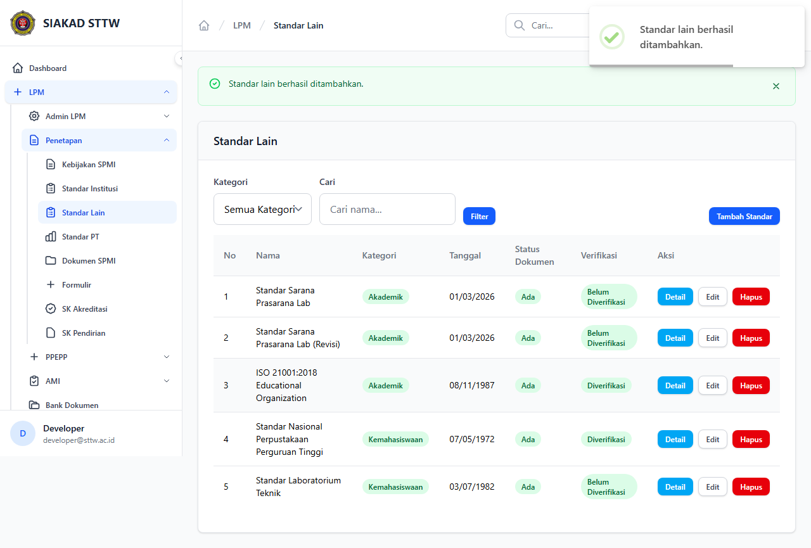
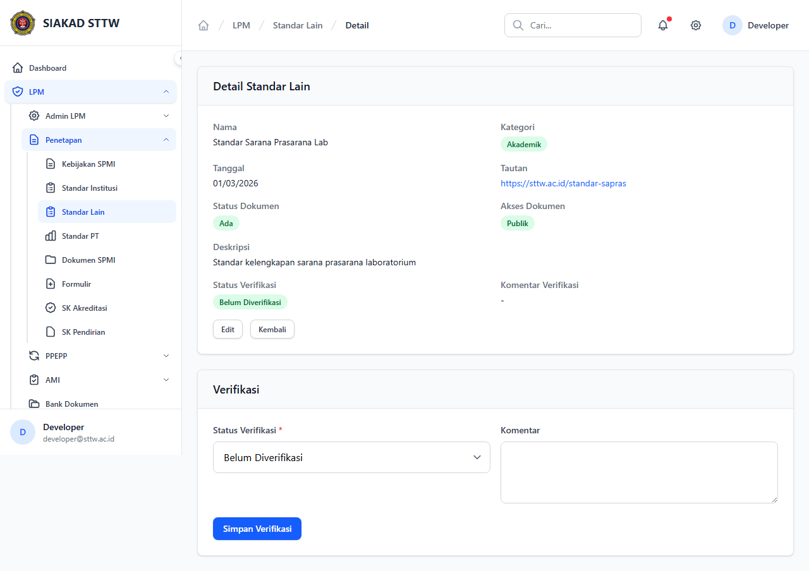
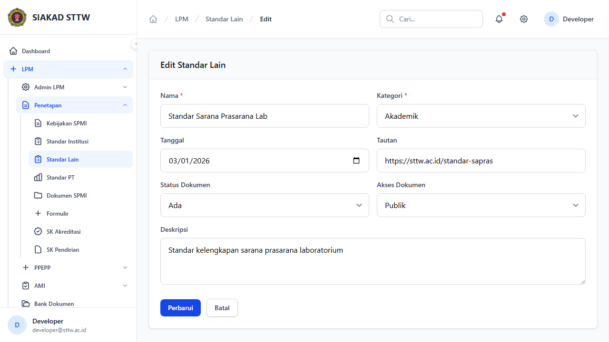
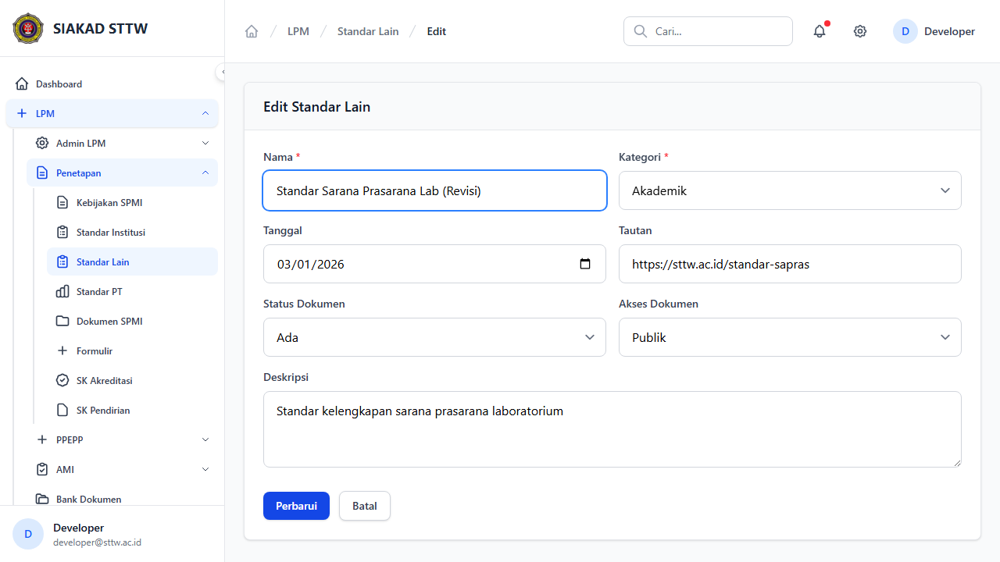
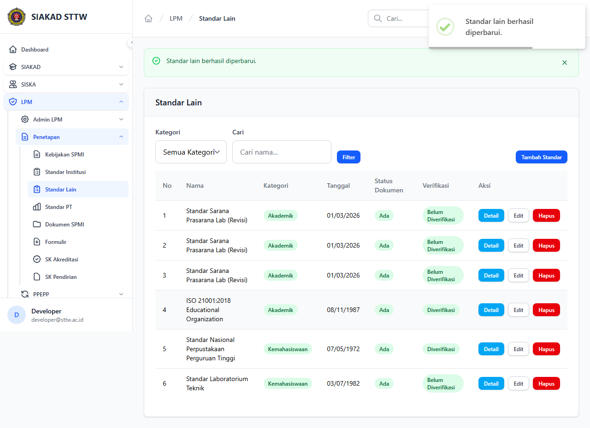

# Workflow Report: Standar Lain

**Tanggal**: 2026-04-18  
**Role**: Admin LPM  
**Modul**: LPM > Penetapan  
**Fitur**: Standar Lain  
**Status**: ✅ Berhasil

## Ringkasan

Mengelola standar lain di luar standar institusi (Akademik, Kemahasiswaan, Sumber Daya, Sarana Prasarana).

Semua 8 langkah pada scan ini lolos tanpa error.

## Langkah-langkah

### 1. Daftar Standar Lain

Tabel standar lain dengan filter kategori.

### 2. Form Tambah (Kosong)

Form pembuatan standar lain baru.

### 3. Form Tambah (Terisi)

Form terisi data standar sarana prasarana lab.

### 4. Berhasil Ditambahkan

Data tersimpan dan redirect ke index.

### 5. Detail Standar Lain

Informasi lengkap standar.

### 6. Form Edit

Form edit dengan data terisi.

### 7. Form Edit (Dimodifikasi)

Data telah diubah.

### 8. Berhasil Diperbarui

Redirect dengan flash message.

## Temuan & Masalah

Tidak ada temuan kritis pada scan ini.

## Catatan

- Screenshot diambil secara otomatis menggunakan Playwright.
- Data yang ditampilkan berasal dari data dummy/seeder yang tersedia pada saat scan.
- Status report mengikuti hasil scan aktual; langkah yang gagal tidak lagi ditandai sebagai sukses.
