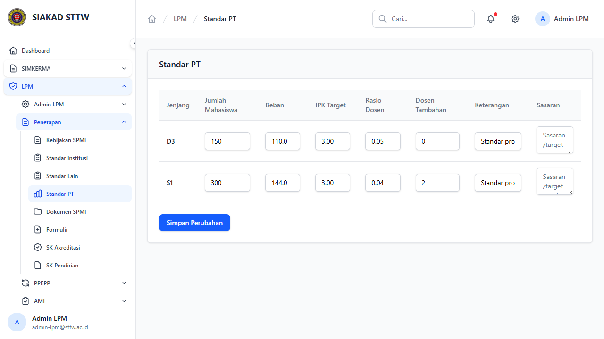
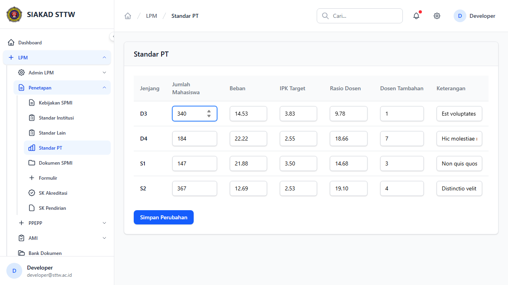
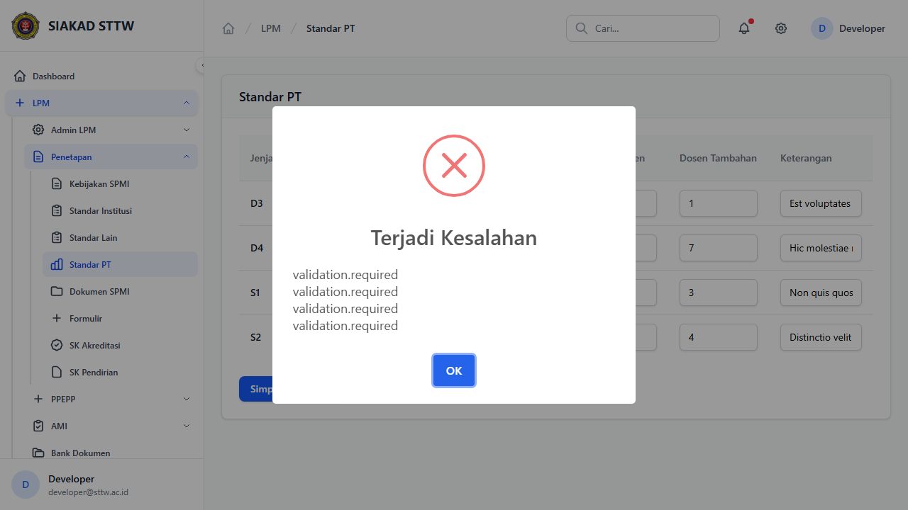

# Workflow Report: Standar PT

**Tanggal**: 2026-04-18  
**Role**: Admin LPM  
**Modul**: LPM > Penetapan  
**Fitur**: Standar PT  
**Status**: ✅ Berhasil

## Ringkasan

Mengelola standar perguruan tinggi berdasarkan jenjang pendidikan (D3, D4, S1, S2, dll) dengan editing langsung pada tabel.

Semua 3 langkah pada scan ini lolos tanpa error.

## Langkah-langkah

### 1. Tabel Standar PT

Tabel editable menampilkan standar per jenjang: jumlah mahasiswa, beban, IPK target, rasio dosen.

### 2. Edit Inline

Nilai pada tabel diubah langsung tanpa membuka form terpisah.

### 3. Berhasil Disimpan

Perubahan berhasil disimpan dengan notifikasi sukses.

## Temuan & Masalah

Tidak ada temuan kritis pada scan ini.

## Catatan

- Screenshot diambil secara otomatis menggunakan Playwright.
- Data yang ditampilkan berasal dari data dummy/seeder yang tersedia pada saat scan.
- Status report mengikuti hasil scan aktual; langkah yang gagal tidak lagi ditandai sebagai sukses.
