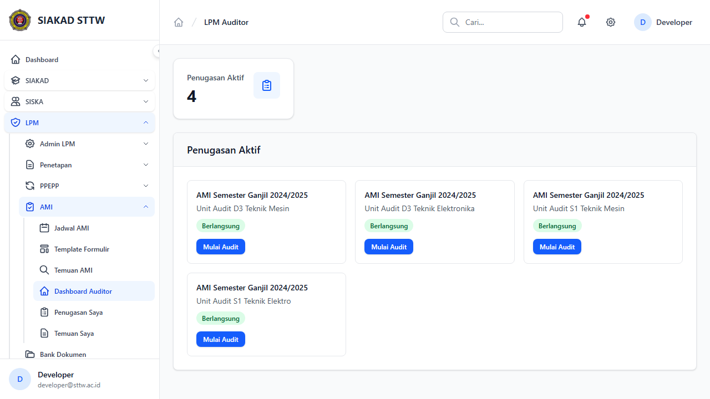

# Workflow Report: Dashboard Auditor

**Tanggal**: 2026-04-18  
**Role**: Auditor Internal  
**Modul**: LPM > Auditor  
**Status**: ✅ Berhasil

## Ringkasan

Dashboard auditor menampilkan penugasan aktif, ringkasan temuan, dan aksi cepat.

## Langkah-langkah

### 1. Dashboard Auditor

Halaman utama auditor dengan daftar penugasan aktif dan statistik temuan.

## Catatan

- Screenshot diambil secara otomatis menggunakan Playwright
- Data yang ditampilkan adalah dummy data dari LpmDummySeeder

