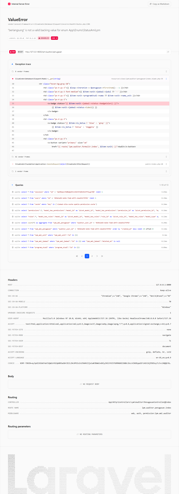

# Workflow Report: Penugasan Auditor

**Tanggal**: 2026-04-18  
**Role**: Auditor Internal  
**Modul**: LPM > Auditor  
**Fitur**: Penugasan Auditor  
**Status**: ✅ Berhasil

## Ringkasan

Daftar penugasan audit yang diberikan kepada auditor.

Semua 1 langkah pada scan ini lolos tanpa error.

## Langkah-langkah

### 1. Daftar Penugasan

Tabel penugasan menampilkan jadwal AMI, unit, dan peran (ketua/anggota).

## Temuan & Masalah

Tidak ada temuan kritis pada scan ini.

## Catatan

- Screenshot diambil secara otomatis menggunakan Playwright.
- Data yang ditampilkan berasal dari data dummy/seeder yang tersedia pada saat scan.
- Status report mengikuti hasil scan aktual; langkah yang gagal tidak lagi ditandai sebagai sukses.
