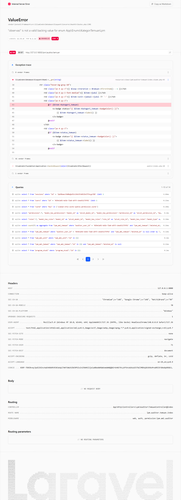

# Workflow Report: LPM Auditor Temuan

**Tanggal**: 2026-05-12
**Role**: auditor
**Modul**: lpm
**Fitur**: auditor-temuan
**Status**: ✅ Berhasil

## Deskripsi Workflow

Daftar temuan AMI yang dilaporkan auditor.

## Ringkasan

Halaman diakses pada delta scan pertengahan April 2026.

## Langkah-langkah

### 1. Buka halaman LPM Auditor Temuan

**Deskripsi**: Pengguna (auditor) membuka `/lpm/auditor/temuan`.

**URL**: `http://127.0.0.1:8000/lpm/auditor/temuan`

## Temuan & Masalah

_Tidak ada temuan signifikan._

## Catatan

- Diambil otomatis pada batch scan delta pertengahan April 2026.
